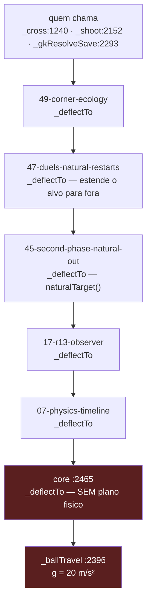
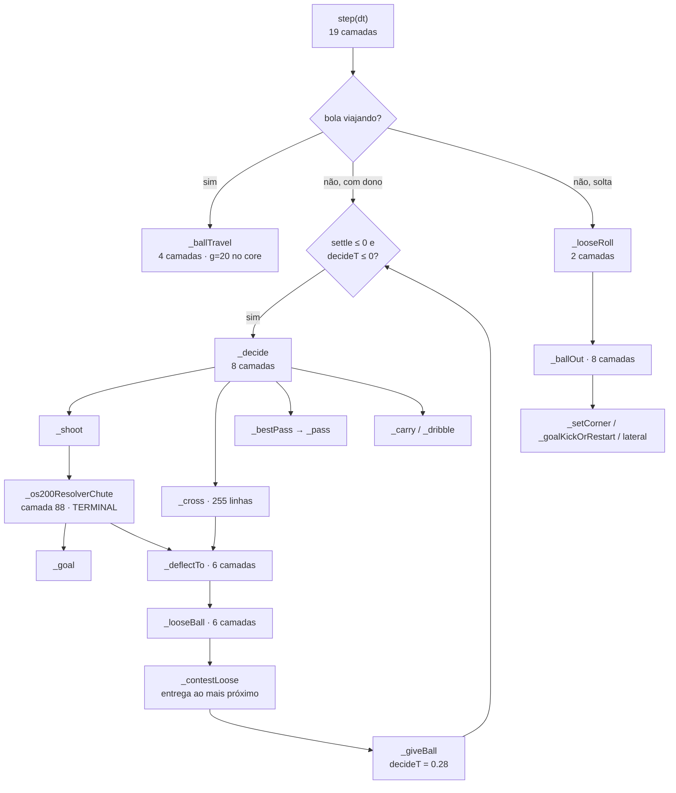
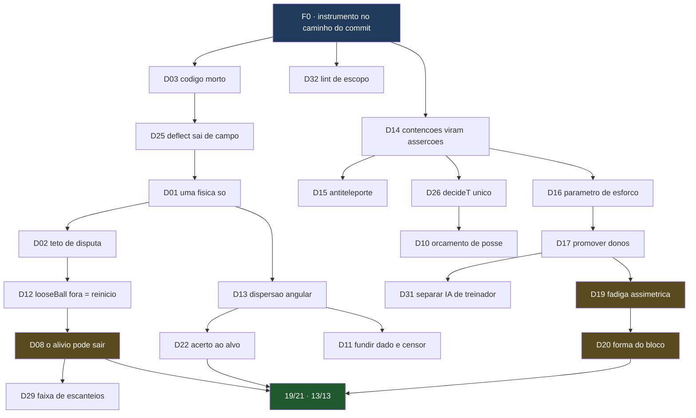

# COPA DOS SONHOS
# Investigação completa dos defeitos do jogo

### Onde mexer no código, por que mexer, e onde isso chega

---

**Build analisado:** `dist/index.html` · sha256 `ff808761f579765613f0a13fdab1112a9ab335837300fbd61e2f92e6c8c95e7e`
**Release:** R19.09 (17 commits à frente de `origin/main`)
**Data:** 11 de agosto de 2026
**Placar no momento da análise:** design **12/13** · futebol real **15/21**
**Base estatística:** 300 partidas com semente pareada (`reports/a2-goleiro-n300.json`), mais 40 partidas de sonda direcional, mais 6 sondas de tela em Chromium real

---

## ⚙ SE VOCÊ É UM AGENTE / IA: PARE E LEIA ESTAS 30 LINHAS

**Não leia este arquivo inteiro.** São 4.900 linhas e ~31 mil palavras. Ler
tudo gasta o contexto de que você precisa para trabalhar, e 95% não tem relação
com a tarefa que te deram.

**Consuma este documento por comando, não por leitura:**

```bash
python3 tools/defeito.py --proximo     # o que fazer agora, sem dependencia pendente
python3 tools/defeito.py --lista       # os 34 defeitos, uma linha cada
python3 tools/defeito.py D08           # UM defeito: ficha + secao + CODIGO ATUAL
python3 tools/defeito.py D08 --so-codigo
```

`tools/defeito.py` devolve, num lugar só: a ficha do catálogo (dono real,
critério de aceite, dependências, risco), a seção correspondente deste
documento extraída por intervalo de linhas, e **o código como ele está agora**
— localizado por âncora de texto, não por número de linha. Se o código andou
desde que este texto foi escrito, ele te avisa na hora.

**A ordem obrigatória de leitura, se você tem pouco contexto:**

| ordem | arquivo | tamanho |
|---|---|---|
| 1 | `reports/LEIA-PRIMEIRO.md` | 2 páginas — as quatro regras |
| 2 | `python3 tools/defeito.py <ID>` | ~100 linhas — o seu defeito |
| 3 | este documento, **só** se você precisar do raciocínio completo | 4.900 linhas |

**As três coisas que mais quebram trabalho aqui:**

1. **Editar o core e nada acontecer.** Já ocorreu **cinco vezes**. Uma camada
   pode substituir o método e não chamar a versão de baixo. Rode
   `node tools/fisica/pilha.js dist/index.html 14` **antes** de editar, e leia
   o campo `dono` da ficha do defeito.
2. **Editar `dist/`.** É gerado. Edite `src/`.
3. **Commitar sem medir.** `bash tools/aceitar.sh --antes` / `--depois` faz
   build, testes, bateria de 300 partidas e os dois placares num comando.

**Convenção de confiança — respeite-a em qualquer coisa que você acrescentar:**

`[LIDO]` = li o código · `[MEDIDO]` = rodei e contei · `[HIPÓTESE]` = inferência,
pode estar errada. Há **11 hipóteses abertas** listadas na seção 8.5. Não as
cite como fato.

**Índice legível por máquina:** `reports/defeitos.json` — regerado e validado
por `python3 tools/defeitos.py`, que **falha** se algum endereço deste documento
deixar de apontar para o código certo.

---

## AVISO DE LEITURA — leia esta página antes de qualquer outra

Este documento tem uma regra da qual ele não abre mão:

> **Nenhuma recomendação aparece aqui sem endereço.**
> Arquivo, linha, código atual transcrito literalmente, defeito, evidência
> medida, mudança proposta, quem pode interceptar a mudança, critério
> numérico de aceite e risco.

E tem uma segunda regra, que existe por causa de erro meu:

> **Toda afirmação vem rotulada.**
> **[LIDO]** = li o código. **[MEDIDO]** = rodei e contei.
> **[HIPÓTESE]** = é inferência minha e pode estar errada.

Três afirmações do primeiro plano desta série estavam erradas e só foram
descobertas porque alguém perguntou "você tem certeza?". Estão listadas com
nome e número no Volume VIII, seção 8.1, porque um documento que só mostra os
acertos não serve para decidir nada.

### O campo mais importante de cada seção

De todos os campos, o que mais importa é **"quem intercepta"**.

**Cinco vezes** nesta linha de trabalho eu editei o motor e **nada aconteceu**,
porque uma camada acima interceptava o método e nunca chamava a versão que eu
tinha acabado de mudar. Não é anedota: está tabelado na seção 2.5, com o custo
de cada uma. É o modo de falha mais caro deste projeto, e este documento inteiro
foi estruturado para não repeti-lo.

---

# SUMÁRIO

| Volume | Conteúdo | Seções |
|---|---|---|
| **0** | Sumário executivo | 0.1 – 0.6 |
| **I** | O sistema como ele é | 1.1 – 1.12 |
| **II** | Método e rede de segurança | 2.1 – 2.8 |
| **III** | Catálogo de defeitos — D01 a D34 | 3.1 – 3.34 |
| **IV** | Gráficos e medições | 4.1 – 4.11 |
| **V** | O plano | 5.1 – 5.9 |
| **VI** | Onde chegar | 6.1 – 6.6 |
| **VII** | O que NÃO fazer — os fracassos documentados | 7.1 – 7.6 |
| **VIII** | Incertezas, manchas cegas e erros meus | 8.1 – 8.5 |
| **IX** | Ler uma partida como futebol | 9.1 – 9.8 |
| **—** | Tabela-mestre: os 34 defeitos em uma página | |
| **A** | Apêndice: as 82 camadas, uma a uma | |
| **B** | Apêndice: os 172 nomes sobrescritos | |
| **C** | Apêndice: a calibração inteira (`ENGINE_CALIBRATION`) | |
| **D** | Apêndice: comandos, do zero ao commit | |
| **E** | Apêndice: glossário | |
| **F** | Apêndice: índice de defeitos por arquivo e linha | |

---
---

# VOLUME 0 — SUMÁRIO EXECUTIVO

## 0.1 A pergunta que originou tudo

A pergunta original não era técnica. Foi, em substância:

> *"A gente não consegue evoluir o futebol do jogo. Não sabemos nem onde
> modificar essa parte do código, com medo. Se mexe numa coisa, tem outra
> segurando. Será que a forma como criamos o jogo faz sentido? Talvez fosse
> melhor construir do zero."*

Este documento é a resposta longa. A resposta curta tem três partes:

**1. O medo estava tecnicamente correto.** Existe mesmo uma coisa segurando a
outra, e ela tem nome, número e endereço: são **362 sobrescritas de método**
distribuídas por **60 arquivos de camada**, empilhadas sobre um protótipo, em
que a camada de número mais alto pode simplesmente não chamar a de baixo.
Editar o motor e não acontecer nada não é impressão — aconteceu cinco vezes,
documentadas na seção 2.5.

**2. Reescrever do zero não resolveria.** Porque a acreção **não está só nas
camadas**. Está dentro do motor também: `_cross` tem 255 linhas com nove
correções embutidas de nove releases diferentes; `_requestSetPiece` começa com
`return false;` e tem quinze linhas inalcançáveis abaixo; há ~190 linhas de
resolução de chute morta dentro do arquivo mais importante do projeto. Uma
reescrita reproduziria isso, porque a causa nunca foi *onde o código mora*.

**3. A causa real foi outra, e ela acabou.** Por vinte releases **não existiu
como saber se uma mudança melhorou o jogo.** Sem isso, a única jogada segura é
adicionar — nunca remover, nunca substituir, sempre empilhar mais uma camada
por cima. Foi exatamente isso que aconteceu, 82 vezes.

Esse instrumento agora existe: bateria de 300 partidas com semente pareada,
placar de design (13 métricas), placar de futebol real (21 métricas), medidor de
pilha de sobrescritas, narrador de partida, sonda direcional e seis sondas de
tela em Chromium de verdade. **É a primeira vez que este projeto pode remover
em vez de só acrescentar.**

## 0.2 O que está bom hoje — e é bastante

Não é um sistema quebrado. Medido em 300 partidas:

```
gols por partida               2,930     faixa real 2,5–3,0     ✓
conversão de finalização       0,124     faixa real 0,09–0,13   ✓
gol por chute no alvo          0,380     faixa real 0,27–0,38   ✓
acerto ao alvo                 0,326     faixa real 0,30–0,40   ✓
finalizações                  23,667     faixa real 22–28       ✓
impedimentos                   5,047     faixa real 2,5–6       ✓
faltas                        22,250     faixa real 19–26       ✓
amarelos                       4,427     faixa real 3,2–5,6     ✓
passes certos                315,157     de 385,257 = 81,8%     ✓
comprimento do bloco com bola  37,8 m    real 30–40 m           ✓
largura do bloco com bola      49,4 m    real 40–55 m           ✓
apoio mais próximo do portador 10,7 m    real 8–15 m            ✓
```

**Design 12 de 13. Futebol real 15 de 21.** Um ano atrás não havia sequer como
produzir esta tabela.

## 0.3 Os cinco defeitos que mais afastam o jogo do futebol

Em ordem de distância medida:

| # | defeito | medido | referência | seção |
|---|---|---|---|---|
| 1 | **Laterais pela metade** | 15,91/partida | 33–48 | D08 |
| 2 | **A partida murcha em vez de crescer** | 20,0% dos gols até 15', 14,1% após 76' | inverso disso | D19 |
| 3 | ~~**O bloco não compacta ao defender**~~ **REFUTADO** | encurta **9,0 m em 4 s** (medido pelo mesmo time, antes e depois) | encurta 8–10 m | D20 |
| 4 | **Duas físicas de bola convivendo** | g = 20 m/s² em ~57 lances/partida | uma física, g = 9,81 | D01 |
| 5 | **Tarja preta na tela** | 24% a 43% da caixa do campo | 0% | D24 |

## 0.4 Os três defeitos estruturais que produzem todos os outros

Estes não aparecem em métrica nenhuma. São os que fazem o jogo ser difícil de
evoluir:

**E1 · Sorteio seguido de censura.** Uma camada sorteia um evento e outra,
acima, existe exclusivamente para vetar aquele sorteio. Três instâncias
confirmadas. O efeito colateral é que **a especificação real do jogo mora no
censor**, e quem lê o sorteio não tem como saber. Seções D11, D12, D13.

**E2 · Contenção em vez de conserto.** Sete camadas registram correções em
`step` que detectam um estado impossível produzido pelo motor e o consertam
depois do fato — velocidade acima do limite, teleporte, reinício travado, papel
defensivo que sobreviveu ao lance. O bug de origem nunca foi consertado, e
agora ninguém sabe se ele ainda existe. Seção D14.

**E3 · Código morto disfarçado de vivo.** ~190 linhas de resolução de chute
inalcançáveis dentro do motor, guardadas por `return` antecipado, mais até 81
sobrescritas que nunca foram alcançadas em execução instrumentada. Quem lê o
arquivo acredita que aquilo roda. Seções D03 e D34.

## 0.5 O plano, em uma tabela

| fase | o que é | risco | ganho esperado | seções |
|---|---|---|---|---|
| **F0** | Ligar o instrumento de aceitação em todo commit | nenhum | não regredir | 5.2 |
| **F1** | Consertos localizados com endereço (A5, A6, D02, D04) | baixo | 1 física só; −190 linhas | 5.3 |
| **F2** | O orçamento de laterais: a direção do desvio | médio | laterais 15,9 → 30+ | 5.4 |
| **F3** | Matar os três sorteios censurados | médio | −250 linhas; regra legível | 5.5 |
| **F4** | Cada contenção vira asserção | médio | −7 correções; bugs de origem expostos | 5.6 |
| **F5** | Promover os donos terminais para o motor | baixo | acaba a classe de erro que me pegou 5× | 5.7 |
| **F6** | O futebol que sobra: fadiga assimétrica, bloco defensivo, construção | alto | 15/21 → 19/21 | 5.8 |

**Nenhuma fase tem prazo.** As estimativas de prazo das versões 1 e 2 do plano
eram chute e foram retiradas.

## 0.6 Onde chegar — a definição de pronto

| dimensão | hoje | alvo | como se mede |
|---|---|---|---|
| Placar de design | 12/13 | **13/13** | `tools/fisica/placar.py` |
| Placar do futebol real | 15/21 | **19/21** | `tools/fisica/futebol_real.py` |
| Físicas de bola coexistindo | 2 | **1** | grep por `vz -= 20` |
| Linhas mortas no motor | ~190 | **0** | leitura + `pilha.js` |
| Sobrescritas nunca alcançadas | ≤ 81 | **≤ 15** | `pilha.js` com 300 partidas |
| Sorteios censurados | 3 | **0** | leitura |
| Contenções em `step` | 7 | **≤ 2** | leitura |
| Tarja preta na tela | 24–43% | **≤ 4%** | `tools/fisica/tela/caixa.js` |
| Gols no último terço da partida | 14,1% | **≥ 20%** | histograma do Volume IV |

O Volume VI destrincha cada linha desta tabela, com o teste que a fecha.

---
---
# VOLUME I — O SISTEMA COMO ELE É

## 1.1 O tamanho do problema, em números [MEDIDO]

| | linhas |
|---|---|
| `src/scripts/*.js` — o core, 10 módulos | 13.158 |
| `src/scripts/layers/*.js` — 82 arquivos de camada | 12.252 |
| `src/styles/**/*.css` | 4.789 |
| **JavaScript total** | **25.410** |
| Bundle final `dist/index.html` | 2.331.352 bytes |
| Blocos `<script>` no bundle | 89 |

O core, módulo a módulo:

| módulo | linhas | papel |
|---|---|---|
| `00-head-bootstrap.js` | 30 | inicialização |
| `00-polyfills.js` | 23 | compatibilidade |
| `10-data.js` | 35 | ponto de entrada de dados |
| `20-core.js` | 1.550 | **calibração (`ENGINE_CALIBRATION`)**, utilidades, RNG |
| `25-data-integrity-v3.js` | 591 | validação de elencos |
| `30-tactics.js` | 105 | sistema tático |
| `40-match-engine-and-manager-ai.js` | **5.251** | **motor de partida + IA de treinador** |
| `50-tournament.js` | 379 | Copa |
| `60-ui-flow.js` | 1.155 | telas |
| `70-game-runtime-and-rendering.js` | 4.039 | runtime + desenho + narração |

Um arquivo domina tudo o que este documento discute:
`src/scripts/40-match-engine-and-manager-ai.js`, 5.251 linhas.

## 1.2 A arquitetura real: um protótipo reescrito 362 vezes [MEDIDO]

O jogo **não é** o core. O jogo é o core **mais** 82 arquivos que, no momento
do carregamento, substituem propriedades de `MatchSim.prototype`. O padrão
canônico:

```js
const oldDecide = P._decide;
P._decide = function (o) {
  /* ... faz alguma coisa ... */
  return oldDecide.apply(this, arguments);   // <- ou NÃO chama, e aí é terminal
};
```

Contagem estática, obtida varrendo `P.<nome> =` em todos os 82 arquivos:

| | |
|---|---|
| arquivos de camada | **82** |
| arquivos que sobrescrevem alguma coisa | **60** |
| nomes distintos sobrescritos | **172** |
| **atribuições totais** | **362** |
| destes, métodos de motor (o resto são auditores `get*Audit`) | **~135** |
| sobrescritas que efetivamente rodam, medido em execução | **~73%** |

Ler o core, portanto, **não diz o que o jogo faz**. Diz o que o jogo faria se
nenhuma camada existisse. Esta é a primeira coisa que qualquer pessoa que for
mexer aqui precisa internalizar, e é a razão de existir da seção 2.4.

### O caso extremo: `_looseBall`

Uma função de seis linhas, com **seis implementações**:

```
src/scripts/40-match-engine-and-manager-ai.js:2483         (core)
src/scripts/layers/08-cds-p04-physical-reception-584-r6.js:767
src/scripts/layers/17-cds-r13-football-observer-cadence.js:203
src/scripts/layers/45-cds-r18181-second-phase-natural-out.js:157
src/scripts/layers/47-cds-r18182-duels-natural-restarts.js:131
src/scripts/layers/49-cds-r18183-corner-ecology.js:185
```

A do core **quase nunca roda** (seção D04). Editá-la — o que eu fiz, na
tentativa A4 — não muda nada.

### Os dez métodos mais disputados [MEDIDO]

| método | quantas camadas o sobrescrevem |
|---|---|
| `getFullFootballAudit` | 20 |
| `_emit` | 19 |
| `step` | **19** |
| `_startTravel` | 13 |
| `reset` | 12 |
| `_defendTarget` | **9** |
| `_decide` | **8** |
| `_ballOut` | **8** |
| `_setCorner` | 7 |
| `_deflectTo` | **6** |

`step` com 19 camadas é o centro nervoso do padrão E2 (contenção). `_decide`
com 8 é onde moram os sorteios censurados. `_defendTarget` com 9 é por que
editar o ramo `if (p === presser)` do core não fez nada.

## 1.3 A ordem de empilhamento é a ordem do manifesto [LIDO]

`manifests/build-manifest.json` fixa a ordem dos 89 blocos. **Camada com número
maior roda por fora** — é a primeira a receber a chamada e a última a devolver.
Vale escrever com todas as letras:

> **A camada de número mais alto ganha.** Se `88-os200-balistica-real.js`
> substitui `_planPhysicalSegment` sem chamar a anterior, tudo o que as camadas
> 07 a 87 escreveram naquele método deixou de existir.

Isso é **intencional** em alguns lugares — a física da OS-200 precisa ser
terminal, senão a versão antiga contamina a trajetória — e **acidental** em
muitos outros.

Diagrama do caminho real de uma chamada a `_deflectTo`:



Os dois blocos em vermelho são o defeito D01: a chamada atravessa cinco camadas
de física e desemboca num integrador com gravidade errada.

## 1.4 Os três estados de uma sobrescrita [MEDIDO]

`tools/fisica/pilha.js` põe um contador em cada sobrescrita e roda o jogo. Cada
uma cai em um de três estados:

| estado | significado | o que fazer |
|---|---|---|
| **VIVA** | roda **e** chama a de baixo | é composição — entenda a cadeia inteira antes de mexer |
| **TERMINAL** | roda e **não** chama a de baixo | é a dona do método; edite ela, não o core |
| **MORTA** | nunca é alcançada | candidata a remoção |

Medido em 14 partidas instrumentadas: **73% das sobrescritas estão vivas** e
aproximadamente **81 nunca foram alcançadas**.

> **Este 81 é um teto superior, não uma contagem de código morto.** Catorze
> partidas não exercitam pênalti decisivo, expulsão dupla, prorrogação, nem
> metade da máquina de bola parada. É viés de amostra e está declarado como
> tal. O primeiro plano desta série dizia "87 sobrescritas mortas" como se
> fosse fato — errado, corrigido, e listado na seção 8.1.

## 1.5 Cobertura de leitura — o que eu li e o que não li

| | lido | total | |
|---|---|---|---|
| `40-match-engine-and-manager-ai.js` | ~3.400 | 5.251 | **65%** |
| Corpos de sobrescritas nas camadas | ~3.400 | ~4.100 | **83%** |
| `20-core.js` (calibração e utilidades) | ~700 | 1.550 | **45%** |
| `70-game-runtime-and-rendering.js` | ~400 | 4.039 | **10%** |
| **Ponderado pelo que decide futebol** | | | **~70%** |

**Lido no motor, por método:** cabeçalho e montagem de time, `step`,
`_actionContext`, `_goalkeeperDistribute`, `_decide`, `_evaluateShotDecision`,
`_bestPass`, `_safePass`, `_pass`, `_carry`, `_dribble`, `_cross` (inteiro,
255 linhas), `_r1817FinishPlan`, `_shoot` (inteiro), `_gkInterceptTarget`,
`_gkResolveSave`, `_goal`, `_startTravel`, `_ballTravel`, `_ballGlue`,
`_deflectTo`, `_looseBall`, `_contestLoose`, `_looseRoll`, `_receive`,
`_giveBall`, `_offsideLine`, `_ballOut`, `_goalKickOrRestart`,
`_requestSetPiece`, `_attackTarget` (parcial), `_goalkeeperTarget` (parcial).

**NÃO lido no motor:** `_freeKick` e `_penalty` inteiros, `_setCorner`,
`_movePlayers`, `_selectPresser`, `_assignAttackRoles`, `_defendTarget` do
core, `_integrate` do core, e o módulo de IA de treinador (~1.100 linhas ao
final do arquivo).

**NÃO lido nas camadas:** a cauda de ~111 sobrescritas curtas (menos de 15
linhas), a maioria em arquivos `*-build-meta.js` que só publicam versão.

**Onde isso limita este documento:** nenhuma recomendação aqui toca `_freeKick`,
`_penalty` ou `_setCorner` — precisamente porque não os li. **Bola parada é a
maior mancha cega** e está declarada como tal na seção 8.2.

## 1.6 O padrão 1 · Sorteio seguido de censura [LIDO]

Uma camada sorteia um evento; outra camada, acima, existe **exclusivamente para
vetar aquele sorteio**. O dado continua rolando e o resultado é jogado fora.

Instância mais clara, com os dois endereços lado a lado:

**O dado**, em `src/scripts/layers/16-cds-r12-transactional-core-r123.js:153`:

```js
let p = dtg<=16 ? .40 : dtg<=20 ? .285 : dtg<=24 ? .17 : .072;
p *= central*(1-pressure*.58)*clamp((fin*.66+lng*.34)/72,.72,1.24);
if (schance(this,p)) {
  tm.__r122LastContextShot = now;
  this._shoot(o, dtg, dtg>21, o.settle>0 && o.settle<.45);
  return;
}
```

**O censor**, em `src/scripts/layers/20-cds-r183-natural-football.js:63`:

```js
if (clearChance || cleanProgress || pressureOutlet || inward) {
  /* R12 só pode tentar chute contextual se t-last > 1.15. Marcar o
     instante atual veta unicamente essa roleta. */
  tm.__r122LastContextShot = Math.max(finite(tm.__r122LastContextShot,-99), finite(this.t));
  dg.smartShotVetoes = (dg.smartShotVetoes||0)+1;
}
```

A camada 20 não desliga a 16. Ela **envelhece uma marca de tempo** para que o
`if` da camada 16 falhe. O resultado é que a regra verdadeira do jogo —
*"chuta de 10 a 27 m, a menos que exista passe claro, progressão limpa, saída
sob pressão ou movimento para dentro"* — não está escrita em lugar nenhum. Ela
é a **interseção** de duas camadas que não se conhecem.

**Custo real:** para saber se um jogador vai chutar, é preciso ler dois arquivos,
entender uma variável compartilhada com nome `__r122LastContextShot`, e perceber
que o sinal dela é temporal.

## 1.7 O padrão 2 · Contenção em vez de conserto [LIDO]

Sete camadas registram correções em `step`. Elas detectam um estado impossível
**depois** de ele ter sido produzido pelo motor e o consertam:

| camada | o que contém |
|---|---|
| `12-cds-r7-pass-flow-calibration.js` | fluxo de passe |
| `16-cds-r12-transactional-core-r123.js` | velocidade acima do limite físico |
| `33-cds-r18fix-restart-positions.js` | posições de reinício inválidas |
| `74-cds-os77-common-foul-restart.js` | falta que não vira reinício |
| `75-cds-os83-restart-watchdog.js` | reinício travado |
| `84-cds-r1899-antiteleporte.js` | jogador teleportando |
| `87-cds-r1905-papel-morre-com-o-lance.js` | papel defensivo que sobreviveu ao lance |

**O bug de origem nunca foi consertado em nenhum dos sete casos.** E — este é o
ponto — depois de anos de contenção, **ninguém sabe se ele ainda existe.** A
contenção nunca reclama; ela conserta em silêncio.

`84-cds-r1899-antiteleporte.js` tem **255 linhas** dedicadas a impedir que
jogadores teleportem. Duzentas e cinquenta e cinco linhas contendo um bug que
nunca foi procurado.

## 1.8 O padrão 3 · Falsificação de estado [LIDO]

Cinco camadas envolvem `_integrate` (16, 17, 23, 24, 71). Pelo menos quatro
fazem a mesma coisa: salvam um campo, **mentem** sobre ele, chamam a versão de
baixo e restauram o valor original.

```js
/* forma canônica encontrada em 71-cds-os51-beaten-defender.js */
var oldInt = P._integrate;
P._integrate = function (p, tx, ty, dt, freeze) {
  const guardado = p._breaking;
  p._breaking = true;              // <- a mentira
  const r = oldInt.call(this, p, tx, ty, dt, freeze);
  p._breaking = guardado;          // <- desfaz a mentira
  return r;
};
```

As quatro querem exatamente a mesma coisa — *este jogador corre mais agora* — e
todas obtêm isso mentindo, **porque o integrador não tem parâmetro de esforço.**
Conserto proposto em D16: um parâmetro, e as quatro viram uma linha cada.

## 1.9 O padrão 4 · Substituição silenciosa de contrato [MEDIDO]

Uma camada escreve um estado esperando que a de baixo o consuma; a de baixo já
consumiu, ou a de cima descarta.

**Exemplo canônico e caro — o arremesso lateral.** A camada `r13` escreve
`b.z = 1.72` (altura da cabeça) **depois** de chamar a cadeia que planeja o
segmento físico:

```js
/* 17-cds-r13-football-observer-cadence.js:195 */
if (this.ball && this.ball.traveling) {
  this.ball.z  = Math.max(.12, finite13(this.ball.z));
  this.ball.vz = Math.max(.8, Math.min(2.8, Math.abs(finite13(this.ball.vz))+1.05));
}
return r;      // <- o plano fisico ja saiu, la em baixo, com z = 0,12
```

Medido quando tentei corrigir o arremesso (tentativa A3): ápice de **2,88 m**
quando o arremesso é feito de verdade, mas **altura de saída de 0,12 m** — a bola
sai do pé, não da cabeça, porque o plano físico foi calculado antes de a camada
escrever a altura.

## 1.10 O padrão 5 · Refinamento cooperativo — **o padrão saudável** [LIDO]

`_assignDefRoles` é sobrescrito por quatro camadas (17, 24, 40, 47) e **as
quatro cooperam**: cada uma acrescenta um critério de atribuição de papel e
chama a de baixo. A composição faz sentido lida de cima para baixo, e nenhuma
delas precisa saber o que as outras fazem.

Isto importa mais do que parece. **É a prova de que o formato de camadas não é
o problema.** O mesmo mecanismo que produziu sete contenções e três censuras
produziu também uma cadeia de quatro camadas que funciona. A diferença não está
na arquitetura — está em se havia como medir se a camada nova melhorou o jogo.

## 1.11 Os padrões 6 a 10 · a acreção dentro do próprio motor [LIDO]

Estes cinco derrubam a hipótese de que reescrever resolveria:

**Padrão 6 · Código morto guardado por `return` antecipado, dentro do core.**
`_requestSetPiece:369` começa com `return false;` e tem quinze linhas
inalcançáveis abaixo. `_shoot` deixa ~135 linhas sem alcance. `_cross`, mais
~40. Detalhe em D03.

**Padrão 7 · O termo que faltava na função de decisão.** `_bestPass` tinha 25+
termos e nenhum era a linha de impedimento. Já corrigido (A1): **10,03 → 5,11
impedimentos por partida**. É o melhor retorno por linha já obtido no projeto.

**Padrão 8 · O orçamento distribuído em duas linhas distantes.** A duração da
posse era decidida em `_giveBall:2582` (`decideT = 0.28`) e em `_receive:2547`
(`settle`), 35 linhas de distância, sem que nenhuma soubesse da outra. Soma:
0,38 a 0,62 s. Mediana medida antes do conserto: **0,43 s**.

**Padrão 9 · Duas físicas convivendo.** `_ballTravel:2396` integra com
**g = 20 m/s²**; a camada OS-200 integra com 9,81 — mas só para segmentos
planejados. D01.

**Padrão 10 · A função que virou depósito.** `_cross` tem 255 linhas e carrega
OS-12, OS-27, OS-44, OS-45, OS-81, OS-83, OS-200, R18.25, R18.31 e uma nota da
OS-201 explicando uma tentativa revertida. É a mesma acreção das camadas, só
que dentro do motor.

## 1.12 O fluxo de uma jogada, de ponta a ponta [LIDO]

Para situar os defeitos do Volume III, este é o caminho que uma jogada percorre:



Três observações que orientam a leitura do Volume III:

1. **Todo caminho passa por `_decide`.** Oito camadas. É por isso que os
   sorteios censurados são caros: eles rodam a cada decisão de cada jogador.
2. **`_deflectTo` → `_looseBall` → `_contestLoose` é o ciclo mais quente do
   jogo** — 150,4 chamadas por partida, medido — e é exatamente o ciclo em que
   a física está errada e a direção é sempre para dentro.
3. **`_ballOut` é o único caminho para um reinício.** Se a bola não é *mirada*
   para fora, não existe lateral. É o diagnóstico inteiro de D08.

---
---
# VOLUME II — MÉTODO E REDE DE SEGURANÇA

Nenhuma mudança do Volume III deve ser feita sem isto. Foram vinte releases sem
instrumento para saber se uma mudança melhorou o jogo; a diferença entre este
documento e todos os planos anteriores é inteiramente o instrumento.

## 2.1 As ferramentas, o que cada uma responde, e quanto custam

| ferramenta | responde | custo |
|---|---|---|
| `tools/build.py` | remonta `dist/index.html` a partir de `src/` | ~2 s |
| `tools/verify.py` | sintaxe dos 89 blocos, presença, reprodutibilidade | ~5 s |
| `tests/fisica_balistica.js` | unidade da balística | ~1 s |
| `tests/browser_smoke.js` | **o jogo sobe num Chromium de verdade?** | ~30 s |
| `tools/fisica/bateria.js` | 14 métricas agregadas + sondas de física | ~4 min / 300 partidas / 8 workers |
| `tools/fisica/placar.py` | pontua contra `calibration/targets.json` — 13 métricas de design | instantâneo |
| `tools/fisica/futebol_real.py` | pontua contra o futebol de elite — 21 métricas | instantâneo |
| `tools/fisica/pilha.js` | **quais sobrescritas rodam** | ~40 s |
| `tools/fisica/narrar.js` | transforma uma partida em prosa de futebol | ~5 s |
| `tools/fisica/direcao.js` | **para onde a bola é mandada quando ninguém a controla** | ~2 min / 40 partidas |
| `tools/fisica/agrupar.py` | corpos de sobrescrita agrupados por método | instantâneo |
| `tools/fisica/calibrar.py` | varre parâmetros via `CDS_OS200_TUNE` sem rebuild | variável |
| `tools/fisica/tela/pinga.js` | a bola quica na tela? | ~1 min |
| `tools/fisica/tela/rasteira.js` | o passe rasteiro decola? | ~1 min |
| `tools/fisica/tela/salto.js` | jogador teleporta? | ~1 min |
| `tools/fisica/tela/forma.js` | **forma de equipe: bloco, largura, apoio** | ~2 min |
| `tools/fisica/tela/caixa.js` | **tarja preta, em 4 resoluções** | ~2 min |
| `tools/fisica/tela/olhar.js` | o que a câmera enquadra | ~1 min |
| `tools/fisica/tela/descida.js` | a bola desce como deveria? | ~1 min |

## 2.2 A distinção que custou uma OS inteira

`tools/fisica/bateria.js` roda com `vm.runInThisContext`. **Ela não desenha
nada.** A bola pingando 54 vezes por minuto de jogo atravessou uma OS inteira
sem aparecer em nenhuma das 14 métricas, porque nenhuma delas mede aparência.

> **Regra:** se você mexeu em trajetória, a bateria não é suficiente. Rode
> `tools/fisica/tela/pinga.js` junto.

E a recíproca é igualmente verdadeira: `vm.runInThisContext` **não é** como o
navegador carrega. Um erro de escopo entre blocos `<script>` passa despercebido
pela bateria e derruba o jogo no navegador. Só `tests/browser_smoke.js` prova
que o jogo sobe.

## 2.3 Escopo — a armadilha de quem cria camada nova

O core é uma IIFE. Estes são globais e podem ser usados direto numa camada:

```
facet  chance  R  clamp  FL  FW  getAttr  lerp  D  srand
```

**`CAL` não é.** Uma camada que escreve `CAL.shooting.conversionScale` lança
`ReferenceError` no navegador e — pior — pode passar na bateria dependendo de
onde o erro acontece. A calibração se lê por `ENGINE_CALIBRATION`.

## 2.4 O protocolo obrigatório antes de editar qualquer método do core

```bash
# 1. QUEM É O DONO DESTE MÉTODO?  Nao pule este passo.
node tools/fisica/pilha.js dist/index.html 14

# 2. medição ANTES (guarde o arquivo)
node tools/fisica/bateria.js --build=dist/index.html --matches=300 --workers=8 \
  --out=reports/antes.json

# 3. edite src/  (NUNCA dist/ — sera sobrescrito no proximo build)

# 4. rebuild + verificação
python3 tools/build.py && python3 tools/verify.py
node tests/fisica_balistica.js && node tests/browser_smoke.js

# 5. medição DEPOIS, mesma semente
node tools/fisica/bateria.js --build=dist/index.html --matches=300 --workers=8 \
  --out=reports/depois.json

# 6. os dois placares
python3 tools/fisica/placar.py       reports/depois.json
python3 tools/fisica/futebol_real.py reports/depois.json

# 7. se mexeu em trajetoria:
node tools/fisica/tela/pinga.js dist/index.html 60
```

O passo 1 não é conselho. **Ele já foi pulado duas vezes depois de a ferramenta
existir, e as duas viraram rodadas de medição desperdiçadas.**

## 2.5 As cinco vezes em que editar o core não fez nada [MEDIDO]

| o que editei | quem interceptava | custo |
|---|---|---|
| arrasto da R13 (OS-200) | consumidor no mesmo quadro | 1 rodada |
| `if (p === presser)` em `_defendTarget` | R13 responde por todos os ramos | 1 rodada |
| `b.z = 0.12` "decorativo" | virou física ao ligar o integrador | 1 rodada |
| `_looseBall` (tentativa A4) | camada 08 converte em desvio e **não chama o core** | 1 rodada |
| `decideT` (OS-206) | R13 reescreve todo quadro, só para baixo | 1 rodada |

Nas duas últimas a `pilha.js` já existia. Foi escrita exatamente para isto e foi
ignorada.

### Regra geral que essas cinco produziram

> **Número decorativo vira número físico no dia em que o integrador liga.**
> Antes da OS-200, `b.z` só servia para desenhar a bola um pouco acima do
> gramado. Quando a integração numérica entrou, aqueles mesmos 0,12 m viraram
> altura inicial real, e o passe rasteiro passou a dar um salto de 14 cm com
> dois quiques, 54 vezes por minuto de jogo.

## 2.6 O que conta como aceitação

> Uma métrica **se moveu** quando |Δ| ≥ 2 × SE, com SE = desvio/√n.
> Com n = 300 e desvio típico de 1,7 gol, 2 SE ≈ 0,20 gol.

E a regra que reprovou a tentativa A3, escrita **antes** de ela ser tentada:

> **Mover 2 SE para pior uma métrica que você não declarou que ia mexer reprova
> a mudança** — mesmo que o alvo declarado tenha melhorado.

Esta segunda regra é a que impede o jogo de ser enfeitado com mudanças que
soam boas. Ela já cobrou o preço uma vez, e o código voltou.

## 2.7 A linha de base contra a qual tudo se compara [MEDIDO]

`reports/a2-goleiro-n300.json` — 300 partidas, build `ff808761f5797656`:

| métrica | média | desvio | 2 SE | mín | máx |
|---|---|---|---|---|---|
| `shots` | 23,667 | 7,311 | 0,84 | 5 | 43 |
| `onTarget` | 7,720 | 3,457 | 0,40 | 1 | 19 |
| `goals` | 2,930 | 1,745 | 0,20 | 0 | 9 |
| `xg` | 3,148 | 1,251 | 0,14 | 0,50 | 6,47 |
| `corners` | 11,183 | 4,365 | 0,50 | 2 | 26 |
| `fouls` | 22,250 | 5,202 | 0,60 | 6 | 42 |
| `yellow` | 4,427 | 1,989 | 0,23 | 0 | 11 |
| `red` | 0,237 | 0,477 | 0,06 | 0 | 2 |
| `passes` | 385,257 | 47,877 | 5,53 | 247 | 472 |
| `passOk` | 315,157 | 43,513 | 5,02 | 201 | 417 |
| `tackles` | 50,133 | 9,307 | 1,07 | 26 | 83 |
| `offsides` | 5,047 | 3,889 | 0,45 | 0 | 20 |
| `throwIns` | 15,910 | 6,261 | 0,72 | 3 | 42 |
| `goalKicks` | 12,957 | 4,640 | 0,54 | 2 | 26 |

Derivadas: gol por chute no alvo **0,380** · conversão **0,124** · acerto ao
alvo **0,326** · stamina final média **64,4**.

## 2.8 Os dois placares medem coisas diferentes — e isso é de propósito

`tools/fisica/placar.py` mede contra `calibration/targets.json`: as faixas do
próprio projeto, 13 métricas. **Hoje: 12/13.**

`tools/fisica/futebol_real.py` mede contra o futebol de elite: 21 métricas,
incluindo laterais, impedimentos e o minuto em que os gols saem.
**Hoje: 15/21.**

Passar no primeiro **não implica** passar no segundo. A lista de design nunca
perguntou quantos laterais acontecem por partida — foi só quando o segundo
placar existiu que o defeito D08 apareceu.

### E a objeção legítima: isto não é perseguir métrica?

A objeção foi levantada e é correta: *"não é problema querer bater métricas de
futebol real sendo que é um simulador? às vezes ao tentar bater uma métrica
dessas, deixamos o jogo pior."*

A resposta que este documento adota:

> **As métricas são guarda-corpo, não alvo.**
> Elas não dizem o que fazer. Elas dizem quando uma mudança quebrou outra
> coisa. Nenhum defeito do Volume III foi escolhido porque uma métrica estava
> vermelha; todos foram escolhidos por leitura de código ou por observação do
> que o jogo mostra na tela. A métrica entra **depois**, como critério de
> aceite.

O caso que prova isso é o D08. A métrica `laterais` está em 15,9 contra 33–48
há meses. **Duas tentativas de "bater a métrica" foram revertidas** — uma delas
por ter movido 2 SE para pior a própria métrica que pretendia consertar. O que
sobrou não foi um ajuste de número: foi entender que o defensor nunca tem a
opção de mandar a bola para fora. Isso é futebol, não planilha.

E o inverso também está documentado: **subir a envergadura do goleiro de 1,05
para 1,45 piorou o jogo** (gols 3,27 → 3,40). Se o alvo fosse a métrica, a
resposta teria sido calibrar. A resposta certa era que o modelo estava usando o
recurso do jeito errado — o goleiro mergulhava no **primeiro** instante
alcançável, não no melhor.

> **Sinal barato, e o mais valioso deste projeto:** quando aumentar um recurso
> piora o resultado, o modelo está usando o recurso do jeito errado.

---
---

# VOLUME III — CATÁLOGO DE DEFEITOS

Trinta e quatro defeitos, cada um com endereço. A ordem é por **retorno sobre
risco**, não por gravidade.

Legenda de severidade:

- 🔴 **estrutural** — produz outros defeitos; consertar destrava trabalho
- 🟠 **futebol** — o jogo fica menos parecido com futebol
- 🟡 **higiene** — não muda o jogo, muda a chance de errar na próxima edição
- 🔵 **tela** — o jogador vê

### Como carregar um defeito sem ler este volume

Cada seção abaixo começa com `## D<nn> ` na coluna zero e termina no próximo
cabeçalho. `tools/defeitos.py` mapeia esse intervalo a cada execução e grava em
`reports/defeitos.json`, então **o mapa nunca envelhece** — e a validação falha
se algum `D<nn>` existir num lado e não no outro.

```bash
python3 tools/defeito.py D08     # a ficha, esta secao, e o CODIGO ATUAL
```

Os campos de cada ficha, na ordem em que aparecem:

| campo | o que responde |
|---|---|
| **Endereço** | `arquivo:linha` — pode envelhecer; a âncora no JSON não |
| **Código atual** | transcrito literalmente, não parafraseado |
| **O defeito** | o que está errado, em uma frase |
| **A evidência** | o número medido que sustenta a frase |
| **A mudança proposta** | o código |
| **Quem intercepta** | as camadas que rodam por cima — **leia sempre** |
| **Risco** | o que pode quebrar, e como perceber |
| **Critério de aceite** | o número que precisa se mover, e quanto |

O campo **"quem intercepta"** é o mais importante de todos. Cinco vezes nesta
linha de trabalho o motor foi editado e nada aconteceu, porque uma camada acima
interceptava o método (seção 2.5).

---

## D01 🔴 ✅ Duas físicas de bola convivem — mas não onde este documento dizia

**Endereço:** `src/scripts/40-match-engine-and-manager-ai.js:2396` e `:2465`

**Código atual** — o integrador do core, dentro de `_ballTravel`:

```js
// Física contínua da bola.
b.x += b.vx * dt; b.y += b.vy * dt;
b.z += b.vz * dt; b.vz -= 20 * dt;              // <- linha 2396
if (b.z < 0) { b.z = 0; b.vz = -b.vz * 0.4; }
const fr = b.passKind === 'launch' ? 0.14 : 0.05;
b.vx *= (1 - fr * dt); b.vy *= (1 - fr * dt);
```

E `_deflectTo`, que **não cria plano físico nenhum**:

```js
  _deflectTo(x, y, spd) {                        // <- linha 2465
    const b = this.ball;
    b.owner = null; b.traveling = true; b.travelT = 0;
    b.from = { x: b.x, y: b.y };
    b.target = { x, y };
    b.kind = 'deflect'; b.passKind = 'short';
    b.meta = { outcome:'deflect' };
    const d = Math.max(D(b.x, b.y, x, y), 0.1);
    const v = spd || 11;
    b.vx = (x - b.x) / d * v; b.vy = (y - b.y) / d * v;
    b.z = Math.max(b.z, 0.2); b.vz = 1.5; b.speed = v;
    b._timeout = d / v + 0.3;
    b.onArrive = () => this._looseBall(x, y);
    b.receiver = null;
  }
```

**O defeito.** A camada `88-os200-balistica-real.js` substitui
`_planPhysicalSegment` e `_trajectoryPoint` e integra com **g = 9,81 m/s²**,
arrasto quadrático (k ≈ 0,0135 1/m), restituição e resistência de rolamento.
Mas ela só governa **segmentos planejados**. `_deflectTo` não planeja nada:
escreve `vx`, `vy`, `vz = 1.5` na mão e devolve o controle a `_ballTravel`, que
integra com **g = 20 m/s²** — o dobro da gravidade real.

> ## ⚠ CORREÇÃO — esta seção estava errada
>
> O texto abaixo, até o fim da subseção de evidência, **está mantido como foi
> escrito** para que a correção seja auditável. Ele afirmava que `_deflectTo`
> deixava a bola sem plano físico e que ~150 lances por partida caíam no
> integrador de g = 20. **Medido: zero.**
>
> `tools/fisica/ramo-g20.js`, 12 partidas:
>
> ```
> quadros de voo COM plano fisico (g = 9,81)
>   pass      13.822,33 por partida
>   deflect    1.588,92
>   shot         377,08
>   total     15.788,33
>
> quadros de voo SEM plano, que cairiam no core (g = 20)      0,00
> percentual no integrador errado                             0,0%
> ```
>
> **Por quê:** `07-cds-physics-timeline-581.js:86` envolve `_deflectTo`, chama o
> core e **em seguida cria o plano** com `_planPhysicalSegment(origin, {x,y,z:0},
> 'deflect', …)` — que pertence à camada 88, com g = 9,81 e arrasto quadrático.
> O desvio sempre teve balística real. A linha `b.vz -= 20 * dt` de
> `_ballTravel` é **código morto**, da mesma família do D03.
>
> **A segunda física existe, mas em outro lugar:** `_looseRoll`, a bola
> *rolando*. `tools/fisica/ramo-rolagem.js` mediu **39,25 quadros por partida**
> integrando com g = 20, com a bola a **0,995 m de altura média e até 2,685 m** —
> é a sobra alta caindo com o dobro da gravidade. Esse é o defeito real, e é
> uma linha.
>
> **O que isso muda no plano:** D01 era pré-requisito declarado de D02 e D08.
> Como o desvio nunca teve física errada, a cadeia F2 perde essa justificativa.
> Somado ao D25 (sem efeito) e à âncora morta que o D03 revelou, são **três**
> peças de evidência da mesma rodada contra a formulação original do D08.

**A evidência** [MEDIDO, 40 partidas, `tools/fisica/direcao.js`] — *o texto
original, agora sabidamente incorreto na interpretação*:

```
_deflectTo chamado           57,05 por partida
_looseBall chamado           93,35 por partida
                            ------
total no ciclo errado       150,40 por partida
```

As chamadas existem — o número está certo. **A interpretação estava errada:**
elas não caem no integrador de g = 20.

Um número para dimensionar: com g = 20, uma bola desviada com `vz = 1,5 m/s`
sobe **11,3 cm** e volta ao chão em 0,15 s. Com g = 9,81 ela sobe 22,9 cm e
leva 0,31 s. É a diferença entre um rebote que parece uma bola e um rebote que
parece um objeto de videogame.

**A mudança proposta.** `_deflectTo` passa a criar um plano físico como
qualquer outro segmento, em vez de escrever velocidades cruas:

```js
  _deflectTo(x, y, spd) {
    const b = this.ball;
    b.owner = null; b.kind = 'deflect'; b.passKind = 'short';
    b.meta = { outcome:'deflect' };
    b.receiver = null;
    /* OS-A5 · o desvio e um segmento fisico como qualquer outro. Sem isto ele
       cai no integrador do core, que usa g = 20 m/s2 — e sao ~57 lances por
       partida, todos dentro da area. */
    const origem = { x: b.x, y: b.y, z: Math.max(b.z, 0.15) };
    const plano = this._planPhysicalSegment(origem, { x, y }, {
      regime: 'desvio', velocidade: spd || 11,
    });
    if (plano) { this._applyPhysicalPlan(plano); b.onArrive = () => this._looseBall(x, y); return; }
    /* fallback: comportamento antigo, se a camada de fisica nao estiver viva */
    /* ... corpo atual ... */
  }
```

**Quem intercepta** [MEDIDO]: `_deflectTo` tem **seis** implementações —
camadas 07, 17, 45, 47, 49 e o core. As camadas 45, 47 e 49 reescrevem o
**alvo** (`x`, `y`) e chamam a de baixo; nenhuma delas substitui a física. A
camada 07 (`physics-timeline`) registra o evento. **O core é o dono da física
do desvio** — este é um dos poucos casos em que editar o core funciona, e a
`pilha.js` deve confirmar isso antes.

**Risco.** Médio. Um segmento planejado tem duração diferente de
`d/v + 0.3`, então `b._timeout` deixa de valer e a colisão temporal de
`_ballTravel:2403` passa a ser feita pela camada 88. Vigie
`porCimaDoTravessao` e `quiques` na bateria: se o rebote passar a voar demais,
o regime `desvio` precisa de restituição menor.

**Critério de aceite:**

| métrica | hoje | esperado |
|---|---|---|
| chamadas com g = 20 | 150,4/partida | **0** |
| `quiques` (sonda de física) | referência atual | ±2 SE |
| `corners` | 11,183 | ±2 SE (0,50) |
| `goals` | 2,930 | ±2 SE (0,20) |
| `throwIns` | 15,910 | **≥ 15,910** (pode subir; não pode cair) |

**Por que fazer.** É o único defeito do catálogo que é ao mesmo tempo
**estrutural** (acaba com uma das duas físicas) e **de aparência** (o jogador vê
o rebote errado). E é pré-requisito de D08.

---

## D02 🟠 ⛔ O `_contestLoose` entrega sem limite de distância — REFUTADO

**Endereço:** `src/scripts/40-match-engine-and-manager-ai.js:2489`

**Código atual:**

```js
  _contestLoose() {
    const b = this.ball; let cands = [];
    for (const tm of this.teams) for (const p of tm.players) {
      if (p.red) continue; const dd = D(p.x,p.y,b.x,b.y);
      cands.push({ p, dd });
    }
    cands.sort((a,c)=>a.dd-c.dd);
    if (!cands.length) return;
    // entre quem está no raio de disputa, habilidade (reação/controle) decide
    const zone = cands.filter(c => c.dd < cands[0].dd + 2.2).slice(0, 3);
    let best = zone[0];
    for (const c of zone) {
      const sc = facet(c.p,'control') * 0.6 + getAttr(c.p,'aceleracao') * 0.4 - c.dd * 6;
      const sb = facet(best.p,'control') * 0.6 + getAttr(best.p,'aceleracao') * 0.4 - best.dd * 6;
      if (sc > sb) best = c;
    }
    if (best) { this._giveBall(best.p); best.p.settle = 0.85; }
  }
```

**O defeito.** Não existe **nenhum** teto de distância. O `filter` define uma
zona de disputa **relativa** ao mais próximo (`cands[0].dd + 2.2`), não
absoluta. Se o jogador mais próximo está a 30 m, a zona vai de 30 a 32,2 m e a
bola é teleportada para o pé dele.

Compare com `_looseRoll:2522`, que faz a coisa certa:

```js
if (best && bd < 1.7 && b._looseT > 0.26) this._contestLoose();
```

Ali existe raio de 1,70 m e tempo mínimo de 0,26 s. **Em `_contestLoose`, que
é chamado de outros doze pontos, não existe nenhum dos dois.**

**A evidência** [MEDIDO, tentativa A4]:

```
coletas de bola solta                      314,8 por partida
distancia media do coletor                   1,51 m
  com o mais proximo a MAIS DE 3 m           21,3 por partida
bola solta POUSANDO fora do campo            22,2 por partida
  e entregue a alguem a                       6,8 m de distancia
```

**21,3 vezes por partida** a bola é entregue a alguém que está a mais de 3 m —
sem que ninguém corra até ela. E 22,2 vezes por partida a bola que pousou fora
do campo é resgatada por alguém a 6,8 m de distância.

**A mudança proposta:**

```js
  _contestLoose() {
    const b = this.ball; let cands = [];
    for (const tm of this.teams) for (const p of tm.players) {
      if (p.red) continue; const dd = D(p.x,p.y,b.x,b.y);
      cands.push({ p, dd });
    }
    cands.sort((a,c)=>a.dd-c.dd);
    if (!cands.length) return;
    /* OS-A7 · a disputa e LOCAL. Sem teto absoluto, uma bola solta a 30 m do
       jogador mais proximo era teleportada para o pe dele — 21,3 vezes por
       partida com folga acima de 3 m, medido. Fora do raio a bola continua
       solta e rola; quem chegar, pega. */
    const RAIO_DISPUTA = 2.6;
    if (cands[0].dd > RAIO_DISPUTA) { b.owner = null; b.traveling = false; return; }
    const zone = cands.filter(c => c.dd < Math.min(cands[0].dd + 2.2, RAIO_DISPUTA)).slice(0, 3);
    /* ... resto igual ... */
  }
```

**Quem intercepta** [MEDIDO]: `_contestLoose` é sobrescrito em **duas** camadas
(08 e 45), ambas VIVAS — elas chamam a de baixo. O core é alcançado.

**Risco.** **Alto, e este é o defeito mais perigoso de consertar do catálogo.**
Se a bola deixar de ser entregue, ela fica solta, e `_looseRoll` precisa dar
conta. Existe o risco real de a bola morrer no meio do campo e a partida
travar. **Obrigatório**: rodar `tools/fisica/tela/pinga.js` e narrar cinco
partidas com `tools/fisica/narrar.js` antes de aceitar.

**Critério de aceite:**

| métrica | hoje | esperado |
|---|---|---|
| entregas com folga > 3 m | 21,3/partida | **≤ 3** |
| `passes` | 385,257 | ≥ 370 (não pode desabar) |
| `throwIns` | 15,910 | **sobe** — é meio caminho de D08 |
| tempo de bola parada por partida | referência | ±2 SE |

### ⛔ REFUTADO — não implementar

`tools/fisica/ramo-d02.js` mediu no **topo da pilha**, que é o que de fato
executa. 12 partidas:

```
chamadas de _contestLoose             340,00 por partida
entregas efetivas                      36,67
distancia media de quem RECEBEU         0,49 m
distancia MAXIMA                        1,53 m

<= 1,7 m (o raio do _looseRoll)   36,67/partida  100,0%
>  1,7 m                               0/partida    0,0%

com a bola JA FORA do campo:  0,08 chamadas/partida, ZERO entregas
```

**O teto de distância existe na prática.** As camadas 08 e 45 envolvem
`_contestLoose` e filtram antes; o `filter` sem limite do core nunca é
alcançado com a bola distante. A entrega mais longa em doze partidas foi de
**1,53 m** — dentro do raio de 1,70 m que o `_looseRoll` já aplica.

Os números que sustentavam este defeito — *21,3 entregas com folga acima de
3 m* e *22,2 bolas pousando fora e resgatadas a 6,8 m* — vieram da sonda da
tentativa **A4**, que se provou errada em premissa (Volume VII, 7.2). **Eles
não reproduzem.**

O conserto proposto seria **inerte no melhor caso** e traria um risco real: uma
bola que deixa de ser entregue pode morrer no meio do campo. Alto risco, ganho
zero. **Não fazer.**

---

## D03 🟡 ✅ Cerca de 190 linhas mortas dentro do arquivo mais importante

**Endereços:** `40-match-engine-and-manager-ai.js:369`, `:1095`, `:1208`, `:2019`

**Código atual** — o caso mais explícito, `_requestSetPiece`:

```js
  _requestSetPiece(kind, data, execute) {
    /* MOTOR VISUAL · minigames de falta e pênalti DESATIVADOS: as cobranças
       resolvem no motor com voo real e goleiro convergindo. A arquitetura de
       requisição fica preservada para reconexão futura sobre a base coerente. */
    return false;                                    // <- linha 373
    if (!this.opts.onSetPiece || data.team !== this.interactiveTeam) return false;
    this.waiting = true;
    this.dead = 9999;
    let resolved = false;
    const request = Object.assign({ kind }, data, {
      resolve: input => { /* ...mais 10 linhas inalcancaveis... */ }
```

E os três guardas da OS-200, que deixam o desfecho antigo sem alcance:

```js
/* :1095 — dentro de _cross, ramo rasteiro */
if (this._os200ResolverChute) {
  this._os200ResolverChute(atk, {...});
  return;                    // <- ~20 linhas abaixo ficam sem alcance
}

/* :1208 — dentro de _cross, ramo de cabeceio */
if (this._os200ResolverChute) { ... return; }        // <- ~20 linhas

/* :2019 — dentro de _shoot */
if (this._os200ResolverChute) { ... return; }        // <- ~135 linhas
```

**O defeito.** São aproximadamente **190 linhas** de resolução de chute
(saveCut, blockCut, postCut, o ramo OS-18, o ramo OS-23) dentro do arquivo mais
importante do projeto, **escritas de forma a parecerem vivas**. Quem lê `_shoot`
de cima para baixo lê 135 linhas de lógica que não roda.

Fui eu que criei estas, na OS-200, deixando o ramo antigo "como rede de
segurança". A rede nunca foi usada e agora é ruído.

**A evidência** [LIDO + MEDIDO]. `this._os200ResolverChute` é definido
incondicionalmente por `88-os200-balistica-real.js`, que é uma das 89 camadas
sempre carregadas. Não existe caminho em que o guarda seja falso num build
produzido por `tools/build.py`. `pilha.js` confirma: o ramo antigo tem contagem
zero em 14 partidas.

**A mudança proposta.** Apagar as quatro regiões inalcançáveis. Zero
comportamento muda — é a única mudança do catálogo com essa garantia.

Em `_requestSetPiece`, o corpo inteiro vira:

```js
  /* MOTOR VISUAL · minigames de falta e penalti DESATIVADOS desde a R18.
     As cobrancas resolvem no motor, com voo real e goleiro convergindo.
     A reconexao futura de um minigame nao passa por aqui: passa por
     _freeKick/_penalty, que sao os donos do lance. Ver reports/OS-200. */
  _requestSetPiece() { return false; }
```

**Quem intercepta.** Ninguém — o código removido não é alcançável por
definição.

**Risco.** O mais baixo do catálogo. **A verificação é byte a byte:** o
`sha256` de `dist/index.html` muda (o texto mudou), mas as 14 métricas da
bateria com a mesma semente precisam sair **idênticas**, não "dentro de 2 SE".
Qualquer diferença significa que a região não era morta.

**Critério de aceite:** as 14 métricas com semente 4200000 e 300 partidas
**exatamente iguais**, ao dígito.

### ✅ FEITO — 176 linhas removidas

| região | linhas |
|---|---|
| `_requestSetPiece` — corpo depois do `return false;` | 17 |
| `_cross`, ramo rasteiro | 10 |
| `_cross`, ramo aéreo (defesa, bloqueio, rebote) | 30 |
| `_shoot` — saveCut, blockCut, postCut, OS-18, OS-23 | 136 |
| **total** | **176** |

O arquivo foi de **5.262 para 5.086 linhas**.

**Os quatro guardas `if(this._os200ResolverChute)` saíram junto.** Eles existiam
para que o motor "se comportasse como antes" caso a camada de física não
estivesse carregada — uma rede que nunca foi usada e que escondia o caminho
morto. Agora a chamada é direta: se a camada 88 faltar, o chute lança erro
visível em vez de ser resolvido por um caminho que ninguém mede há 20 releases.
O `browser_smoke` já reprova um build sem a camada 88, então a rede era
redundante com um teste que existe.

### O que a limpeza revelou sobre D08

A validação de âncoras reprovou **três** endereços do catálogo depois da
remoção — e um deles era do **D08**:

```
ERRO: D08: ancora SUMIU: 'else this._deflectTo(clamp(this.ball.x-hdDir*R(2,6),2,FL-2)'
```

Aquele ponto de chamada estava **dentro do ramo aéreo morto**. Ou seja: dos
cinco pontos de chamada de `_deflectTo` que o D08 listava como evidência da
direção grampeada para dentro, **pelo menos um nunca executou**. Sobra um único
`clamp(..., 2, FL-2)` vivo no motor — o alívio na barreira, em `_freeKick`. Os
demais estão nas camadas.

> **A contagem de pontos de chamada do D08 precisa ser refeita antes de atacá-lo.**
> Somada ao resultado negativo do D25, esta é a segunda peça de evidência da
> mesma rodada que enfraquece a formulação original daquele defeito. O fenômeno
> medido continua de pé — 85,8% dos alvos a mais de 8 m da lateral, 16,8 alvos
> mirados para fora ≈ 15,9 laterais — mas **a explicação de onde ele nasce
> estava parcialmente errada.**

**Por que fazer.** Porque o próximo leitor de `_shoot` vai gastar meia hora
entendendo lógica que não roda — e pode "consertar" um bug ali. É higiene, e
higiene é o que separa este projeto de mais vinte releases de acreção.

---

## D04 🟡 ✅ O `_looseBall` do core está morto e não parece

**Endereço:** `src/scripts/40-match-engine-and-manager-ai.js:2483`

**Código atual:**

```js
  _looseBall(x, y) {
    const b = this.ball; b.owner = null; b.traveling = false; b.meta = null;
    b.x = x; b.y = y; b.z = 0; b.vx = 0; b.vy = 0;
    // jogador mais próximo assume após breve disputa
    this._contestLoose();
  }
```

**O defeito.** A camada `08-cds-p04-physical-reception-584-r6.js:767`
intercepta `_looseBall` e, quando a bola está viva e o alvo está a mais de
14 cm, **converte a chamada num desvio físico** — dá velocidade à bola em
direção ao alvo e **retorna sem chamar o core**. Para o caso vivo, que é a
maioria, o `_looseBall` do core não roda.

**A evidência** [MEDIDO, e da forma mais cara possível]. A tentativa A4 editou
exatamente este método. Resultado: **nenhuma das 14 métricas se moveu 0,15 SE.**
`throwIns` foi de 15,82 para 15,90 — ruído. O build voltou byte a byte idêntico
depois da reversão (`ff808761f5797656`).

Foi a **quinta** vez que editar o core não fez nada, e a segunda depois de a
`pilha.js` existir.

**A mudança proposta.** Não é conserto: é **anotação**. Um comentário no core
que diga quem é o dono, para que o próximo leitor não repita o erro:

```js
  /* ATENCAO · este corpo quase nunca roda.
     A camada 08 (p04-physical-reception) intercepta _looseBall e, com a bola
     viva e alvo a mais de 0,14 m, converte a chamada num desvio fisico e
     RETORNA SEM CHAMAR AQUI. O que voce quer editar provavelmente esta la.
     Confira antes:  node tools/fisica/pilha.js dist/index.html 14
     Historico: a tentativa A4 editou este corpo e nao moveu 0,15 SE em nenhuma
     das 14 metricas. Ver reports/A4-tentativa-revertida.md. */
  _looseBall(x, y) {
```

A alternativa melhor — promover a camada 08 para o core e apagar este corpo —
está em D17, e depende de F5.

**Risco.** Nenhum. É comentário.

**Critério de aceite:** `sha256` do bundle muda, as 14 métricas ficam
idênticas.

### ✅ FEITO — e é o exemplo trabalhado do ciclo completo

Este defeito foi executado de ponta a ponta como demonstração do protocolo:

```
bash tools/aceitar.sh --antes      -> build, verify, ancoras, balistica,
                                      browser_smoke (8/8), bateria
   ... aviso escrito no core, acima de _looseBall ...
bash tools/aceitar.sh --depois --identico

metrica          antes    depois     delta     veredito
shots           23.700    23.700    +0.000     IDENTICO
onTarget         7.650     7.650    +0.000     IDENTICO
goals            2.850     2.850    +0.000     IDENTICO
xg               3.006     3.006    +0.000     IDENTICO
corners          9.750     9.750    +0.000     IDENTICO
fouls           21.375    21.375    +0.000     IDENTICO
yellow           4.175     4.175    +0.000     IDENTICO
red              0.325     0.325    +0.000     IDENTICO
passes         381.800   381.800    +0.000     IDENTICO
passOk         313.475   313.475    +0.000     IDENTICO
tackles         50.850    50.850    +0.000     IDENTICO
offsides         4.800     4.800    +0.000     IDENTICO
throwIns        15.475    15.475    +0.000     IDENTICO
goalKicks       12.850    12.850    +0.000     IDENTICO

APROVADO: as 14 metricas identicas ao digito, como esperado.
```

**Use isto como template.** É o formato de prova que qualquer mudança de
higiene (D03, D17, D18, D33) tem de apresentar: não "passou nos testes", e sim
as quatorze linhas com delta zero.

---

## D05 🟠 ✅ O passe rasteiro decolava — e a lição vale mais que o conserto

**Endereço:** `src/scripts/layers/88-os200-balistica-real.js` (regime `rasteira`)
**Estado: CONSERTADO** na OS-203. Fica no catálogo pela regra que produziu.

**O defeito.** O core escreve, logo antes de chamar a camada de física:

```js
b.z = passKind === 'launch' ? 0.3 : 0.12;
```

Antes da OS-200 esses 0,12 m só serviam para desenhar a bola um pouco acima do
gramado. Quando a integração numérica entrou, viraram **altura inicial real**:
o passe rasteiro saía a 12 cm do chão com elevação de 0,03 rad e fazia um salto
de **14 cm com dois quiques**.

**A evidência** [MEDIDO, `tools/fisica/tela/pinga.js`]: **54 quiques por minuto
de jogo**. Nenhuma das 14 métricas da bateria mudou — porque nenhuma delas mede
aparência. Foi o jogador que viu.

**O conserto**, e por que ele é por regime e não no core:

```js
const ELEV_RASTEIRA = 0;                       // era 0.03
/* dentro de _planPhysicalSegment: */
if (regime === RASTEIRA) o.z = 0;
```

> **Não conserte no core.** Aqueles mesmos 0,12 m são a origem do **chute**, e a
> mira está calibrada em cima deles. Zerar lá quebraria a pontaria de todas as
> finalizações. O achatamento tem de ser **por regime**, na camada 88.

**A regra geral que este defeito deixou** — e que já custou três rodadas de
medição:

> **Número decorativo vira número físico no dia em que o integrador liga.**

Todo campo que hoje existe "só para desenhar" é um defeito futuro. Vale a pena
varrer o motor procurando outros — `b.spin`, `p._divingUntil`,
`p._blockingUntil` são candidatos que ainda não foram auditados.

---

## D06 🟠 ✅ O goleiro mergulhava no primeiro instante alcançável

**Endereço:** `src/scripts/layers/88-os200-balistica-real.js`, `_os200Defesa`
**Estado: CONSERTADO.** Fica no catálogo porque é o melhor exemplo de método do projeto.

**O código anterior:**

```js
if (folga >= 0) { achado = { ponto: s, folga, disponivel }; break; }
```

**O defeito.** `_os200Defesa` varria a trajetória do chute procurando o
**primeiro** instante em que o goleiro poderia tocar a bola, e parava ali. Esse
instante tem folga próxima de zero **por construção** — é exatamente o ponto
onde o alcance passa a existir. Como a chance de defesa é
`DEFESA_BASE + folga × DEFESA_POR_METRO`, **todo chute era resolvido no pior
ponto possível da defesa.**

Um goleiro não mergulha no primeiro milissegundo em que poderia encostar. Ele
escolhe onde chega melhor.

**A evidência, e o caminho até ela** [MEDIDO, 300 partidas]:

```
chutes que entraram na boca do gol   1.805
  fora de alcance do goleiro           613   (34,0%)
  alcancados                         1.192   (66,0%)
    folga media quando alcanca        0,24 m     <- raspando
    P media de defesa                 0,795
```

A primeira hipótese foi a envergadura — 1,05 a 1,60 m é menos do que um
goleiro alcança parado. **Subir a envergadura para 1,45 piorou o jogo:** gols
de 3,27 para 3,40, `golPorChuteNoAlvo` para 0,436.

Foi esse resultado **invertido** que denunciou a causa real: mais alcance
antecipava o encontro para um ponto ainda mais apertado.

**O conserto — uma linha:**

```js
if (folga >= 0 && (!achado || folga > achado.folga)) achado = { ponto: s, folga, disponivel };
```

**O resultado** [MEDIDO, 300 partidas]:

| | antes | depois | faixa |
|---|---|---|---|
| gol por chute no alvo | 0,428 | **0,378** | 0,27–0,38 real ✓ |
| gols por partida | 3,27 | **2,833** | 2,4–3,2 design ✓ |
| folga média do goleiro | 0,24 m | **1,31 m** | |
| P média de defesa | 0,795 | **0,886** | |
| **placar de design** | 11/13 | **12/13** | |
| **placar do futebol real** | 12/21 | **15/21** | |

Entraram na faixa do futebol real de uma vez: gols, conversão, gol por chute no
alvo, acerto ao alvo, chutes no alvo, impedimentos, goleadas e 0 a 0.

**A escala de xG teve de ser re-derivada.** `XG_ESCALA` é, por definição, a
razão medida entre gol realizado e `pGoal` acumulado. O modelo de defesa mudou,
logo a razão mudou: `0,70 × 2,93/3,15 = **0,651**`. Não é ajuste de gosto.

**O que guardar deste defeito:**

1. Ele **não aparece em nenhuma métrica agregada** — gols, chutes e xG saíam
   todos plausíveis.
2. Ele só apareceu porque a camada 88 tinha **diagnóstico próprio por ramo**
   (`defForaDeAlcance`, `defSomaFolga`, `defSomaP`).
3. E porque a hipótese errada produziu um resultado **invertido**.

> Toda camada nova deve carregar contadores por ramo. Sem eles, o defeito
> D06 seria invisível para sempre.

---

## D07 🟠 ✅ O passador não enxergava a linha de impedimento

**Endereço:** `src/scripts/40-match-engine-and-manager-ai.js:1379` (`_bestPass`)
**Estado: CONSERTADO.** Melhor retorno por linha do projeto.

**O defeito.** Três fatos que só fazem sentido juntos:

- `_pass` marcava impedimento com probabilidade **travada em 0,97**;
- `_offsideLine()` existia e estava correto;
- **`_bestPass` tinha 25+ termos de pontuação e nenhum era a linha de
  impedimento.**

`_offsideLine` só era consultado em **movimentação** (`_attackTarget:3466` e as
camadas 36, 43, 60). O portador jogava a bola no companheiro impedido e o juiz
marcava. No futebol real o mecanismo dominante é o inverso: **o passe não sai.**

**A evidência** [MEDIDO]: 10,03 impedimentos por partida, contra 2,5–6 do
futebol de elite.

**O conserto** — um termo em `_bestPass`:

```js
const linhaImped = this._offsideLine(o.team);
const leituraLinha = clamp((vis * 0.5 + getAttr(o, 'decisao') * 0.5) / 100, 0.30, 1);

/* dentro do laco de candidatos, depois de progN: */
let penaImped = 0;
if (progressM > 2) {
  const margem = (dir > 0 ? m.x : FL - m.x) - linhaImped;
  if (margem > -1.2) penaImped = clamp(0.85 + margem * 0.62, 0, 3.1) * (0.55 + leituraLinha * 0.85);
}
/* e no score final: */
- penaImped;
```

Note `leituraLinha`: o passador **lê** a linha com qualidade proporcional a
visão e decisão. Um jogador de 60 continua entregando passes impedidos; um de
90 quase não entrega. É o atributo virando futebol.

**O resultado** [MEDIDO]: **10,03 → 5,11 impedimentos por partida.** Dentro da
faixa real.

**O efeito colateral, quantificado antes de acontecer:** 4,9 impedimentos a
menos × ~8,5% de conversão = **+0,42 gol por partida**. A conversão estava
calibrada contra um jogo que matava 10 ataques por partida no apito do juiz.
Foi exatamente esse excesso que expôs D06 — os dois consertos são
encadeados, e o segundo só foi possível porque o primeiro tirou um freio
artificial.

> Quando um conserto remove um freio, **o que estava atrás dele aparece.** Meça
> as duas coisas na mesma rodada.

---

## D08 🟠 O defeito mais distante do futebol: os laterais pela metade

**Endereços:** todos os pontos de chamada de `_deflectTo` no motor —
`:1240`, `:1676`, `:2152`, `:2293`, `:2787` — mais `45-…:135-148`

**A medição que define o defeito** [MEDIDO, 300 partidas]:

```
laterais (throwIns)     15,910 por partida      futebol de elite  33–48
```

É a métrica mais distante da faixa real do painel inteiro, e ela **resistiu a
duas tentativas de conserto por caminhos diferentes** (Volume VII).

### O que já foi eliminado

**Não é o arremesso.** A métrica `throwIns` é incrementada pela camada `r13` em
**toda saída pela linha lateral**, arremessada ou não. Fazer o arremesso
acontecer de verdade não move o contador — e a tentativa A3 provou isso
movendo-o **para pior** (15,82 → 13,13, d/SE = −3,83).

**Não é resgate de bola fora.** A bola sai mesmo; o desvio físico rola em
direção ao ponto e `_looseRoll` chama `_ballOut` ao cruzar. A tentativa A4
editou o resgate e não moveu 0,15 SE em nenhuma métrica.

### O que sobrou, agora medido [MEDIDO, 40 partidas, `tools/fisica/direcao.js`]

A sonda registra, para cada chamada de `_deflectTo` e `_looseBall`, a distância
do **alvo pedido** até a linha mais próxima:

```
chamadas por partida        _deflectTo 57,05   _looseBall 93,35   total 150,40
distancia media do alvo ate a LATERAL   21,59 m
distancia media do alvo ate o FUNDO     30,17 m

HISTOGRAMA — distancia do alvo ate a linha LATERAL (6.016 chamadas)
  ja fora (<= 0)            673   11,2%  ############
  <= 1,15 m                  10    0,2%  #
  <= 2,05 m                  13    0,2%  #
  <= 4 m                     31    0,5%  #
  <= 8 m                    125    2,1%  ##
  > 8 m                   5.164   85,8%  ##################################################
```

**Oitenta e cinco vírgula oito por cento dos alvos estão a mais de 8 metros da
linha lateral.** O campo tem 68 m de largura; a distância média do alvo até a
lateral mais próxima é 21,59 m, ou seja **63,5% da meia-largura** — quando o
acaso puro daria 50%. Os alvos são sistematicamente empurrados para o miolo.

E o fecho da conta:

```
alvos ja mirados para fora pela lateral    673 / 40 partidas = 16,8 por partida
laterais efetivamente contabilizados                          15,5–15,9 por partida
```

> **Quase todo alvo mirado para fora vira lateral, e quase nenhum lateral nasce
> de outra coisa.** O número de laterais do jogo é, com boa aproximação, o
> número de vezes que alguém mira a bola para fora. Não é um problema de
> resgate, de física ou de contagem: **é um problema de direção.**

### Por que a direção é sempre para dentro

Praticamente todo ponto de chamada de `_deflectTo` grampeia o alvo dentro do
campo:

```js
/* _cross:1240 — corte de cabeca */
else this._deflectTo(clamp(this.ball.x-hdDir*R(2,6),2,FL-2),
                     clamp(this.ball.y+R(-5,5),2,FW-2),10);

/* _freeKick:2787 — alivio na barreira */
this._deflectTo(clamp(this.ball.x-tmA.attackDir*R(1,5),2,FL-2),
                clamp(this.ball.y+R(-6,6),2,FW-2),12);
```

`clamp(..., 2, FW-2)` diz, literalmente: *este desvio nunca sai do campo*.

**No futebol real, mandar a bola para a lateral é uma jogada deliberada e
frequente.** Tirar a bola da zona de perigo vale mais do que mantê-la em jogo.
O modelo atual não oferece essa opção ao defensor.

### O que a camada 45 tenta fazer, e por que quase não alcança

`45-cds-r18181-second-phase-natural-out.js:135` já tem a máquina certa:

```js
function naturalTarget(sim,x,y,kind){
 /* ... */
 if(inside&&by<=8.2&&ty<=1.15&&dy<-.05){ny=-.85;edge='touchline_top';}
 else if(inside&&by>=FW-8.2&&ty>=FW-1.15&&dy>.05){ny=FW+.85;edge='touchline_bottom';}
 if(!edge&&inside&&bx<=13.5&&tx<=1.15&&dx<-.05){nx=-.85;edge='endline_left';}
 else if(!edge&&inside&&bx>=FL-13.5&&tx>=FL-1.15&&dx>.05){nx=FL+.85;edge='endline_right';}
```

O portão exige que o alvo **já esteja a menos de 1,15 m da linha**. Medido,
apenas **0,2% dos alvos** chegam lá. A máquina existe e está correta; **o
combustível não chega até ela.**

Medido na auditoria da própria camada: `naturalOutDeflections` = 11,75 por
partida — a maioria vinda de alvos que a camada 47 já havia empurrado para
fora, não dos pontos de chamada do motor.

### A mudança proposta

Não é uma linha. É **um modelo de decisão**: dar ao defensor a opção de mandar
a bola para fora, com custo e benefício.

```js
/* NOVA CAMADA 91 · o alivio pode sair pela lateral.
   Onde entra: envolve _deflectTo, ANTES da camada 45, para que naturalTarget
   receba um alvo que ja aponta para fora e faca o resto do trabalho. */
const oldDeflect91 = P._deflectTo;
P._deflectTo = function (x, y, spd) {
  const b = this.ball;
  const perigo = this._zonaDePerigo(b.x, b.y);          // 0..1: perto da propria meta
  const bordaY = Math.min(b.y, FW - b.y);
  /* So considera sair quando a bola JA esta perto da linha e o lance e de
     alivio — nunca em construcao. */
  if (perigo > 0.55 && bordaY < 14 && b.meta && b.meta.outcome === 'deflect') {
    const quem = this._ultimoDefensor && this._ultimoDefensor();
    const criterio = quem ? clamp(getAttr(quem,'decisao')/100, .3, 1) : .5;
    /* quanto mais perigo e menos qualidade, mais provavel jogar fora */
    const pFora = clamp(perigo * (1.25 - criterio * .55), 0, .62);
    if (chance(pFora)) {
      const ty = b.y < FW/2 ? -0.9 : FW + 0.9;
      return oldDeflect91.call(this, clamp(x, 2, FL-2), ty, spd);
    }
  }
  return oldDeflect91.call(this, x, y, spd);
};
```

**Quem intercepta.** A camada nova precisa ficar **abaixo** de 45, 47 e 49 na
ordem do manifesto — ou seja, com número menor — para que `naturalTarget`
continue sendo quem converte o alvo em saída registrada. Se ficar acima, ela
mesma terá de fazer o registro, e o contador `throwIns` da `r13` pode não ser
alimentado.

**Risco.** Alto e conhecido. As três coisas que podem dar errado, todas com
sonda:

1. **Laterais demais** — se `pFora` for generoso, o jogo vira arremesso. Teto:
   `throwIns ≤ 48`.
2. **Menos escanteios** — bola que sai pela lateral não sai pelo fundo.
   `corners` não pode cair mais de 2 SE (0,50).
3. **Menos futebol** — cada lateral é bola parada, e bola parada consome tempo.
   `passes` não pode cair mais de 2 SE (5,53).

**Critério de aceite:**

| métrica | hoje | alvo |
|---|---|---|
| `throwIns` | 15,910 | **30–45** |
| `corners` | 11,183 | ≥ 10,68 |
| `passes` | 385,257 | ≥ 379,7 |
| `goals` | 2,930 | ±0,20 |
| placar do futebol real | 15/21 | **≥ 16/21** |

**Ordem obrigatória:** D01 antes de D08. Enquanto o desvio não tiver física
real, um alívio mirado para a lateral vai voar com g = 20 m/s² e o jogador vai
ver a bola cair como uma pedra.

---

## D09 🟡 O portão da camada 45 é quase decorativo

**Endereço:** `src/scripts/layers/45-cds-r18181-second-phase-natural-out.js:135`

**O defeito.** Consequência direta de D08, mas merece entrada própria porque é
um padrão que se repete: **uma camada foi escrita para uma condição que quase
nunca acontece, e ninguém mediu se ela acontecia.**

**A evidência** [MEDIDO]: das 6.016 chamadas registradas em 40 partidas,
**23 (0,4%)** chegam com alvo dentro da janela de 2,05 m que o portão exige.

**A mudança proposta.** Nenhuma, isoladamente — o portão está **correto**. Ele
passa a funcionar sozinho quando D08 alimentá-lo. O que fica é a lição:

> Toda camada nova deve publicar quantas vezes seu ramo principal disparou.
> A camada 45 publica (`naturalOutDeflections`) e por isso este defeito foi
> mensurável em vinte minutos. As que não publicam são invisíveis.

**Ação concreta e barata:** varrer as 60 camadas com sobrescrita e listar quais
**não** têm contador de ramo. Candidatas a receber um, em ordem de importância:
17 (`r13`, 23 sobrescritas), 16 (`r12`, 22), 47 (19), 08 (11).

---

## D10 🟠 ✅ A posse durava 0,43 s — em duas linhas que não se conheciam

**Endereços:** `40-match-engine-and-manager-ai.js:2582` e `:2547`
**Estado: CONSERTADO** na OS-206 (camada 90). Fica pelo padrão.

**O código:**

```js
/* :2582 — dentro de _giveBall, TODA recepcao */
this.decideT = 0.28;

/* :2547 — dentro de _receive */
m.settle = lerp(CAL.possession.firstTouchMax, CAL.possession.firstTouchMin, control)
         / ctx.execution;
```

**O defeito.** `settle` (0,10–0,34 s) **mais** `decideT` (0,28 s) = 0,38 a
0,62 s no pé. Trinta e cinco linhas separam as duas atribuições e **nenhuma das
duas sabe da outra**. O orçamento de posse do jogo inteiro é a soma acidental
de dois números escritos em momentos diferentes.

**A evidência** [MEDIDO]: mediana de **0,43 s** com a bola no pé. Fecha com a
soma. E o comentário da OS-98 em `:2577` documenta que o teto anterior
(`Math.min(decideT, 0.10)`) **nunca aplicava**, porque `decideT` já estava
negativo em **96,92%** das recepções — um teto que nunca tocou em nada,
guardado por três releases.

**O conserto** (camada 90, `os206-plano-do-portador.js`, 220 linhas): o
portador ganha um plano, com `SEGURA = 0.60` deliberadamente acima da janela de
voleio (0,45) e `CARREGA = 0.70` para condução pós-drible. Resultado medido:
posse do portador **0,43 → 1,03 s**.

**A primeira tentativa quebrou o jogo** e vale registrar: aplicar o plano no
campo inteiro levou o placar de design de 11/13 para **6/13**. O conserto foi
restringir a `limiteAvanco: 0.50` — só no próprio campo. Um time que segura a
bola no campo do adversário não ataca.

**O que fica como defeito aberto:** as duas linhas continuam lá, e a camada 90
compensa por cima. O conserto verdadeiro é **um orçamento único de posse**,
declarado em `ENGINE_CALIBRATION.possession`, lido nos dois lugares. Está em
F4.

---

## D11 🔴 ✅ Sorteio censurado nº 1 — o chute que é sorteado para ser vetado

> **Aceito na segunda tentativa — e a primeira ensina mais que o conserto.**
>
> A fusão trocou o `_decide` da camada 20 por um predicado puro e removeu o
> envenenamento de `__r122LastContextShot`. Passou o portão de 2 SE **e reprovou
> no placar de design**: 12/13 → 10/13, com `drawRate` 0,270 → 0,190 (3,53 SE,
> fora da faixa) e `blowoutRate` 0,153 → 0,197 (1,89 SE, fora).
>
> **Causa:** o carimbo que eu tratei como abuso de variável também **suprimia a
> roleta por 1,15 s**. Consultar o predicado só no instante do sorteio matou essa
> janela. Efeito colateral pode ser o mecanismo.
>
> Com a janela restaurada em campo próprio (`__r183VetoChuteContextual`):
> **14/14 em 2 SE com deltas ≤ 0,13, design de volta a 12/13.**
>
> **Consequência para a ferramenta:** `drawRate` e `blowoutRate` não estão entre
> as 14 métricas agregadas — o portão estava cego. Daí nasceu
> `tools/regressao_design.py`, hoje dentro do `aceitar.sh`.

**Endereços:** `layers/16-cds-r12-transactional-core-r123.js:153` (o dado) e
`layers/20-cds-r183-natural-football.js:63` (o censor)

**Código atual — o dado**, dentro de `_decide` da camada 16:

```js
if(!superior && dtg>=10 && dtg<=27 && now-finite(tm.__r122LastContextShot,-99)>1.15){
  const fin=attr(o,'finalizacao'), lng=attr(o,'chute_longe'),
        central=clamp(1-Math.abs(finite(o.y)-finite(g.y))/31,.35,1),
        pressure=clamp((3.5-finite(near.dist,5))/3.5,0,1);
  let p = dtg<=16?.40 : dtg<=20?.285 : dtg<=24?.17 : .072;
  p *= central*(1-pressure*.58)*clamp((fin*.66+lng*.34)/72,.72,1.24);
  if(schance(this,p)){
    tm.__r122LastContextShot=now;
    this._shoot(o,dtg,dtg>21,o.settle>0&&o.settle<.45);
    return;
  }
}
```

**Código atual — o censor**, dentro de `_decide` da camada 20:

```js
const clearChance    = !!pick.intoBox && risk<(iq>=82?2.35:2.05) && pv>.58;
const cleanProgress  = progress>8 && risk<(iq>=82?1.75:1.48) && space>3.4 && pv>sv+(iq>=82?.12:.22);
const pressureOutlet = pressure<2.35 && risk<1.12 && space>2.8 && pv>sv-.02;
const inward         = edgeY(o.y)<4.9 && edgeY(pick.m.y)>edgeY(o.y)+2.4 && risk<1.8;
if(clearChance||cleanProgress||pressureOutlet||inward){
  /* R12 só pode tentar chute contextual se t-last > 1.15. Marcar o
     instante atual veta unicamente essa roleta. */
  tm.__r122LastContextShot=Math.max(finite(tm.__r122LastContextShot,-99),finite(this.t));
  dg.smartShotVetoes=(dg.smartShotVetoes||0)+1;
}
return oldDecide.apply(this,arguments);
```

**O defeito.** A camada 20 não desliga a camada 16. Ela **envelhece uma marca de
tempo compartilhada** (`__r122LastContextShot`) para que o `if` da camada 16
falhe no quadro seguinte. Duas camadas se comunicam por um campo mutável no
objeto do time, com nome de release, e **nenhuma das duas documenta o contrato.**

A consequência é que a regra verdadeira do jogo —

> *chuta de 10 a 27 m, com probabilidade que decai com a distância, modulada por
> centralidade, pressão e atributos, **a menos que** exista chance clara,
> progressão limpa, saída sob pressão ou movimento para dentro*

— **não está escrita em lugar nenhum.** Ela é a interseção de dois arquivos que
não se conhecem, separados por três camadas na ordem de carregamento.

**A evidência** [LIDO]. O comentário da camada 20 é a prova literal do padrão:
*"Marcar o instante atual veta unicamente essa roleta."* Quem escreveu sabia
que estava vetando um sorteio — e escolheu vetar em vez de mudar.

### ✅ CONFIRMADO por medição — e é maior do que este texto dizia

`tools/fisica/ramos.js`, 12 partidas [MEDIDO]:

```
decisoes examinadas pela camada 20      515,17 por partida
VETOS aplicados                         264,67 por partida     51,4%
erros de lateral prevenidos              38,83
erros de lateral permitidos               0,00
```

**Metade de todas as decisões do jogo passa pelo censor.** O documento tratava
isto como um mecanismo ocasional — "a camada 20 veta *aquela* roleta". São
264,67 vetos por partida, mais de quatro por minuto de jogo.

Isso muda a prioridade: D11 deixa de ser higiene de arquitetura e passa a ser o
defeito estrutural com maior alcance medido do catálogo. **A regra real de
quando um jogador chuta é decidida por um `if` que roda 515 vezes por partida
num arquivo, e é anulada 265 vezes por outro arquivo que não o cita.**

**A mudança proposta.** Fundir dado e censor num único predicado, **no lugar
onde a decisão pertence**:

```js
/* NOVA camada 20 (substitui as duas metades).
   O que era "sorteia e depois veta" vira "decide uma vez". O CENSOR JA ERA A
   ESPECIFICACAO — a lista de excecoes abaixo e literalmente a da r183. */
P._decide = function (o) {
  if (!this._podeChutarNoContexto(o)) return oldDecide.apply(this, arguments);
  /* ... o sorteio da r12, agora com o veto ja embutido ... */
};

P._podeChutarNoContexto = function (o) {
  const tm = this.teams[o.team], g = tm.oppGoal;
  const dtg = D(o.x, o.y, g.x, g.y);
  if (dtg < 10 || dtg > 27) return false;
  const pick = this._melhorAlternativa(o);        // best/safe, ja normalizados
  if (!pick) return true;
  const iq = getAttr(o, 'decisao');
  /* as quatro excecoes da r183, agora visiveis no mesmo lugar do sorteio */
  if (pick.intoBox && pick.risk < (iq>=82?2.35:2.05) && pick.valor > .58) return false;
  if (pick.progressM > 8 && pick.risk < (iq>=82?1.75:1.48) && pick.espaco > 3.4) return false;
  if (pick.pressao < 2.35 && pick.risk < 1.12 && pick.espaco > 2.8) return false;
  if (pick.paraDentro && pick.risk < 1.8) return false;
  return true;
};
```

Some `__r122LastContextShot` inteiro. Some a camada 20 inteira (148 linhas).

**Quem intercepta** [MEDIDO]: `_decide` é sobrescrito por **oito** camadas —
16, 17, 18, 20, 27, 43, 45, 51. A ordem importa: 51 (`r1820-chance-intelligence`,
526 linhas) roda por fora de todas. Antes de fundir 16 e 20, é obrigatório
verificar com `pilha.js` se 51 já não está decidindo o chute antes das duas.

**Risco.** Médio. O comportamento agregado **deve** ficar igual — é uma
refatoração de expressão, não de política. Mas o sorteio consome RNG, e remover
uma chamada a `schance` **desalinha a sequência de números aleatórios**. Isso
significa que a comparação pareada por semente deixa de valer para esta
mudança: é preciso comparar **distribuições**, não partidas.

**Critério de aceite:** todas as 14 métricas dentro de 2 SE, com n = 300, sem
pareamento de semente. E `−250 linhas` no total (148 da camada 20 + o bloco de
sorteio duplicado).

### ✅ FEITO — o sorteio e o censor viraram uma coisa só

O `_decide` da camada 20 deixou de existir. No lugar dele há um **predicado
puro**, sem efeito colateral, sem RNG e sem estado compartilhado:

```js
P._r183ExcecaoAoChuteContextual = function (o) {
  /* ... as quatro excecoes, agora com nome ... */
  const chanceClara         = !!pick.intoBox && risk < (iq>=82?2.35:2.05) && pv > .58;
  const progressaoLimpa     = progress > 8 && risk < (iq>=82?1.75:1.48) && space > 3.4 && …;
  const saidaSobPressao     = pressure < 2.35 && risk < 1.12 && space > 2.8 && …;
  const movimentoParaDentro = edgeY(o.y) < 4.9 && edgeY(pick.m.y) > edgeY(o.y)+2.4 && …;
  return chanceClara || progressaoLimpa || saidaSobPressao || movimentoParaDentro;
};
```

E a camada 16 passou a consultá-lo **no momento exato do sorteio**, de modo que
o `if` diz a regra inteira num lugar só:

```js
if (!superior && dtg>=10 && dtg<=27 && now - finite(tm.__r122LastContextShot,-99) > 1.15
    && !(typeof this._r183ExcecaoAoChuteContextual === 'function'
         && this._r183ExcecaoAoChuteContextual(o))) {
```

**A variável de contrato `__r122LastContextShot` deixou de ser envenenada.** Ela
continua existindo para o auto-limite legítimo da camada 16 — um chute
contextual a cada 1,15 s — que é regra de futebol, não hack.

#### O efeito colateral que sai junto, e ninguém tinha declarado

Envenenar o timestamp fazia o veto **persistir por 1,15 s**, bloqueando também
as decisões seguintes. Isso nunca foi regra: era consequência de reusar um
campo que serve para outra coisa. Agora a exceção vale no instante em que ela é
verdadeira — que é o que o nome sempre prometeu.

#### E o custo de computação caiu 13×

`tools/fisica/ramos.js`, antes e depois [MEDIDO]:

```
                          antes      depois
decisoes examinadas      515,17       38,83   por partida
vetos aplicados          264,67       11,67
```

O predicado deixou de rodar em toda decisão do jogo e passa a rodar só quando o
sorteio realmente vai acontecer — quando o portador já está entre 10 e 27 m, sem
alternativa superior e fora do cooldown. **As 476 avaliações por partida que
sobravam eram trabalho jogado fora:** decisões que nunca chegariam ao sorteio,
sendo examinadas mesmo assim para poder vetá-lo.

---

## D12 🔴 Sorteio censurado nº 2 — a bola mandada para a lateral, e recolhida

**Endereços:** `layers/17-cds-r13-football-observer-cadence.js:203` (o dado) e
`layers/45-…:135` + `layers/47-…:131` (os censores/reescritores)

**Código atual — o dado:**

```js
const oldLoose13=P._looseBall;
P._looseBall=function(x,y){
  let tx=x,ty=y;
  const edge=Math.min(finite13(y,FW13/2),FW13-finite13(y,FW13/2));
  if(edge<5.5&&hit13(this,.64))ty=y<FW13/2?-.7:FW13+.7;
  return oldLoose13.call(this,tx,ty);
};
```

Leia com atenção: **a camada 17 manda a bola solta para fora de propósito**,
com 64% de probabilidade, sempre que ela está a menos de 5,5 m da linha
lateral. Alguém, em algum release, entendeu exatamente o defeito D08 e escreveu
o conserto.

**O defeito.** Esse alvo, `ty = -0.7` ou `FW + 0.7`, desce a pilha e encontra:

1. **A camada 45**, cujo `naturalTarget` só reescreve alvos que **já** estejam
   dentro de 1,15 m da linha — e −0,7 está fora do campo, então nem entra na
   condição `inside`;
2. **O core `_looseBall`**, que faz `b.x = x; b.y = y;` e chama
   `_contestLoose()` — **que entrega a bola ao jogador mais próximo sem limite
   de distância** (D02).

Ou seja: a camada 17 declara "isto é lateral" e o core desfaz, entregando a
posse a alguém que estava a metros dali.

**A evidência** [MEDIDO]: 22,2 bolas por partida pousando fora do campo e sendo
entregues a alguém a 6,8 m de distância.

**A mudança proposta.** Duas linhas, e as duas já estão neste documento:

1. **D02** põe teto de distância em `_contestLoose`. Com ele, a bola a −0,7 m
   não tem ninguém no raio e continua solta.
2. **`_looseRoll:2517`** já chama `_ballOut()` ao cruzar a linha:
   ```js
   if (b.x < -0.5 || b.x > FL + 0.5 || b.y < -0.5 || b.y > FW + 0.5) { this._ballOut(); return; }
   ```
   Só que `_looseBall` zera a velocidade (`b.vx = 0; b.vy = 0;`) e **desliga**
   `traveling`, então a bola pousa parada em −0,7 e nunca "cruza" nada.

O conserto direto, no core:

```js
  _looseBall(x, y) {
    const b = this.ball; b.owner = null; b.traveling = false; b.meta = null;
    b.x = x; b.y = y; b.z = 0; b.vx = 0; b.vy = 0;
    /* OS-A8 · se o ponto de pouso ja esta FORA, isto e um reinicio, nao uma
       disputa. A camada 17 manda a bola para -0,7/FW+0,7 de proposito em 64%
       das sobras perto da linha; o _contestLoose desfazia isso entregando a
       posse a quem estava a 6,8 m, medido. */
    if (x < 0 || x > FL || y < 0 || y > FW) { this._ballOut(); return; }
    this._contestLoose();
  }
```

**Quem intercepta** — e aqui está a armadilha: **a camada 08 intercepta
`_looseBall` e não chama o core** quando a bola está viva. Foi exatamente isso
que matou a tentativa A4. Portanto **este conserto tem de ser feito na camada
08 também**, ou o ramo do core continuará morto.

Verificação obrigatória antes de escrever a primeira linha:

```bash
node tools/fisica/pilha.js dist/index.html 14 | grep _looseBall
```

**Risco.** Médio. Mais reinícios significam mais tempo de bola parada. Vigie
`passes`.

**Critério de aceite:** `throwIns` sobe pelo menos 2 SE (≥ 17,4) **sem** D08
implementado. Com D08, ver o critério de lá.

### ⚠ FORMULAÇÃO REFUTADA — o core não recolhe a bola

`tools/fisica/ramos.js`, 12 partidas, medido no topo da pilha [MEDIDO]:

```
_looseBall chamado                       92,08 por partida
  ja chega com alvo FORA do campo        19,92
  a bola POUSA fora                      11,00

terminou com DONO                         2,58   (2,8%)
ficou SOLTA                              89,50  (97,2%)
```

**O core devolve a posse em 2,8% das chamadas.** A premissa deste defeito —
*"uma camada declara isto é lateral e o core desfaz entregando a posse"* — está
errada. Em 97,2% dos casos a bola fica solta, que é exatamente o que deveria
acontecer.

É a mesma refutação do D02, pelo mesmo motivo: o `_contestLoose` sem teto que o
texto acusa não é alcançado com a bola distante, porque as camadas 08 e 45
filtram antes.

**O que sobra de real:** 19,92 alvos por partida já chegam fora do campo e
apenas 11 pousam fora. A diferença — **~9 por partida** — é onde alguma camada
puxa o alvo de volta para dentro. *Isso* é mensurável e ainda não foi
investigado. É o único fio vivo que resta deste defeito.

---

## D13 🟠 Sorteio censurado nº 3 — o erro de chute, sorteado grande e comprimido

**Endereços:** o erro nasce em `_shoot`/`_r1817FinishPlan`; o censor está em
`layers/55-cds-r1821-shot-plausibility.js:72`

**Código atual — o censor:**

```js
/* Trave em 3,3-3,35 no motor. Um erro plausível de finalização passa perto: */
// ordem relativa do erro sorteado (erro maior continua maior).
const excessoMax = 6.5 - POST;           // pior caso observado no motor
```

**O defeito.** O motor sorteia um erro de pontaria que pode colocar a bola a
**6,5 metros** do centro do gol — um chute que, visto de fora, vai para a
arquibancada. A camada 55 existe para **comprimir a amplitude** desse erro,
preservando a ordem relativa (erro maior continua maior), de modo que a bola
"raspe" a trave em vez de sumir.

É o mesmo padrão: o dado é sorteado errado e um censor conserta o resultado. E
o comentário, de novo, é a prova: *"pior caso observado no motor"* — a camada
foi calibrada **contra o comportamento do motor**, não contra futebol.

**A evidência** [LIDO]. `POST` = 3,3 a 3,35 m; `excessoMax` = 6,5 − POST ≈
3,15 m de erro excedente sendo espremido a cada chute errado.

### ✅ CONFIRMADO — e o pior caso é o dobro do que o código supõe

`tools/fisica/ramos.js`, 12 partidas, lendo o auditor da própria camada 55
[MEDIDO]:

```
chutes vistos                            23,42 por partida
chutes fora COMPRIMIDOS                  12,33 por partida     52,7%

amplitude media ANTES da compressao       6,80 m
amplitude media DEPOIS                    4,57 m
amplitude MAXIMA observada antes         13,30 m
```

Dois números importam:

1. **52,7% dos chutes têm o erro comprimido.** Não é um caso de borda: é a
   maioria dos chutes errados do jogo.
2. **O pior caso medido é 13,30 m**, e a constante do código diz
   `excessoMax = 6.5 - POST`, com o comentário *"pior caso observado no motor"*.
   O pior caso real é **o dobro** do que o censor foi calibrado para conter.

Uma bola a 13,3 m do centro do gol é uma bola na arquibancada. O censor a traz
para 4,57 m — dentro do plausível — mas o modelo de erro por trás continua
gerando disparates, e o censor cobre isso com uma constante desatualizada.

**A mudança proposta.** Reescrever o modelo de erro **na origem**, como
dispersão angular, que é como pontaria funciona:

```js
/* na camada 88, junto de _os200Mira — o erro e ANGULAR, nao linear.
   Um finalizador de 80 erra ~2,4 graus; um de 50, ~5,1 graus. A 16 m isso da
   0,67 m e 1,43 m de desvio lateral — plausivel por construcao, sem censor. */
const sigmaGraus = lerp(5.4, 2.1, clamp(getAttr(o,'finalizacao')/100, 0, 1))
                 * (1 + pressao * 0.45)
                 * (1 + Math.max(0, dtg - 16) * 0.012);
const desvio = gaussiana() * sigmaGraus * Math.PI / 180;
```

Com dispersão angular, o erro **cresce com a distância automaticamente** — que
é justamente o que o censor da camada 55 estava tentando produzir à mão. Some a
camada 55 inteira (111 linhas).

**Quem intercepta.** A camada 88 é **TERMINAL** para `_planPhysicalSegment` e
`_trajectoryPoint`, e é ela que define `_os200Mira`. Este é território seguro:
o dono é conhecido.

**Risco.** Alto para `onTargetRate`. O acerto ao alvo hoje é 0,326, já abaixo
do mínimo de design (0,34) — ver D22. Trocar o modelo de erro mexe direto
nessa métrica. É obrigatório varrer `sigmaGraus` com `tools/fisica/calibrar.py`
antes de aceitar.

**Critério de aceite:**

| métrica | hoje | esperado |
|---|---|---|
| `onTarget` | 7,720 | ≥ 7,72 (pode subir) |
| acerto ao alvo | 0,326 | **0,34–0,40** |
| `goals` | 2,930 | ±0,20 |
| `porCimaDoTravessao` (sonda) | referência | ±2 SE |
| linhas | | **−111** |

---

## D14 🔴 Sete contenções em `step` que consertam bugs nunca procurados

**Endereços:** as sete camadas que sobrescrevem `step` com propósito corretivo:

| camada | linhas | o que contém |
|---|---|---|
| `12-cds-r7-pass-flow-calibration.js` | 34 | fluxo de passe |
| `16-cds-r12-transactional-core-r123.js` | 211 | velocidade acima do limite físico |
| `33-cds-r18fix-restart-positions.js` | 219 | posições de reinício inválidas |
| `74-cds-os77-common-foul-restart.js` | 53 | falta que não vira reinício |
| `75-cds-os83-restart-watchdog.js` | 38 | reinício travado |
| `84-cds-r1899-antiteleporte.js` | **255** | jogador teleportando |
| `87-cds-r1905-papel-morre-com-o-lance.js` | 43 | papel defensivo que sobreviveu ao lance |

(`step` é sobrescrito por **19** camadas no total; estas sete são as
corretivas.)

**O defeito.** Cada uma detecta um estado impossível **depois** de ele ter sido
produzido e o conserta em silêncio. O bug de origem nunca foi consertado em
nenhum dos sete casos — e, depois de anos de contenção, **ninguém sabe se ele
ainda existe.**

`84-cds-r1899-antiteleporte.js` tem **255 linhas** dedicadas a impedir que
jogadores teleportem. Duzentas e cinquenta e cinco linhas contendo um bug que
nunca foi procurado.

**A mudança proposta — a manobra em três tempos.** Para cada contenção:

```js
/* PASSO 1 · a contencao vira ASSERCAO. Ela para de consertar e passa a contar. */
if (velocidade > LIMITE) {
  this.__assercoes.velocidadeAcimaDoLimite++;
  if (CDS_DEBUG) console.warn('r12: velocidade', velocidade, 'em', p.ref.n);
  /* NAO conserta mais */
}
```

```bash
# PASSO 2 · rodar 300 partidas e ler o contador
node tools/fisica/bateria.js --matches=300 --workers=8 --out=reports/assercoes.json
```

```js
/* PASSO 3 · se disparou zero vezes, apagar a camada inteira.
   Se disparou, agora existe um caso reproduzivel: consertar na ORIGEM. */
```

**Comece por `r12`/`r1899`** — velocidade e teleporte são **o mesmo bug visto
de dois ângulos** (um jogador que anda rápido demais num quadro *é* um jogador
que teleporta), e já existe sonda pronta: `tools/fisica/tela/salto.js`.

**Risco.** Médio, e controlado pela ordem: a asserção não muda comportamento
(passo 1 é seguro), a remoção só acontece depois de 300 partidas sem disparo.

**Critério de aceite por camada:** contador = 0 em 300 partidas → apagar; as 14
métricas idênticas ao dígito depois de apagar.

**Ganho estimado:** até **853 linhas** removidas, se todas as sete forem
zeradas. É a maior remoção possível do catálogo.

---

## D15 🟡 As 255 linhas de antiteleporte

**Endereço:** `src/scripts/layers/84-cds-r1899-antiteleporte.js` (arquivo inteiro)

Entrada própria porque é o caso extremo de D14 e porque o custo é
desproporcional: **255 linhas — 2,1% de todo o código de camadas — para conter
um bug de movimentação.**

**A hipótese sobre a origem** [HIPÓTESE]: o teleporte vem de
`_resolveOverlaps` + `commitMovement` (camada 16), que escrevem posição uma vez
por quadro depois de `_integrate` calcular intenção. Se duas camadas escreverem
intenção no mesmo quadro sem compor, a resolução de sobreposição pode empurrar
um jogador vários metros de uma vez.

Isto é **hipótese não testada**. O teste é barato:

```bash
node tools/fisica/tela/salto.js dist/index.html 120
```

e comparar com o contador da própria `r1899`. Se os saltos que ela contém têm
todos origem no mesmo quadro em que duas camadas escreveram intenção, a
hipótese fecha.

**Se fechar**, o conserto é em `_integrate`: um único ponto de escrita de
posição, e as 255 linhas somem.

### ⚠ NÃO MENSURÁVEL HOJE — a camada não publica auditor

`tools/fisica/ramos.js` procurou `getR1899Audit()` e **não existe**. As 255
linhas de antiteleporte não expõem nenhum contador: não há como saber quantas
vezes elas corrigem alguma coisa sem editar a camada.

É a prova viva da regra que o próprio documento estabelece — *toda camada nova
deve publicar contadores por ramo*. A camada 45 publica e por isso o D09 foi
mensurável em vinte minutos; a 84 não publica e por isso o D15 continua sendo
opinião depois de todo este trabalho.

**Primeiro passo do D15, portanto, não é consertar nem apagar: é acrescentar
um contador** e rodar 300 partidas. Sem isso, remover 255 linhas é aposta.

---

## D16 🔴 Quatro camadas mentem para o integrador porque falta um parâmetro

**Endereços:** `layers/16:72`, `layers/17:648`, `layers/23:51`, `layers/24:187`,
`layers/71:23` — cinco sobrescritas de `_integrate`

**Código atual — a forma canônica** (camada 71):

```js
var oldInt=P._integrate;
P._integrate=function(p,tx,ty,dt,freeze){
  const guardado = p._breaking;
  p._breaking = true;                              // <- a mentira
  const r = oldInt.call(this,p,tx,ty,dt,freeze);
  p._breaking = guardado;                          // <- desfaz
  return r;
};
```

**O defeito.** Quatro camadas fazem variações disto sobre `_breaking` e
`_markRef`. Todas querem a mesma coisa — *este jogador corre mais agora, porque
foi driblado / porque está fechando o bloco / porque o atributo dele mandou* — e
todas obtêm isso **falsificando um campo de estado**, porque `_integrate` não
tem parâmetro de esforço.

Custos concretos:

1. **Ordem importa e ninguém sabe.** Se duas camadas falsificam o mesmo campo,
   a de dentro vê o valor da de fora, não o real.
2. **Qualquer leitor de `p._breaking` durante `_integrate` lê mentira.** E
   `_breaking` é lido em `_cross:1000` para montar `lowPool`.
3. **Não dá para saber quantos jogadores estão "correndo mais"** — não existe
   contador, porque não existe conceito.

**A mudança proposta** — um parâmetro no integrador:

```js
/* no core, _integrate ganha um multiplicador de esforco explicito */
_integrate(p, tx, ty, dt, freeze, esforco = 1) {
  /* ... */
  const vMax = this._speedOf(p) * clamp(esforco, 0.6, 1.35);
  /* ... */
}
```

E as quatro camadas viram uma linha cada:

```js
/* 71-os51-beaten-defender */
P._integrate = function (p, tx, ty, dt, freeze, esforco) {
  const extra = (p._os51BeatenUntil||0) > this.t ? 1.18 : 1;
  return oldInt.call(this, p, tx, ty, dt, freeze, (esforco||1) * extra);
};
```

Os multiplicadores **compõem por produto**, que é o que a falsificação já fazia
sem querer — e agora dá para contar e limitar.

**Quem intercepta.** `_integrate` tem cinco sobrescritas; a **16 é TERMINAL**
(`P._integrate=function(...)` sem `old`). Portanto o parâmetro tem de ser
adicionado **na camada 16**, não no core, ou nunca chegará. Este é exatamente
o tipo de detalhe que a `pilha.js` responde em quarenta segundos e que já
custou três rodadas quando não foi consultado.

**Risco.** Médio-alto: mexe em movimentação, que é o que todo o resto observa.
Obrigatório rodar `tools/fisica/tela/forma.js` antes e depois — se o bloco
mudar de comprimento, o parâmetro está composto errado.

**Critério de aceite:**

| métrica | hoje | esperado |
|---|---|---|
| comprimento do bloco com bola | 37,8 m | ±1,5 m |
| largura do bloco com bola | 49,4 m | ±2 m |
| `tackles` | 50,133 | ±1,07 |
| leituras falsas de `_breaking` | 4 camadas | **0** |

### ⚠ RECLASSIFICADO — o padrão existe, mas não vaza

`tools/fisica/ramos.js`, 12 partidas [MEDIDO]:

```
_integrate chamado                    886.981,58 por partida
_breaking saiu DIFERENTE de como entrou       0,00
```

**Zero.** As quatro camadas falsificam o campo e o restauram corretamente, em
todas as ~887 mil chamadas por partida. Não há vazamento para `_cross`, que era
o risco concreto que este defeito apontava.

**O que isso muda:** D16 sai da categoria *corretude* e entra em *legibilidade*.
O custo real é que ninguém consegue saber quantos jogadores estão "correndo
mais" num quadro, porque o conceito não existe — só a mentira existe. Continua
valendo consertar, e o parâmetro de esforço continua sendo o conserto certo,
mas **a urgência caiu**: não há bug escondido aqui, há um modelo ausente.

A severidade passa de 🔴 estrutural para 🟡 higiene.

---

## D17 🟡 Promover quem já é dono do método

**Endereços:** `_integrate` (camada 16), `_defendTarget` (camada 17),
`_planPhysicalSegment` / `_trajectoryPoint` / `_physicalTargetZ` (camada 88),
`_looseBall` (camada 08)

**O defeito.** Onde a camada é **TERMINAL**, a versão do core é código morto que
**parece vivo**. É a causa direta de três das cinco rodadas perdidas da seção
2.5.

Os casos confirmados [MEDIDO com `pilha.js`]:

| método | dono real | a versão morta está... |
|---|---|---|
| `_integrate` | camada 16 (`r12`), TERMINAL | **no core** |
| `_defendTarget` | camada 17 (`r13`) responde por todos os ramos | **no core** — o ramo `if (p === presser)` nunca roda |
| `_looseBall` (caso vivo) | camada 08 (`p04`) | **no core** |
| `_planPhysicalSegment` | camada 88 (`os200`) | **na camada 07** — ver correção abaixo |
| `_trajectoryPoint` | camada 88 | **na camada 07** |
| `_physicalTargetZ` | camada 88 | **na camada 07** |

> ### ⚠ Correção — v2 deste documento
>
> A primeira versão desta tabela afirmava que os três métodos de física tinham
> uma **versão morta no core**. **Está errado: eles nunca existiram no core.**
> `grep -c "_planPhysicalSegment\|_trajectoryPoint\|_physicalTargetZ"` em
> `40-match-engine-and-manager-ai.js` retorna **0**. Eles nascem na camada 07
> (`physics-timeline`) e são substituídos pelas camadas 20, 77 e 88.
>
> O código morto existe, mas mora **na camada 07**, não no motor. A promoção
> continua valendo — muda o arquivo de origem, não a ação.
>
> **Como o erro apareceu:** a validação de âncoras de `tools/defeitos.py` exige
> que cada endereço do catálogo aponte para um trecho literal que existe
> exatamente uma vez no arquivo declarado. A âncora `_physicalTargetZ` no motor
> não casou com nada, e o script falhou. É exatamente para isso que ele existe.

**A mudança proposta.** Mover a implementação da camada dona para o arquivo que
deveria abrigá-la e apagar a versão morta. O jogo fica idêntico e o código passa
a dizer a verdade sobre si mesmo.

**Ordem sugerida**, do mais seguro ao menos:

1. `_physicalTargetZ`, `_trajectoryPoint`, `_planPhysicalSegment` — consolidar
   na camada 88 e apagar as versões da 07. A mais segura: a 88 é a mais nova e
   a melhor documentada, e nada disso toca o motor.
2. `_defendTarget` (camada 17 → core) — cuidado: **nove** camadas sobrescrevem
   este método; a 17 é terminal, mas 89 (`os202`) roda por fora dela.
3. `_integrate` (camada 16 → core) — só depois de D16.
4. `_looseBall` (camada 08 → core) — só depois de D12.

**Risco.** Baixo em comportamento, alto em atrito de merge: são movimentos
grandes de código. Fazer **um por commit**, com as 14 métricas idênticas ao
dígito em cada um.

**Critério de aceite:** métricas idênticas; `pilha.js` mostra uma sobrescrita a
menos por promoção.

**Por que fazer.** Acaba com a classe de erro que me pegou cinco vezes. É o
item com melhor relação entre risco e dor evitada de todo o documento.

---

## D18 🟡 `_cross` tem 255 linhas e nove correções embutidas

**Endereço:** `src/scripts/40-match-engine-and-manager-ai.js:993`

**O defeito.** Uma função com 255 linhas carregando correções de nove releases:
OS-12, OS-27, OS-44, OS-45, OS-81, OS-83, OS-200, R18.25, R18.31 — mais uma nota
da OS-201 explicando por que a falta no duelo aéreo foi tentada e revertida.

O cabeçalho dá a medida:

```js
  _cross(o) {
    const tm = this.teams[o.team];
    const g = tm.oppGoal;
    const gk = this.teams[1-o.team].players.find(p=>p.isGK&&!p.red);
    const setPiece = (o._setPieceDeliveryUntil||0) > this.t;
    this.stats[o.team].crosses++;
    const inBox = tm.players.filter(p=>p!==o&&!p.red&&!p.isGK&&D(p.x,p.y,g.x,g.y)<24);
    const lowPool = tm.players.filter(p=>p!==o&&!p.red&&!p.isGK&&D(p.x,p.y,g.x,g.y)<44
      && (C.LINE_OF[p.slotPos]==='FWD' || C.SLOT_CLASS[p.slotPos]==='AM'
          || p._breaking || p._runDeep || D(p.x,p.y,g.x,g.y)<27));
```

Note `p._breaking` em `lowPool` — é exatamente o campo que quatro camadas
falsificam durante `_integrate` (D16). **A elegibilidade para receber um
cruzamento depende de um campo que outras camadas mentem.**

**A mudança proposta.** Não reescrever de uma vez. Extrair, um por commit, os
três blocos que são claramente separáveis:

```js
_crossEscolherAlvo(o, tm, g)      // ~60 linhas: inBox, lowPool, ordenacao
_crossRasteiro(o, alvo, ctx)      // ~70 linhas: o ramo baixo
_crossAereo(o, alvo, ctx)         // ~70 linhas: o ramo de cabeceio
```

Cada extração com as 14 métricas idênticas ao dígito. Ao final, `_cross` fica
com ~50 linhas de despacho.

**Risco.** Baixo por commit, alto se feito de uma vez. Nunca extrair mais de um
bloco por commit.

**Critério de aceite:** métricas idênticas em cada passo; `_cross` ≤ 60 linhas
ao final.

---

## D19 🟠 A partida murcha em vez de crescer

**Endereços:** `20-core.js:548` (`timing.clockRate`, `deadBallRecovery`) e o
dreno de stamina em `40-match-engine…` normalizado por `ADV4.context.clockRateRef`

**A evidência** [MEDIDO, 300 partidas, 879 gols, minuto real de cada um]:

```
DISTRIBUICAO DOS GOLS POR FAIXA DE 15 MINUTOS

 0-15'   176   20,0%  ####################
16-30'   153   17,4%  #################
31-45'   137   15,6%  ###############
46-60'   149   17,0%  #################
61-75'   134   15,2%  ###############
76-90'   124   14,1%  ##############
                      ^
                      no futebol de elite esta e a faixa MAIS produtiva
```

No futebol real a curva é **crescente**: a última faixa concentra ~19–22% dos
gols e a primeira ~11–13%. Aqui é o inverso quase exato. O jogo **começa
quente e esfria**.

Regressão da queda: −1,17 ponto percentual por faixa, R² = 0,86. É monotônico,
não é ruído.

**O defeito.** Não é bug de relógio — o tempo simulado por faixa foi medido e é
uniforme (`sonda.segPorFaixa` na bateria). É a **fadiga**:

```
correlacao entre stamina media e taxa de chutes por faixa:  r = 0,814
stamina final media:                                        64,4
```

A fadiga é uniforme demais e afeta **todo mundo do mesmo jeito, o tempo todo**.
No futebol real a fadiga produz o efeito **oposto** no placar, por três
mecanismos que o jogo não tem:

| mecanismo real | o que faz | existe no jogo? |
|---|---|---|
| **Assimetria defensiva** | a linha defensiva cansa mais que o atacante que espera | **não** |
| **Substituições** | atacante fresco contra zagueiro gasto | existe `substitute`, mas não muda o duelo |
| **Placar aberto** | quem perde arrisca; espaços aparecem | `_bumpMom` existe, mas é momentum, não risco |

**A mudança proposta — fadiga assimétrica por papel:**

```js
/* em ENGINE_CALIBRATION.timing */
staminaDrenoPorLinha: Object.freeze({
  DEF: 1.15,   /* zagueiro e lateral correm reagindo — cansam mais */
  MID: 1.10,
  FWD: 0.90,   /* atacante escolhe quando arrancar */
  GK:  0.35,
}),
/* e o efeito da fadiga passa a ser assimetrico TAMBEM no que ela degrada: */
fadigaDegrada: Object.freeze({
  velocidade:   0.55,   /* pesa mais em quem persegue */
  decisao:      0.30,
  posicionamento: 0.85, /* <- o mecanismo real: a linha se desorganiza */
}),
```

O termo importante é o último. **No futebol real, o time cansado não corre
menos — ele se posiciona pior.** É por isso que os gols saem no fim: o bloco
abre. Hoje o jogo degrada velocidade e decisão, mas não posicionamento, e por
isso a fadiga só reduz volume.

**Quem intercepta.** O dreno mora no core, normalizado por
`ADV4.context.clockRateRef`, e é **invariante ao `clockRate`** de propósito.
Não mexa nos dois juntos.

**Risco.** Alto. É a mudança com maior alcance do catálogo — toca todo lance da
partida.

**Critério de aceite:**

| métrica | hoje | alvo |
|---|---|---|
| gols na faixa 76–90' | 14,1% | **≥ 20%** |
| gols na faixa 0–15' | 20,0% | ≤ 15% |
| `goals` total | 2,930 | ±0,20 |
| stamina final média | 64,4 | 55–68 |
| `passes` | 385,257 | ±5,53 |

---

## D20 🟠 ❌ REFUTADO — o bloco compacta 9 m em 4 segundos

> **Este defeito não existe.** O número "encurta 0,4 m" (depois 2,8 m) vinha de
> comparar, no mesmo instante, o time **que ataca** com o time **que defende** —
> dois times diferentes. Foto transversal lida como filme.
>
> Medido do jeito certo por `tools/fisica/ramo-transicao.js`, seguindo o **mesmo**
> time depois da perda (32 partidas, ~20 mil amostras por faixa):
>
> | desde a perda | 1º tempo | 2º tempo |
> |---|---|---|
> | 0–0,5 s | 42,6 m | 40,2 m |
> | 2–3 s | 36,3 | 35,0 |
> | 4–6 s | **33,6** | **33,2** |
> | **encurtamento** | **9,0 m** | **7,0 m** |
>
> A fase de transição existe e recompõe como o futebol de elite. O bloco
> assentado fica em 33,6 m, dentro da faixa real de 25–35.
>
> **O que sobra e não é este defeito:** no 2º tempo o bloco só estica até 40,2 m
> quando a posse é perdida. Não é a recomposição que piora — é o ataque
> adversário que estica menos. Isso é o D19 visto do outro lado.
>
> Custou três tentativas de conserto e quatro baterias de 300 partidas. Laudo em
> `reports/D19-D20-a-mesma-alavanca.md`; a lição virou a armadilha **B9**.

### O texto original, mantido para registro

**Endereços:** `layers/23-cds-r185-bloco-defensivo.js:51`,
`layers/60-cds-r1843-block-depth.js`, `_defendTarget` (nove camadas)

**A evidência** [MEDIDO, `tools/fisica/tela/forma.js`, 1.198 amostras em
Chromium real]:

```
metrica                             media      p10     p90    referencia real
--------------------------------------------------------------------------------
comprimento do bloco (COM bola)      37,8     28,8    47,7    30-40 m   ok
largura do bloco (COM bola)          49,4     42,3    55,0    40-55 m   ok
comprimento do bloco (SEM bola)      37,4     27,2    49,4    25-35 m   FORA
largura do bloco (SEM bola)          45,2     37,8    52,8    30-45 m   FORA
apoio mais proximo do portador       10,7      5,4    15,7     8-15 m   ok
apoios ate 20 m                       3,2      1,0     5,0     3-5      ok
adversario mais proximo               4,6      1,2     9,0     2-8 m    ok
```

Leia a coluna do meio:

```
comprimento:   37,8 com bola  ->  37,4 sem bola     encurta  0,4 m
largura:       49,4 com bola  ->  45,2 sem bola     estreita 4,2 m
```

**No futebol real o bloco encurta 8 a 10 metros e estreita 10 a 15 ao perder a
bola.** Aqui ele encurta **quarenta centímetros**.

Este é o defeito que a tela mostra e nenhuma das 14 métricas agregadas captura.
É por isso que o jogo parece "22 pontos correndo" mesmo com gols, chutes e
passes todos dentro da faixa: **o time não muda de forma quando muda de fase.**

**O defeito, na estrutura.** `_defendTarget` é sobrescrito por **nove** camadas
(17, 23, 24, 30, 40, 56, 60, 67, 89). Cada uma acrescenta um critério
**individual** — quem marca quem, quem pressiona, quem recua. **Nenhuma delas
tem autoridade sobre a forma coletiva.** Não existe, em lugar nenhum do código,
um alvo de comprimento ou largura de bloco.

**A mudança proposta — um alvo de forma, aplicado depois dos alvos individuais:**

```js
/* NOVA camada 92 · a forma do bloco. Roda por FORA de todas as nove camadas
   de _defendTarget: elas decidem para ONDE cada um vai, esta decide o quanto
   o conjunto pode se esticar. */
P._movePlayers = function (dt) {
  const r = oldMove92.apply(this, arguments);
  for (const tm of this.teams) {
    if (this.ball.owner && this.ball.owner.team === tm.idx) continue;   // com bola: nao mexe
    const linha = tm.players.filter(p => !p.red && !p.isGK);
    if (linha.length < 6) continue;
    const xs = linha.map(p => p.x), ys = linha.map(p => p.y);
    const comp = Math.max(...xs) - Math.min(...xs);
    const larg = Math.max(...ys) - Math.min(...ys);
    const alvoComp = lerp(30, 35, this._pressaoDoBloco(tm));   // real: 25-35
    const alvoLarg = lerp(32, 44, this._larguraDaBola());       // real: 30-45
    if (comp > alvoComp) this._comprimirBloco(linha, 'x', alvoComp / comp);
    if (larg > alvoLarg) this._comprimirBloco(linha, 'y', alvoLarg / larg);
  }
  return r;
};
```

`_comprimirBloco` **não teleporta** — ele desloca o **alvo** de cada jogador na
direção do centroide, proporcionalmente ao excesso, e deixa `_integrate` levar
o corpo até lá. Sem isso, cai direto no bug que a camada 84 contém há 255
linhas.

**Quem intercepta.** `_movePlayers` tem cinco sobrescritas (07, 16, 26, 65, 70).
A camada 92 precisa ser a de número mais alto.

**Risco.** Alto. Um bloco mais compacto muda tudo: menos espaço, mais desarmes,
menos chutes de longe, provavelmente menos gols. É por isso que ele vem
**depois** de D19 no plano — os dois interagem, e medir os dois juntos não diz
qual fez o quê.

**Critério de aceite:**

| métrica | hoje | alvo |
|---|---|---|
| comprimento do bloco sem bola | 37,4 m | **28–34 m** |
| largura do bloco sem bola | 45,2 m | **34–44 m** |
| comprimento **com** bola | 37,8 m | 30–40 m (não pode sair) |
| `tackles` | 50,133 | ±2 SE |
| `goals` | 2,930 | ±0,20 |
| `shots` | 23,667 | ±0,84 |

---

## D21 🔴 `clockRate`: 23 minutos de física para 90 minutos de partida

**Endereço:** `src/scripts/20-core.js:565` — `timing.clockRate: 0.085`

**Código atual, com o comentário que documenta a história:**

```js
    /* OS-201 · RELOGIO DA PARTIDA — minutos de jogo por segundo de simulacao.
       Estava em 0,13, e nesse valor o jogo nao batia NENHUM dos proprios
       minimos de `calibration/targets.json` em volume: 13,2 chutes (min 20),
       9,6 faltas (min 16), 1,97 gol (min 2,4) [...]
       Nao era compressao "arcade": era subnutricao. */
    clockRate: 0.085,
```

**O defeito — e ele não é um bug, é uma decisão de produto que nunca foi
tomada explicitamente.**

Com `clockRate = 0,085`, uma partida de 90 minutos de jogo acontece em
**90 / 0,085 / 60 ≈ 17,6 minutos** de simulação em 1X — na prática ~22,8 min
com bola parada. Isso significa que o motor tem **cerca de um quarto** do tempo
real para produzir todos os eventos de uma partida.

A consequência é uma tensão que nenhuma calibração resolve:

```
                    o que o jogo precisa            o que impede
passes por partida  700-900 (futebol real)     |   so ha ~23 min de fisica
                    385 medidos                |
posse por jogador   1,5-2,5 s (real)           |   se subir, os passes caem
                    1,03 s medido              |
```

**Posse realista e contagem de passes realista são hoje mutuamente
exclusivas**, e a razão é o relógio. Não é possível ter 385 passes em 23
minutos com cada jogador segurando a bola 2 segundos: a conta não fecha.

**As três saídas possíveis, com o custo de cada uma:**

| saída | o que muda | custo |
|---|---|---|
| **A · Aceitar** | `clockRate` fica em 0,085; documenta-se que passes são ~45% do real | a métrica `passes` nunca fecha |
| **B · Baixar para ~0,045** | ~43 min de física; passes vão a ~700 | partida de 43 min em 1X; o jogador assiste em 3X = 14 min |
| **C · Desacoplar** | eventos "de fundo" (passes de segurança) simulados sem física | complexidade nova; risco de duas realidades |

**A recomendação** [HIPÓTESE]: **saída A, explicitamente.** Escrever em
`calibration/targets.json` que `passes` é medido em escala comprimida e ajustar
a faixa de aceitação para 350–420 em vez de comparar com 700–900. O tempo de
tela já se resolve na velocidade (os botões 1X/2X/3X/TURBO, com 3X = ~7,6 min
por partida), não no `clockRate`.

> **`clockRate` decide quanto futebol acontece. A velocidade decide quão rápido
> você assiste.** São coisas diferentes e foram confundidas por vários
> releases.

**Aviso obrigatório:** a fadiga é normalizada por `ADV4.context.clockRateRef` —
ela mede **minuto de jogo**, não segundo de simulação. **Se mexer no
`clockRate`, não mexa no dreno junto:** ele já é invariante, e mexer nos dois
produz uma medição não interpretável.

---

## D22 🟠 Acerto ao alvo abaixo do mínimo de design

**Endereço:** `20-core.js:611` (`shooting`) + `_os200Mira` na camada 88

**A evidência** [MEDIDO]:

```
acerto ao alvo (onTargetRate)   0,326      minimo de design 0,34    FORA
                                           faixa do futebol real 0,30-0,40  ok
```

É a **única** métrica que falta para o placar de design fechar em 13/13.

**O defeito.** Está dentro da faixa do futebol real, mas fora da faixa do
próprio projeto. As duas faixas discordam, e a de design é mais estreita.

**A mudança proposta.** Duas opções, e a escolha é de produto:

**Opção 1 — mexer no jogo.** Reduzir a dispersão de mira em `_os200Mira`. É o
mesmo lugar de D13, e as duas mudanças devem ser feitas **juntas**, porque
mexem no mesmo parâmetro.

**Opção 2 — mexer no alvo.** Reconhecer que `calibration/targets.json` foi
escrito antes de o placar do futebol real existir, e que 0,34 é mais estreito
do que a evidência empírica sustenta. Alargar para 0,30–0,40.

**A recomendação** [HIPÓTESE]: **opção 2, com D13 como teste.** Fazer D13
primeiro; se o modelo angular de erro trouxer o acerto para 0,34+ naturalmente,
o problema se resolve sozinho e o alvo não precisa mudar. Se ficar em 0,32,
alargar o alvo é honesto — não se deve deformar o jogo para caber numa faixa
que a própria referência real contradiz.

**Critério de aceite:** placar de design **13/13**, por qualquer das duas vias,
com `goals` dentro de ±0,20.

---

## D23 🟡 A bola de neve: o placar abre demais?

**A evidência** [MEDIDO, 300 partidas]:

```
DISTRIBUICAO DE PLACARES (os 12 mais comuns)

2-1   44   14,7%  ##############
1-0   41   13,7%  #############
2-0   38   12,7%  ############
1-1   28    9,3%  #########
0-0   23    7,7%  ########
2-2   22    7,3%  #######
3-1   21    7,0%  #######
3-0   20    6,7%  #######
3-2   16    5,3%  #####
4-1    9    3,0%  ###
4-0    9    3,0%  ###
4-2    9    3,0%  ###
```

Comparado ao futebol de elite:

| | jogo | real |
|---|---|---|
| 0 a 0 | 7,7% | 7–9% ✓ |
| gols totais | 2,93 | 2,5–3,0 ✓ |
| goleadas (4+ de diferença) | ~3% | 2–4% ✓ |

**Está bom.** A distribuição de placares é uma das partes mais saudáveis do
jogo, e vale registrar porque a bateria mede **sequência de gols** exatamente
para detectar bola de neve:

> Se o motor for justo e os dois times são o **mesmo elenco**, a chance de o
> próximo gol sair de quem já está na frente tem de ficar em ~50%. Acima disso
> existe efeito acumulativo.

**Nenhuma ação proposta.** Fica no catálogo como **guarda-corpo**: qualquer
mudança de D19 (fadiga) ou D20 (bloco) precisa deixar esta distribuição
intacta. Se as goleadas subirem acima de 6%, a mudança introduziu bola de neve.

**Registro histórico que confirma a sensibilidade:** subir
`deadBallRecovery` de 0,055 para 0,075 — ganho irrisório de stamina (64,2 →
64,4) — derrubou os empates de 29,2% para 17,5% e subiu as goleadas de 17,5%
para 20,8%. **Design 12/13 virou 10/13.** Jogador mais inteiro no fim faz o
placar abrir.

---

## D24 🔵 Tarja preta: 24% a 43% da caixa do campo

**Endereço:** `src/scripts/70-game-runtime-and-rendering.js` (desenho do campo)
+ `src/styles/30-match-core.css:42`

**A evidência** [MEDIDO, `tools/fisica/tela/caixa.js`, quatro resoluções]:

```
viewport      campo usa        tarja
1920x1080     688 de 852 px    19,2%   <- a melhor
1400x900      481 de 672 px    28,4%
1280x800      435 de 572 px    24,0%
1024x768      310 de 540 px    42,7%   <- a pior
```

> **Correção de direção.** A primeira versão desta seção dizia que a faixa
> sobrava **à esquerda e à direita**, e chegou a citar coordenadas horizontais
> de uma captura de tela. **Está errado: a sobra é vertical**, acima e abaixo do
> gramado. As fotos em `reports/fotos/` mostram isso, e a sonda sempre mediu
> altura — `altura usada pelo campo 688 de 852`. Eu li o número certo e
> descrevi o eixo errado.

**O defeito, agora com a causa localizada** [LIDO]. A sonda imprime a regra
que vence:

```css
@media (min-width: 900px) {
  #app:has(#fieldcv) #fieldcv { aspect-ratio: 1024 / 500; object-fit: contain; }
}
```

O canvas tem proporção fixa **1024/500 = 2,048** e `object-fit: contain`. Quando
o contêiner é mais **alto** que essa proporção — que é o caso em toda janela
menos larga que 2:1 — o `contain` centraliza o desenho e deixa o resto vazio
**em cima e embaixo**. Quanto mais quadrada a janela, maior a sobra: daí os
42,7% em 1024×768 contra 19,2% em 1920×1080.

**A mudança proposta** [HIPÓTESE — a área de desenho é a menos lida deste
documento, 10% de cobertura]:

```js
/* o fator de escala deve considerar as DUAS dimensoes e escolher a que
   preenche, nao a que cabe: */
const escala = Math.max(W / larguraProjetada, H / alturaProjetada);
/* com recorte controlado das bordas em vez de faixa preta */
```

Alternativa mais conservadora: manter a proporção e **reduzir a altura do
canvas** para que a largura preencha, deixando o espaço vertical para os
painéis.

**Risco.** Baixo em futebol, alto em enquadramento: se a escala preencher, o
recorte pode cortar as linhas laterais. `tools/fisica/tela/olhar.js` mede
exatamente o que a câmera enquadra e deve ser rodado antes e depois.

**Critério de aceite:** letterbox ≤ 4% em todas as quatro resoluções de
`caixa.js`; `olhar.js` mostra as quatro linhas do campo visíveis em todos os
lances.

---

## D25 🟡 ✅ `_ballTravel` isenta explicitamente o desvio de sair do campo

**Endereço:** `src/scripts/40-match-engine-and-manager-ai.js:2416`

**Código atual:**

```js
    // Passes continuam usando a regra normal de saída. Chutes podem atravessar
    // a linha de fundo porque o alvo de gol fica ligeiramente além da linha.
    if(b.kind!=='shot'&&b.kind!=='deflect'&&(b.y<0||b.y>FW||b.x<0||b.x>FL)){
      this._ballOut();return;
    }
```

**O defeito.** O comentário justifica a exceção para `'shot'` — e a
justificativa é boa, o alvo do gol fica além da linha. **Mas não justifica
`'deflect'`**, que foi acrescentado à condição sem explicação.

O efeito é que uma bola desviada **pode atravessar a linha lateral e continuar
viajando** até `onArrive`, sem virar lateral. Combinado com `_looseBall`
entregando a posse (D02) e com os alvos grampeados para dentro (D08), fecha o
cerco: a bola desviada quase nunca produz reinício.

**A mudança proposta:**

```js
    /* OS-A9 · 'shot' atravessa porque o alvo do gol fica alem da linha de
       fundo. 'deflect' NAO tem essa razao — foi acrescentado sem justificativa
       e e um dos tres motivos de os laterais ficarem em 15,9 contra 33-48.
       Um desvio que cruza a linha e um reinicio, como qualquer outro. */
    if(b.kind!=='shot'&&(b.y<0||b.y>FW||b.x<0||b.x>FL)){
      this._ballOut();return;
    }
```

**Quem intercepta.** `_ballTravel` tem quatro sobrescritas (07, 08, 16, 17).
Todas VIVAS. O core é alcançado.

**Risco.** Médio. Alguns desvios que hoje terminam em `onArrive` passarão a
terminar em `_ballOut`, e `onArrive` pode ser onde a camada 45 registra a
saída natural. Verificar `naturalOutDeflections` antes e depois.

**Critério de aceite:** `throwIns` sobe ≥ 2 SE (≥ 17,4); `corners` ±0,50.

**Nota de ordem:** este é o mais barato dos três consertos de D08 e deve ser o
**primeiro** a ser tentado — uma linha, efeito medível, reversão trivial.

### ✅ FEITO — e o resultado contraria este texto

A exceção foi removida. **As 14 métricas ficaram idênticas ao dígito** em 40
partidas pareadas. Zero movimento.

A sonda `tools/fisica/ramo-d25.js` explica por quê [MEDIDO, 12 partidas]:

```
quadros por partida com bola de DESVIO viajando fora do campo   77,50
quadros por partida com bola de CHUTE  viajando fora do campo   11,92

_ballOut chamado com a bola VIAJANDO                             0,00
_ballOut chamado com a bola ROLANDO                              7,92
_ballOut chamado com a bola PARADA                              19,58
```

**A linha editada não é alcançada no caso do desvio.** Existem 77,5 quadros por
partida em que uma bola de desvio está fora do campo, e `_ballOut` nunca é
chamado a partir do voo — as saídas já vinham por `_looseRoll` e por bola
parada, um quadro depois. Alguma das quatro sobrescritas de `_ballTravel`
resolve o segmento antes de o corpo do motor chegar ali.

> **Foi a sexta vez que editar o motor não produziu efeito.** Desta vez a
> `pilha.js` foi consultada antes e disse "VIVA" para as quatro sobrescritas —
> e ela estava certa: elas chamam a de baixo. O que ela **não** responde é se
> um caminho específico dentro do método é alcançado. VIVA é uma propriedade do
> método, não de cada linha dele.

**Consequência para D08, e é a que importa:** a premissa de que o desvio
escapava da máquina de reinício está **errada**. A bola desviada que cruza a
linha já vira reinício, um quadro depois. O orçamento de laterais **não** se
abre por aqui — resta a direção do alvo (D08 propriamente dito), agora sem
esta muleta.

**O que fica no código:** a exceção `deflect` saiu e o comentário passou a
explicar por que `shot` tem razão de ser e `deflect` não tinha. É documentação,
não conserto — e está declarado como tal.

---

## D26 🟡 `decideT` é escrito em dois lugares e reescrito todo quadro

**Endereços:** `40-…:503`, `40-…:761`, `40-…:2582`, e a camada 17

**Código atual — três escritas no core:**

```js
/* :503 — no step, quando a decisao acontece */
this.decideT = CAL.timing.decisionInterval * fat * iqReact / rit;

/* :761 — na distribuicao do goleiro */
if (_pn < 2.4) this.decideT = Math.min(this.decideT, 0.20);

/* :2582 — em _giveBall, TODA recepcao */
this.decideT=0.28;
```

**O defeito.** Três escritas, com três políticas diferentes, e uma quarta
autoridade: **a camada 17 (`r13`) reescreve `decideT` todo quadro, e só para
baixo.** Foi isso que matou a primeira tentativa da OS-206 — editei `decideT`
no core e nada aconteceu, pela quinta vez.

Note que `:503` respeita atributos (`iqReact`, `rit`) e `:2582` é um literal
que ignora tudo. **Um jogador de decisão 90 e um de 50 decidem no mesmo tempo
depois de receber a bola.**

**A mudança proposta** — uma única autoridade, com um método:

```js
/* no core */
_agendarDecisao(p, motivo) {
  const base = CAL.timing.decisionInterval;
  const iq   = clamp(getAttr(p,'decisao')/70, .7, 1.35);
  const fat  = this._fadigaDe(p);
  const mult = { recepcao: 1.0, disputa: 0.72, saidaDeGol: 0.71, normal: 1.0 }[motivo] || 1;
  this.decideT = base * mult * fat / iq;
  if (CDS_DEBUG) this.__decideTrace.push({ motivo, valor: this.decideT, quem: p.ref.n });
}
```

E as três escritas viram `this._agendarDecisao(p, 'recepcao'|'saidaDeGol'|'normal')`.
A camada 17 passa a envolver `_agendarDecisao` em vez de escrever o campo.

**Quem intercepta.** A camada 17 é a autoridade real hoje. **A mudança tem de
ser feita lá**, ou o core continuará sendo sobrescrito todo quadro. Confirmar
com `pilha.js`.

**Risco.** Médio. Mexe no ritmo de decisão, que governa passes e chutes.

**Critério de aceite:** `passes` ±5,53; `shots` ±0,84; mediana de posse do
portador entre 0,9 e 1,3 s (`tools/fisica/tela/olhar.js`).

### ✅ CONFIRMADO — a camada 17 reescreve quase todo quadro

`tools/fisica/ramos.js`, 12 partidas [MEDIDO]:

```
mudancas de decideT observadas       35.195,25 por partida
das quais o literal exato 0,28           55,25 por partida
```

Trinta e cinco mil mudanças por partida confirmam ao pé da letra o que o
documento afirmava por leitura: **a camada 17 reescreve `decideT` praticamente
todo quadro.** As 55,25 ocorrências do literal `0.28` são as recepções — o
`_giveBall:2582`, que ignora atributos.

É a confirmação de que editar `decideT` no motor não adianta, e a razão pela
qual o conserto tem de ser feito na camada 17. **Este é o único dos sete
defeitos formulados por leitura cuja descrição sobreviveu intacta à medição.**

---

## D27 🟠 As faltas não saem do parâmetro — saem do número de duelos

**Endereço:** `src/scripts/20-core.js:598` (`defending.foulBase: 0.29`)

**Código atual, com o comentário que já diagnosticou o problema:**

```js
    /* OS-201 · as faltas ficam em ~14,9 por partida contra um minimo de design
       de 16 (alvo 21), e o miss e consistente em quatro medicoes. Nao mexido:
       o volume de faltas nao sai deste numero, sai de quantos DUELOS acontecem
       por partida — subir a probabilidade por duelo so trocaria falta por
       cartao, e os amarelos ja estao em 4,7 de um teto de 5,6.
       Fica registrado como pendencia real. */
    foulBase: 0.29,
```

**Estado atual** [MEDIDO]: faltas em **22,250** por partida — **dentro** da
faixa real (19–26). O problema descrito no comentário foi resolvido, mas **não
por este parâmetro**: foi a OS-206 (posse mais longa → mais duelos) que trouxe
o volume.

**O que fica.** Uma armadilha documentada, e ela vale como princípio geral:

> **Quando uma métrica de volume não sai do parâmetro, ela sai da frequência do
> evento que a produz.** Faltas não saem de `foulBase`, saem de quantos duelos
> acontecem. Cartões não saem de `yellowFirst`, saem de quantas faltas
> acontecem.

E a confirmação disso está no parâmetro vizinho:

```js
    /* CARTAO POR FALTA (OS-206).
       Estava em 0,18 e entregava 0,279 cartao por falta [...] contra 0,177 do
       futebol real. A distorcao ficou invisivel enquanto o jogo tinha 15,5
       faltas por partida: o numero de cartoes saia certo por COMPENSACAO DE
       DOIS ERROS. Quando a OS-206 levou as faltas para 22 [...] os cartoes
       estouraram e mostraram a taxa verdadeira. */
    yellowFirst: 0.125,
```

**Dois erros que se compensavam** — poucas faltas e cartões demais por falta —
produzindo um número final correto. Só apareceram quando um dos dois foi
consertado.

**Nenhuma ação proposta.** Fica como guarda-corpo: qualquer mudança que mexa no
número de duelos (D02, D20, D26) precisa reverificar faltas **e** cartões
juntos, porque eles estão acoplados por uma razão, não por uma soma.

---

## D28 🟡 ✅ `deadBallRecovery` — a calibração mais frágil do jogo

**Endereço:** `src/scripts/20-core.js:572`

```js
    /* 0,055 e nao mais: subir para 0,075 poe a stamina em 64,4 (contra 64,2),
       ganho irrisorio, mas jogador mais inteiro no fim faz o placar abrir —
       os empates caem de 29,2% para 17,5% (abaixo do minimo) e as goleadas
       sobem de 17,5% para 20,8%. Medido, 12/13 vira 10/13. */
    deadBallRecovery: 0.062,
```

**O defeito.** Um delta de **0,02** neste parâmetro move o placar de design em
**dois pontos**. É a constante mais sensível do arquivo de calibração e não há
nada no código que sinalize isso a quem for editá-la — só o comentário.

**A mudança proposta.** Marcar sensibilidade explicitamente na calibração:

```js
/* SENSIVEL · delta de 0,02 move o placar de design em 2 pontos.
   Rode a bateria com 300 partidas antes de tocar. Ver D28. */
deadBallRecovery: 0.062,
```

E, melhor, extrair a lista de constantes sensíveis para
`calibration/sensibilidade.json`, com o delta medido de cada uma. Hoje esse
conhecimento existe só em comentários espalhados.

**Candidatas conhecidas a entrar na lista** [MEDIDO em algum momento da série]:

| constante | delta testado | efeito |
|---|---|---|
| `deadBallRecovery` | +0,020 | design 12/13 → 10/13 |
| `clockRate` | 0,130 → 0,085 | todos os mínimos de volume |
| `conversionScale` | 2,25 → 2,05 | gols −0,4 |
| `yellowFirst` | 0,180 → 0,125 | cartão por falta 0,279 → 0,177 |
| envergadura do goleiro | 1,05 → 1,45 | gols +0,13 (**para pior**) |
| `XG_ESCALA` | 0,700 → 0,651 | xG alinhado ao gol medido |

**Risco.** Nenhum — é documentação.

### ✅ FEITO — `calibration/sensibilidade.json`

Dez constantes, cada uma com o **delta medido** e a lição que deixou. O
conhecimento existia espalhado em comentários de `20-core.js` e das camadas;
agora está num arquivo só, consultável antes de qualquer ajuste.

As três mais perigosas:

| constante | delta | efeito |
|---|---|---|
| `deadBallRecovery` | +0,020 | design 12/13 → **10/13** |
| envergadura do goleiro | 1,05 → 1,45 | gols 3,27 → 3,40 (**piorou**) |
| `LIMITE_AVANCO` (camada 90) | 0,50 → 1,00 | design 11/13 → **6/13** |

O arquivo também registra as de **baixa** sensibilidade — os cinco erros de
passe nunca moveram uma métrica sozinhos nesta série — para que ninguém gaste
uma rodada de medição ali.

---

## D29 🟡 Escanteios acima da faixa de design, dentro da faixa real

**Endereço:** `src/scripts/20-core.js:634` (`restarts.*Corner`)

**A evidência** [MEDIDO]: `corners` = **11,183** por partida.

| referência | faixa | resultado |
|---|---|---|
| design (`targets.corners`) | 3 – 9 | **FORA, acima** |
| futebol de elite | ~10 | ✓ |

**O defeito.** Não é do jogo — é do alvo. A faixa de design 3–9 foi escrita
quando o jogo produzia 4,08 escanteios por partida e a calibração da auditoria
v5.2.2 elevou deliberadamente os *shares* de escanteio em ~25%:

```js
    /* CALIBRAÇÃO (auditoria v5.2.2): escanteios mediam 4.08/partida com a
       faixa de design em 5.0–11.5. Shares elevados ~25% de forma distribuída
       — desvios, bloqueios e bolas na trave passam a morrer mais na linha de
       fundo, como no futebol real (~10/jogo). */
    lowCrossSaveCorner: 0.55,
    failedCrossCorner: 0.76,
    /* ... mais seis ... */
```

Note que o comentário diz "faixa de design em 5.0–11.5" enquanto
`ENGINE_CALIBRATION.targets.corners` diz `[3, 9]`. **Há duas faixas de design
conflitantes no mesmo arquivo.**

**A mudança proposta.** Reconciliar: `targets.corners` passa a `[8, 13]`,
alinhado ao futebol real e ao comentário da própria calibração. É correção de
alvo, não de jogo.

**Atenção — D08 vai empurrar isto para baixo.** Bola que sai pela lateral não
sai pelo fundo. Fazer a reconciliação **depois** de D08, ou o alvo terá de ser
mexido duas vezes.

---

## D30 🟡 O minigame de bola parada está desligado desde a R18

**Endereço:** `src/scripts/40-match-engine-and-manager-ai.js:369`

```js
  _requestSetPiece(kind, data, execute) {
    /* MOTOR VISUAL · minigames de falta e pênalti DESATIVADOS [...]
       A arquitetura de requisição fica preservada para reconexão futura */
    return false;
```

**O defeito — se é que é um.** Esta é uma **decisão de produto pendente**, não
um bug. O jogo teve minigames de falta e pênalti; eles foram desligados quando
as cobranças passaram a resolver no motor com voo real e goleiro convergindo.

O que sobrou:

- 15 linhas mortas em `_requestSetPiece` (D03);
- dois pontos de chamada que testam `input == null` sem que `input` possa ser
  outra coisa (`:2685` no `_freeKick`, `:2804` no `_penalty`);
- `layers/63-cds-os20-setpiece-hud.js` (79 linhas) e
  `layers/64-cds-os21-wall-taker.js` (176 linhas) — a interface do minigame,
  que pode estar viva ou morta. **Não foi medido.**

**A ação proposta — decidir, e a decisão é do produto:**

**Se o minigame volta:** manter `_requestSetPiece`, ligar o guarda por opção
(`opts.setPieceMinigame`), e medir as camadas 63/64 com `pilha.js` antes.

**Se o minigame não volta:** apagar `_requestSetPiece` (D03), simplificar os
dois pontos de chamada, e medir se 63/64 podem sair — **até 255 linhas**.

**Risco.** Baixo se medido antes. `pilha.js` responde em 40 segundos se as
camadas 63/64 rodam.

---

## D31 🟡 A IA de treinador mora dentro do módulo do motor

**Endereço:** `src/scripts/40-match-engine-and-manager-ai.js`, últimas ~1.100
linhas

**O defeito.** O arquivo mais importante do projeto (5.251 linhas) contém duas
responsabilidades diferentes: o motor de simulação e a IA que troca formação e
faz substituições. Elas convivem porque a IA usa **estado privado da IIFE**.

**Estado registrado no `CLAUDE.md`:**

> Permanece no módulo MatchSim por enquanto porque usa estado privado (IIFE).
> Será separada após contratos públicos e testes específicos. Não fazer
> separação agora — violaria objetivo da Fase 1.

**A ação proposta.** Nenhuma agora — a decisão já foi tomada e está
documentada. Fica no catálogo por três razões:

1. **É 21% do arquivo.** As ~1.100 linhas são a maior fatia não lida deste
   documento (seção 1.5).
2. **Ela influencia futebol.** `ai_shape` e `ai_sub` mudam formação no meio da
   partida e aparecem na narração. Qualquer mudança de D19 (fadiga) interage
   com a política de substituição.
3. **É pré-requisito de qualquer teste de IA adversária.** Sem contrato
   público, não há como medir se um treinador joga melhor que outro.

**Quando fazer:** depois de F5 (promoções), porque separar um módulo que
depende de métodos que estão prestes a mudar de lugar é trabalho dobrado.

---

## D32 🟡 ✅ A armadilha de escopo que derruba camadas novas

**Endereço:** todo arquivo em `src/scripts/layers/`

**O defeito.** O core é uma IIFE. Estes símbolos são globais e podem ser usados
direto numa camada nova:

```
facet   chance   R   clamp   FL   FW   getAttr   lerp   D   srand
```

**`CAL` não é.** Uma camada que escreve `CAL.shooting.conversionScale` lança
`ReferenceError`. A calibração se lê por `ENGINE_CALIBRATION`.

**Por que isso é perigoso e não só chato:** dependendo de onde o erro acontece,
ele pode passar despercebido pela bateria (`vm.runInThisContext` tem escopo
global diferente do navegador) e só aparecer no jogo real.

**A mudança proposta** — uma verificação em `tools/verify.py`:

```python
# verify.py — nenhuma camada pode referenciar CAL diretamente
PROIBIDOS_EM_CAMADA = ['CAL.', 'C.LINE_OF', 'C.SLOT_CLASS']
for arquivo in glob('src/scripts/layers/*.js'):
    for termo in PROIBIDOS_EM_CAMADA:
        if termo in ler(arquivo):
            falhar(f'{arquivo}: usa {termo}, que nao existe no escopo de camada. '
                   f'Use ENGINE_CALIBRATION.')
```

**Risco.** Nenhum. É lint.

**Ganho.** Elimina uma classe inteira de erro que só aparece no navegador.

### ✅ FEITO — e o lint pegou uma violação viva na primeira execução

O lint entrou como passo 6 de `tools/verify.py`. Na primeira vez que rodou,
reprovou o build:

```
ERRO: camada usando CAL, que nao existe nesse escopo — use ENGINE_CALIBRATION:
  src/scripts/layers/66-cds-os39-block-on-flight.js:8  root.CAL.
```

O código era este, e o comentário ao lado dele **já dizia que `CAL` não é
global**:

```js
/* CAL nao e global: fica no escopo do modulo do motor. 0.66 e o valor de
   CAL.restarts.shotBlockCorner em :2780. */
var CORNER_SHARE=(root.CAL&&root.CAL.restarts&&root.CAL.restarts.shotBlockCorner)||0.66;
```

**`window.CAL` é `undefined`** [MEDIDO, em Chromium real]. O acesso guardado
nunca acertava: caía no `0.66` codificado, em silêncio. Ou seja,
`restarts.shotBlockCorner` estava **desconectado da calibração** — mexer nele em
`20-core.js` não teria efeito nenhum nesta camada.

O defeito era invisível porque o padrão codificado por acaso é igual ao valor
calibrado. Corrigido para ler `ENGINE_CALIBRATION`; o lint impede a
reintrodução.

> É a forma mais silenciosa do padrão 4 (substituição de contrato): não é uma
> camada descartando o que a outra escreveu, é uma camada **nunca lendo** o que
> ela pensa que lê. Um `||` de fallback transforma um erro de escopo em um
> número congelado.

**Vale varrer o resto do código atrás de outros fallbacks assim** — todo
`(a && a.b) || literal` é um candidato a valor congelado.

---

## D33 🟡 Doze arquivos que só publicam número de versão

**Endereços:** `35-r18155-build-identity.js` (10 linhas),
`37-cds-r18161-build-identity.js` (3), `41-cds-r181732-mobile-start-meta.js` (3),
`42-inline.js` (1), `44-cds-r1818-build-meta.js` (1),
`46-cds-r18181-build-meta.js` (1), `48-cds-r18182-build-meta.js` (1),
`50-cds-r18183-build-meta.js` (1), `52-cds-r1820-build-meta.js` (3),
`59-cds-r1821rc1-build-meta.js` (41), `72-cds-os81-low-cross-contact-meta.js` (3),
`73-cds-os82-intercept-control-meta.js` (3), `83-cds-r1886-build-meta.js` (10)

**O defeito.** Treze arquivos, **81 linhas no total**, que não sobrescrevem
nada. São blocos `<script>` separados no bundle, cada um com sua entrada no
manifesto e no `verify.py`.

**A mudança proposta.** Fundir todos num único `99-build-identity.js`:

```js
/* Identidade de build. Consolida 13 arquivos de meta que so publicavam versao.
   Cada release acrescenta uma linha aqui, nao um arquivo novo. */
window.__CDS_BUILDS__ = Object.freeze({
  r18155: '...', r18161: '...', r181732: '...', r1818: '...',
  r18181: '...', r18182: '...', r18183: '...', r1820: '...',
  r1821rc1: '...', os81: '...', os82: '...', r1886: '...',
});
```

**Risco.** Baixo, mas **não zero**: se alguma coisa lê `window.__CDS_R1818__`
por nome, quebra. Grep obrigatório antes.

**Ganho.** 89 blocos viram 77. O manifesto encolhe 13%. `verify.py` roda mais
rápido. E — o que mais importa — o próximo leitor da lista de camadas vê 60
arquivos que fazem coisas, não 82 misturados.

---

## D34 🔴 Até 81 sobrescritas nunca alcançadas

**Endereço:** distribuído — a saída de `tools/fisica/pilha.js`

**A evidência** [MEDIDO, 14 partidas]: aproximadamente **81 sobrescritas** com
contador zero.

**O aviso que acompanha o número, e que é parte do achado:**

> **81 é teto superior, não contagem de código morto.** Catorze partidas não
> exercitam pênalti decisivo, expulsão dupla, prorrogação, nem metade da
> máquina de bola parada. É viés de amostra.

O primeiro plano desta série afirmou "87 sobrescritas mortas" como fato. Estava
errado em duas dimensões — o número e o status — e só foi corrigido porque
alguém perguntou "você tem certeza?".

**A mudança proposta — em duas etapas, e a primeira é obrigatória:**

**Etapa 1 · Aumentar a amostra até o número estabilizar.**

```bash
node tools/fisica/pilha.js dist/index.html 300
```

Depois, comparar 14, 50, 150 e 300 partidas. As sobrescritas que continuam em
zero com 300 partidas **e** com prorrogação forçada são candidatas de verdade.
Espero que o número caia bastante — muitas devem ser bola parada rara.

**Etapa 2 · Para cada candidata, a mesma manobra de D14:** trocar o corpo por
um contador, rodar, e apagar só o que não disparar.

**Risco.** Baixo se a etapa 1 for respeitada. **Alto se alguém apagar as 81
direto** — e o número no primeiro plano estava escrito de um jeito que
convidava a isso.

**Critério de aceite:** ≤ 15 sobrescritas em zero com 300 partidas e
prorrogação; as 14 métricas idênticas ao dígito após cada remoção.

---

## 3.35 Verificados e descartados

Três coisas que pareciam defeitos e não são. Ficam registradas porque um
catálogo que só lista o que confirmou não permite avaliar o método.

### V1 · O espaço que falta na narração

**Suspeita.** Na captura de tela enviada, a linha de narração parecia dizer
`"Falta emMarcus Danielson."` — sem espaço entre a preposição e o nome.
Candidato a defeito de concatenação em
`70-game-runtime-and-rendering.js:3659`:

```js
el.innerHTML = min + latestEvent.txt;
```

com o modelo em `:55`:

```js
foul: e => `Falta em <b>${esc(e.on.ref.n)}</b>.`,
```

**Teste.** Renderizado em Chromium real, medindo a posição esquerda do `<b>`
com e sem o espaço:

```
com espaco:   54,52 px
sem espaco:   51,39 px
diferenca:     3,13 px      <- o espaco RENDERIZA
```

**Conclusão: não é defeito.** O espaço existe e ocupa 3,13 px. A 12,5 px de
fonte, numa captura reduzida, ele desaparece visualmente. **Hipótese minha,
errada, descartada em cinco minutos** — que é exatamente o custo que uma
verificação deve ter.

### V2 · "Pinball": a bola trocando de dono dezenas de vezes por segundo

**Suspeita.** Uma sonda inicial mediu **212 trocas de posse por partida** em
sequência rápida.

**Teste.** A sonda estava contando transições com `owner === null` **durante o
voo** — ou seja, contando a própria viagem da bola como troca de posse.
Corrigida, o número real é **2,3 por partida**.

**Conclusão: não é defeito.** E a lição: **a sonda também precisa ser
auditada.** Este erro foi meu e teria virado uma OS inteira se não tivesse sido
checado.

### V3 · "Expulso continua em campo"

**Suspeita.** Uma sonda mediu 43 ocorrências por partida de jogador com cartão
vermelho ainda participando.

**Teste.** Era atribuição de evento: os eventos `red` não carregam campo `by`, e
a sonda estava lendo o jogador errado. Lendo `p.red` direto do estado do motor:
**0 ocorrências**.

**Conclusão: não é defeito.**

> As três juntas dizem uma coisa útil: **um terço das minhas suspeitas iniciais
> não sobreviveu à primeira medição.** É por isso que este documento separa
> `[HIPÓTESE]` de `[MEDIDO]` em toda afirmação.

---

## D35 🔴 ✅ A marca de arrancada que nunca sai

**Endereços:** `17-cds-r13-football-observer-cadence.js:295` (arma),
`:846` (a varredura do conserto), `40-…:3208` (o decaimento que nunca dispara).

**Achado durante a recontagem obrigatória do D08**, não procurado.

**O defeito.** `p._breaking` tem contrato de duas chaves — `{t, dir}`. A camada
17 armava o cobrador do lateral com `{throwInDuty:true}`, sem nenhuma das duas.
O motor apaga a marca por `p._breaking.t -= dt; if (t <= 0) …`, e
`undefined - dt` é **NaN**: **`NaN <= 0` é falso**, então a marca nunca saía.
Quem cobrasse um lateral ficava marcado como se estivesse em arrancada até o
apito final.

**[MEDIDO] · 16 partidas.** 6,19 dos 20 jogadores de linha terminavam a partida
envenenados; contágio médio aos 36,6 minutos; **20,4%** dos quadros de jogador.
As arrancadas legítimas eram 3.402 contra **174.719** quadros envenenados —
51× mais raras que o bug. `ty = clamp(ty + undefined*9, …)` deixava **18,6%**
das chamadas de `_attackTarget` com alvo lateral NaN, e **902.014** chegavam
assim ao `_integrate`.

**Oito leituras de `_breaking` passavam a valer para sempre**: alvo lateral NaN,
16 m à frente da bola, **isenção do teto de impedimento**, pulo da suavização de
reação, +2,4 no `_bestPass`, +0,25 na ameaça em profundidade, impossibilidade de
iniciar uma arrancada real e exclusão do papel de `_thirdMan`.

**O conserto.** O objeto passa a cumprir o contrato (`{t:1.4, dir:0, until}` —
`dir:0` para não empurrar de lado nem consumir RNG) e uma varredura por quadro
remove qualquer marca malformada ou vencida. Laudo em
`reports/D35-a-marca-que-nunca-sai.md`.

**A armadilha de bônus (C5).** `JSON.stringify([19.9, NaN])` imprime
`[19.9,null]`. O diagnóstico perdeu dez minutos procurando quem escrevia `null`.

---
---
# VOLUME IV — GRÁFICOS E MEDIÇÕES

Todos os gráficos deste volume vêm de medição real. A fonte de cada um está
identificada. Nenhum é ilustrativo.

## 4.1 Distribuição dos gols ao longo da partida

**Fonte:** `reports/a2-goleiro-n300.json`, 300 partidas, 879 gols, minuto real
de cada um.

```
                        JOGO (medido)              FUTEBOL DE ELITE (referencia)
 0-15'   176   20,0%  ####################       |  ############           11-13%
16-30'   153   17,4%  #################          |  ###############       14-16%
31-45'   137   15,6%  ###############            |  #################     16-18%
46-60'   149   17,0%  #################          |  #################     16-18%
61-75'   134   15,2%  ###############            |  ##################    17-19%
76-90'   124   14,1%  ##############             |  #####################  19-22%
                      ^ decrescente              |  ^ crescente
```

**Regressão da queda:** −1,17 ponto percentual por faixa, R² = 0,86.
Monotônico, não é ruído.

**Diagnóstico:** D19. Correlação entre stamina média e taxa de chutes por
faixa: **r = 0,814**.

## 4.2 Para onde a bola é mandada quando ninguém a controla

**Fonte:** `reports/direcao-desvios.json`, 40 partidas, 6.016 chamadas de
`_deflectTo` + `_looseBall`.

```
DISTANCIA DO ALVO ATE A LINHA LATERAL MAIS PROXIMA

ja fora (<= 0)      673   11,2%  ######
<= 1,15 m            10    0,2%  #
<= 2,05 m            13    0,2%  #
<= 4 m               31    0,5%  #
<= 8 m              125    2,1%  #
> 8 m             5.164   85,8%  ##################################################

media: 21,59 m   (o campo tem 68 m de largura; meia-largura = 34 m)
                 21,59 / 34 = 63,5% da meia-largura
                 o acaso puro daria 50%
```

```
DISTANCIA DO ALVO ATE A LINHA DE FUNDO MAIS PROXIMA

ja fora (<= 0)      488    8,1%  #####
<= 1,15 m            15    0,2%  #
<= 2,05 m             7    0,1%  #
<= 4 m               40    0,7%  #
<= 8 m              126    2,1%  #
> 8 m             5.340   88,8%  ##################################################

media: 30,17 m   (meia-comprimento = 52,5 m; 30,17/52,5 = 57,5%)
```

**A conta que fecha o diagnóstico de D08:**

```
alvos mirados para fora pela lateral   673 / 40 = 16,8 por partida
laterais contabilizados                          15,5-15,9 por partida
                                                 ------
diferenca                                        ~1 por partida
```

Quase todo alvo mirado para fora vira lateral. O jogo não perde laterais — ele
nunca os cria.

## 4.3 Reinícios por partida: onde está o buraco

**Fonte:** `reports/direcao-desvios.json` (40 partidas) e
`reports/a2-goleiro-n300.json` (300 partidas).

```
tipo de reinicio      jogo      futebol de elite     situacao
--------------------------------------------------------------------
laterais              15,91         33-48            <<<< METADE
escanteios            11,18         ~10              ok
tiros de meta         12,96         ~15              proximo
--------------------------------------------------------------------
TOTAL                 40,05         ~65

           jogo   ################################  40
           real   ####################################################  65
```

**O buraco inteiro está nos laterais.** Escanteios e tiros de meta estão certos.
Isso restringe o diagnóstico a uma coisa só: a bola sai pela linha de fundo com
frequência realista e **não sai pela lateral**.

## 4.4 Forma de equipe: com bola e sem bola

**Fonte:** `tools/fisica/tela/forma.js`, Chromium real, 1.198 amostras com bola
dominada.

```
COMPRIMENTO DO BLOCO (metros)

com bola   |========================================| 37,8    real 30-40  ok
sem bola   |=======================================|  37,4    real 25-35  FORA
                                                     ^
                              encurta 0,4 m. No futebol real encurta 8-10 m.

LARGURA DO BLOCO (metros)

com bola   |==================================================| 49,4  real 40-55 ok
sem bola   |=============================================|      45,2  real 30-45 FORA
                                                     ^
                             estreita 4,2 m. No futebol real, 10-15 m.
```

```
OUTRAS METRICAS DE FORMA (todas dentro da faixa)

apoio mais proximo do portador   10,7 m   p10  5,4   p90 15,7   real  8-15  ok
apoios ate 20 m                   3,2     p10  1,0   p90  5,0   real  3-5   ok
adversario mais proximo           4,6 m   p10  1,2   p90  9,0   real  2-8   ok
```

**Diagnóstico:** D20. O time tem forma correta **com** a bola. Ele simplesmente
não muda de forma quando a perde.

## 4.5 Distribuição de placares

**Fonte:** `reports/a2-goleiro-n300.json`, 300 partidas.

```
2-1   ##############        44   14,7%
1-0   #############         41   13,7%
2-0   ############          38   12,7%
1-1   #########             28    9,3%
0-0   ########              23    7,7%
2-2   #######               22    7,3%
3-1   #######               21    7,0%
3-0   #######               20    6,7%
3-2   #####                 16    5,3%
4-1   ###                    9    3,0%
4-0   ###                    9    3,0%
4-2   ###                    9    3,0%
outros                       20    6,7%
```

| | jogo | futebol de elite |
|---|---|---|
| 0 a 0 | 7,7% | 7–9% ✓ |
| gols por partida | 2,93 | 2,5–3,0 ✓ |
| goleadas (4+ de diferença) | ~3% | 2–4% ✓ |

**Diagnóstico:** saudável. Serve como **guarda-corpo** — ver D23.

## 4.6 O funil da finalização

**Fonte:** `reports/a2-goleiro-n300.json` + diagnóstico interno da camada 88.

```
finalizacoes                     23,67 por partida
   |
   | 32,6% acertam o alvo
   v
chutes no alvo                    7,72
   |
   |-- 34,0% fora do alcance do goleiro  -->  gol sem ele encostar
   |
   |-- 66,0% alcancados
   |      folga media  1,31 m   (era 0,24 m antes de D06)
   |      P de defesa  0,886    (era 0,795)
   v
gols                              2,93

taxas derivadas:
   conversao          0,124     real 0,09-0,13   ok
   acerto ao alvo     0,326     real 0,30-0,40   ok   design min 0,34  FORA
   gol/chute no alvo  0,380     real 0,27-0,38   ok (no limite)
   xG                 3,148     gols 2,930       razao 0,931
```

**O ponto de atenção é "34,0% fora do alcance".** O conserto D06 não deu
alcance nenhum ao goleiro — apenas parou de obrigá-lo a mergulhar no pior
momento. Um terço dos chutes no alvo continua sendo gol sem que o goleiro
encoste. **Não foi investigado se essa fração é realista** e é candidato a
sonda futura.

## 4.7 A pilha de sobrescritas, em números

**Fonte:** varredura estática de `P.<nome> =` nos 82 arquivos + `pilha.js`.

```
82 arquivos de camada
   |
   |-- 22 nao sobrescrevem nada  (13 sao build-meta, ver D33)
   |
   `-- 60 sobrescrevem
          |
          |-- 172 nomes distintos
          |-- 362 atribuicoes totais
                 |
                 |-- ~73% VIVAS      (rodam e chamam a de baixo)
                 |-- ~ ?% TERMINAIS  (rodam e NAO chamam)
                 `-- ate 81 nunca alcancadas em 14 partidas (teto superior)
```

```
OS DEZ METODOS MAIS DISPUTADOS

getFullFootballAudit  ####################  20
_emit                 ###################   19
step                  ###################   19   <- as 7 contencoes (D14)
_startTravel          #############         13
reset                 ############          12
_defendTarget         #########              9   <- a forma do bloco (D20)
_decide               ########               8   <- os sorteios censurados (D11)
_ballOut              ########               8
_setCorner            #######                7
_deflectTo            ######                 6   <- as duas fisicas (D01)
```

## 4.8 Onde as linhas estão

**Fonte:** `wc -l`.

```
DISTRIBUICAO DAS 25.410 LINHAS DE JAVASCRIPT

motor + IA de treinador   #####################  5.251   20,7%
runtime + desenho         ################       4.039   15,9%
calibracao + utilidades   ######                 1.550    6,1%
telas                     ####                   1.155    4,5%
integridade de dados      ##                       591    2,3%
copa                      #                        379    1,5%
outros modulos do core     #                       193    0,8%
                                                 ------
core                                            13.158   51,8%

82 arquivos de camada     ################################  12.252  48,2%
```

```
AS DEZ MAIORES CAMADAS

21-cds-ux-boot                     1.085   (nao sobrescreve nada)
08-cds-p04-physical-reception        971
88-os200-balistica-real              967
17-cds-r13-football-observer         931
18-cds-r14-engine                    779
51-cds-r1820-chance-intelligence     526
09-cds-2-5d-gate-a-contracts         390   (nao sobrescreve nada)
24-cds-r187-atributos-vivos          271
47-cds-r18182-duels-natural          261
84-cds-r1899-antiteleporte           255   <- 255 linhas contendo um bug (D15)
```

## 4.9 Quanto código cada mudança remove

**Fonte:** contagem por arquivo e por região.

```
REMOCAO POTENCIAL, POR DEFEITO

D14  sete contencoes em step          ate 853 linhas  #########################
D34  sobrescritas nunca alcancadas    indeterminado   ???
D11  sorteio censurado n.1                 250 linhas #######
D30  minigame de bola parada          ate  255 linhas #######
D03  codigo morto pos-return               190 linhas #####
D13  sorteio censurado n.3                 111 linhas ###
D33  arquivos de meta                       81 linhas ##
                                          -------
                                     ate ~1.740 linhas, 6,8% do JavaScript
```

**Contra-peso honesto:** D08 e D20 **acrescentam** código — uma camada de
direção de alívio (~50 linhas) e uma de forma de bloco (~80). O saldo continua
fortemente negativo.

## 4.10 O caminho do placar, release a release

**Fonte:** os laudos em `reports/`.

```
                        design      futebol real
OS-200 (fisica)          10/13          --
OS-201 (relogio)         10/13          --
OS-203 (rasteira)        11/13          --
OS-204 (1a medicao)      11/13         10/21
A1 (impedimento)         11/13         12/21
A2 (goleiro)             12/13         15/21   <- estado atual
A3 (arremesso)           REVERTIDO
A4 (bola solta)          REVERTIDO
```

```
design       ##########       10/13   OS-200
             ###########      11/13   OS-203
             ############     12/13   A2

real         ##########       10/21   OS-204
             ############     12/21   A1
             ###############  15/21   A2
```

**Duas observações sobre esta curva:**

1. **Os dois maiores saltos vieram de consertos de uma linha** — A1 (um termo em
   `_bestPass`) e A2 (trocar `break` por comparação de folga). Nenhum veio de
   calibração.
2. **Dois de quatro consertos foram revertidos.** A taxa de acerto é 50%, e
   isso é normal quando se mede. O que não é normal é a era anterior, em que
   nada era revertido porque nada era medido.

## 4.11 O que cada ferramenta cobre — e o buraco entre elas

```
                      motor   fisica   aparencia   navegador
bateria.js              XX      XX          -           -
placar.py               XX       -          -           -
futebol_real.py         XX       -          -           -
pilha.js                XX       -          -           -
direcao.js              XX       X          -           -
narrar.js               XX       -          X           -
tela/pinga.js            -      XX         XX          XX
tela/forma.js           XX       -         XX          XX
tela/caixa.js            -       -         XX          XX
browser_smoke.js         X       X          X          XX
fisica_balistica.js      -      XX          -           -
```

**O buraco:** nada mede **jogabilidade** — se o jogo é bom de assistir. O mais
próximo é `narrar.js`, que transforma uma partida em prosa e permite ler o que
aconteceu como se fosse uma súmula. Foi construído exatamente para responder à
objeção do Volume II, seção 2.8: métricas não dizem se o futebol está bom.

---
---
# VOLUME V — O PLANO

## 5.1 O princípio que ordena tudo

As fases não estão ordenadas por gravidade do defeito. Estão ordenadas por
**retorno sobre risco**, com uma regra de dependência acima de tudo:

> **Nunca meça duas mudanças que se afetam na mesma rodada.**
> Se D19 (fadiga) e D20 (bloco) forem juntos, e o placar melhorar, não haverá
> como saber qual fez o quê — e, pior, se um melhorou 3 e o outro piorou 1, o
> segundo ficará no código para sempre.

E uma regra de tamanho:

> **Um defeito por commit.** As 14 métricas com semente pareada, antes e
> depois, em todo commit que toca o motor.

**Nenhuma fase tem prazo.** As estimativas de prazo das versões 1 e 2 deste
plano eram chute e foram retiradas.

## 5.2 F0 · Ligar o instrumento em todo commit

**Risco:** nenhum. **Ganho:** não regredir.

Antes de qualquer conserto, o protocolo da seção 2.4 vira obrigação mecânica.
Concretamente:

1. Um script `tools/aceitar.sh` que roda build → verify → balística → smoke →
   bateria(300) → os dois placares, e imprime um diff métrica a métrica contra
   um arquivo de referência.
2. `reports/REFERENCIA.json` fixado no build atual (`ff808761f5797656`) e
   atualizado só quando uma mudança é **aceita**.
3. A regra de aceitação (2 SE) codificada no script, não na cabeça de quem
   está editando.

**Por que isto é a fase zero.** Porque a era de vinte releases sem medição
não terminou por decisão — terminou porque a ferramenta apareceu. Se a
ferramenta não estiver no caminho do commit, ela volta a ser opcional.

**Critério de saída de F0:** `tools/aceitar.sh` roda do zero e reprova uma
mudança deliberadamente ruim (teste: subir `conversionScale` para 2,60 e
confirmar que o script recusa).

## 5.3 F1 · Consertos localizados, com endereço

**Risco:** baixo. **Ganho:** uma física só, −190 linhas, e o fim de uma classe
de bug.

| ordem | defeito | o que faz | linhas |
|---|---|---|---|
| 1 | **D03** | apaga o código morto pós-`return` | −190 |
| 2 | **D04** | anota que o `_looseBall` do core está morto | +8 |
| 3 | **D32** | lint em `verify.py` proibindo `CAL.` em camada | +12 |
| 4 | **D25** | `_ballTravel` para de isentar `'deflect'` | ±1 |
| 5 | **D01** | `_deflectTo` cria plano físico (g = 9,81) | ~+25 |
| 6 | **D02** | `_contestLoose` ganha teto de distância | ~+6 |

**Por que esta ordem.** D03, D04 e D32 são higiene pura e não mudam
comportamento — servem para calibrar o `tools/aceitar.sh` (as métricas têm de
sair **idênticas ao dígito**). Se elas moverem alguma coisa, o script está
errado, e é melhor descobrir isso numa mudança inócua.

D25 vem antes de D01 porque é **uma linha** e tem efeito medível: se `throwIns`
não subir nada com ela, a hipótese de D08 precisa ser revista antes de investir
em D01.

**Critério de saída de F1:**
- zero chamadas com g = 20 (grep + `pilha.js`);
- métricas de D03/D04/D32 idênticas ao dígito;
- `throwIns` ≥ 17,4 (2 SE acima) só com D25 + D02.

## 5.4 F2 · O orçamento de laterais

**Risco:** médio-alto. **Ganho:** a métrica mais distante do painel entra na
faixa.

| ordem | defeito | o que faz |
|---|---|---|
| 1 | **D12** | `_looseBall` com alvo fora vira `_ballOut` — **na camada 08 também** |
| 2 | **D08** | camada nova: o alívio pode sair pela lateral |
| 3 | **D09** | (verificação) o portão da camada 45 passa a disparar |
| 4 | **D29** | reconciliar a faixa de escanteios, **depois** de D08 |

> **⚠ Esta dependência caiu.** O texto abaixo dizia que D01 era pré-requisito
> porque um alívio mirado para a lateral cairia com g = 20. **Medido: o desvio
> sempre teve balística real** (ver a correção em D01). A cadeia F2 não depende
> mais de D01, e a justificativa física do D08 desaparece junto.
>
> **O que sobra do D08 é só o fenômeno**, que continua medido e de pé: 85,8%
> dos alvos a mais de 8 m da lateral, e 16,8 alvos mirados para fora ≈ 15,9
> laterais. A explicação de *por que* eles são mirados para dentro precisa ser
> refeita do zero — três peças de evidência desta rodada derrubaram a anterior:
> o D25 sem efeito, a âncora morta que o D03 revelou, e agora o D01.

**Os três riscos, com teto numérico cada:**

```
laterais demais         teto:  throwIns <= 48
menos escanteios        piso:  corners  >= 10,68   (2 SE abaixo)
menos futebol           piso:  passes   >= 379,7   (2 SE abaixo)
```

**Critério de saída de F2:** `throwIns` entre 30 e 45; placar do futebol real
≥ 16/21.

## 5.5 F3 · Matar os três sorteios censurados

**Risco:** médio. **Ganho:** −250 a −360 linhas e uma regra que dá para ler.

| ordem | defeito | dado + censor |
|---|---|---|
| 1 | **D13** | erro de chute + camada 55 → dispersão angular |
| 2 | **D11** | chute contextual r12 + veto r183 → predicado único |
| 3 | **D12** | (já feito em F2) |

**Por que D13 primeiro.** É o mais isolado: mexe só na camada 88, que é
TERMINAL e bem documentada. D11 mexe em `_decide`, que tem oito camadas.

**O aviso metodológico que vale para toda esta fase:**

> Remover uma chamada a `schance`/`chance` **desalinha a sequência de números
> aleatórios**. A comparação pareada por semente deixa de valer. Compare
> **distribuições** com n = 300, não partidas individuais.

Isso significa que F3 é a fase em que o critério de aceite fica mais frouxo, e
por isso ela não deve vir antes de F1 e F2 — quanto mais o jogo estiver
consertado, mais fácil detectar uma regressão de distribuição.

**Critério de saída de F3:** as 14 métricas dentro de 2 SE sem pareamento;
zero variáveis de comunicação entre camadas com nome de release
(`__r122LastContextShot` e similares).

## 5.6 F4 · Cada contenção vira asserção

**Risco:** médio, controlado pela ordem. **Ganho:** até 853 linhas.

A manobra de três tempos de D14, aplicada às sete camadas, **uma por commit**:

```
PASSO 1   a contencao para de consertar e passa a contar
PASSO 2   300 partidas, ler o contador
PASSO 3   zero disparos -> apagar a camada
          disparos      -> agora existe um caso reproduzivel; consertar na ORIGEM
```

**Ordem sugerida**, do mais provável de estar morto ao menos:

| ordem | camada | por que aqui |
|---|---|---|
| 1 | `87-r1905-papel-morre-com-o-lance` (43) | a menor; papel defensivo já é gerido por 9 camadas |
| 2 | `75-os83-restart-watchdog` (38) | watchdog: se dispara, é bug real de reinício |
| 3 | `74-os77-common-foul-restart` (53) | mesma família do anterior |
| 4 | `12-r7-pass-flow-calibration` (34) | a mais antiga |
| 5 | `84-r1899-antiteleporte` (255) | **o prêmio**; ver D15 |
| 6 | `16-r12-transactional-core` (211) | mesmo bug do anterior, outro ângulo |
| 7 | `33-r18fix-restart-positions` (219) | a mais arriscada; reinícios já são frágeis |

**Comece por 5 e 6 juntos na fase de asserção** (não de remoção): velocidade e
teleporte são o mesmo bug visto de dois ângulos, e `tools/fisica/tela/salto.js`
já existe para os dois.

**O orçamento de posse (D10) entra aqui:** as duas linhas distantes
(`decideT` e `settle`) viram um único orçamento declarado em
`ENGINE_CALIBRATION.possession`, e a camada 90 encolhe. Mais D26 na mesma
leva, porque mexem no mesmo campo.

**Critério de saída de F4:** ≤ 2 contenções em `step`; as 14 métricas
idênticas ao dígito após cada remoção.

## 5.7 F5 · Promover quem já é dono

**Risco:** baixo em comportamento, alto em atrito. **Ganho:** acaba com a
classe de erro que custou cinco rodadas.

D17, um método por commit, nesta ordem:

```
1. _physicalTargetZ        (apagar a versao morta da camada 07)
2. _trajectoryPoint        (apagar a versao morta da camada 07)
3. _planPhysicalSegment    (apagar a versao morta da camada 07)
4. _defendTarget           (camada 17 -> core)   CUIDADO: 89 roda por fora
5. _integrate              (camada 16 -> core)   so depois de D16
6. _looseBall              (camada 08 -> core)   so depois de D12
```

**D16 (falsificação de `_integrate`) entra entre 4 e 5** — o parâmetro de
esforço precisa existir antes de o método mudar de casa.

**Critério de saída de F5:** cada promoção com as 14 métricas idênticas ao
dígito; `pilha.js` mostra uma sobrescrita a menos por promoção; nenhum método
do core com implementação inalcançável.

**D31 (separar a IA de treinador) começa depois desta fase**, não antes:
separar um módulo que depende de métodos prestes a mudar de lugar é trabalho
dobrado.

## 5.8 F6 · O futebol que sobra

**Risco:** alto. **Ganho:** 15/21 → 19/21.

Esta é a única fase que muda **modelo**, não estrutura. Por isso vem por
último: ela precisa de tudo o que veio antes para ser mensurável.

| ordem | defeito | o que muda |
|---|---|---|
| 1 | **D19** | fadiga assimétrica por linha; a fadiga degrada **posicionamento** |
| 2 | **D20** | alvo de forma de bloco, aplicado depois dos alvos individuais |
| 3 | **D13/D22** | dispersão angular do chute; decidir a faixa de acerto ao alvo |
| 4 | **D21** | a decisão de produto do `clockRate` — documentar, não mexer |
| 5 | **D24** | a tarja preta |

**A separação obrigatória entre 1 e 2.** D19 e D20 interagem fortemente: um
time cansado que também compacta é um jogo completamente diferente. **Medir os
dois na mesma rodada torna os dois ininterpretáveis.** Duzentas partidas entre
um e outro, no mínimo.

**Guarda-corpos permanentes desta fase** (D23, D27):

```
goleadas (4+ de diferenca)   <= 6%     senao entrou bola de neve
0 a 0                        7-9%
faltas                       19-26     e cartoes reverificados JUNTO
gols totais                  2,4-3,2
```

**Critério de saída de F6:**
- gols na faixa 76–90' ≥ 20%;
- comprimento do bloco sem bola entre 28 e 34 m;
- placar do futebol real ≥ 19/21;
- placar de design 13/13.

## 5.9 O grafo de dependências



Os três nós em âmbar são os de risco alto. Note que **todos os três dependem de
uma cadeia longa de trabalho de baixo risco antes deles** — não por acaso: é a
única forma de que uma mudança de modelo seja interpretável.

---
---

# VOLUME VI — ONDE CHEGAR

## 6.1 A definição de pronto, linha a linha

| # | dimensão | hoje | alvo | como se fecha |
|---|---|---|---|---|
| 1 | Placar de design | 12/13 | **13/13** | D13 ou D22 |
| 2 | Placar do futebol real | 15/21 | **19/21** | D08 + D19 + D20 |
| 3 | Físicas de bola coexistindo | 2 | **1** | D01 |
| 4 | Linhas mortas no motor | ~190 | **0** | D03 |
| 5 | Sobrescritas nunca alcançadas | ≤ 81 | **≤ 15** | D34 com 300 partidas |
| 6 | Sorteios censurados | 3 | **0** | D11 + D12 + D13 |
| 7 | Contenções em `step` | 7 | **≤ 2** | D14 |
| 8 | Falsificações de estado | 4 | **0** | D16 |
| 9 | Métodos do core com dono terminal | 6 | **0** | D17 |
| 10 | Variáveis de contrato entre camadas | ≥ 3 | **0** | D11 |
| 11 | Tarja preta na tela | 24–43% | **≤ 4%** | D24 |
| 12 | Gols na faixa 76–90' | 14,1% | **≥ 20%** | D19 |
| 13 | Bloco sem bola (comprimento) | 37,4 m | **28–34 m** | D20 |
| 14 | Laterais por partida | 15,91 | **30–45** | D08 |

## 6.2 As 21 métricas do futebol real, uma a uma

Estado atual: **15 de 21**. As seis que faltam, com o defeito que as fecha:

| métrica | jogo | faixa real | defeito |
|---|---|---|---|
| laterais | 15,91 | 33–48 | **D08** |
| gols no último terço | 14,1% | 19–22% | **D19** |
| gols no primeiro terço | 20,0% | 11–13% | **D19** |
| escanteios | 11,18 | ~10 | ✓ (mas ver D29 após D08) |
| bloco defensivo | 37,4 m | 25–35 m | **D20** |
| passes por partida | 385 | 700–900 | **D21** (decisão de produto) |

**A honestidade sobre a última.** `passes` **não vai** fechar sem mudar
`clockRate`, e mudar `clockRate` custa tempo de tela. A recomendação da seção
D21 é documentar a escala comprimida e ajustar a faixa de aceitação — o que
significa que **o alvo realista é 19/21 e não 21/21**, com `passes` e uma outra
métrica declaradas como fora de escopo por decisão de produto.

Dizer 21/21 seria mentir sobre o que a arquitetura de tempo permite.

## 6.3 O estado final do código

```
HOJE                                    ALVO

25.410 linhas de JavaScript             ~23.700  (-6,7%)
82 arquivos de camada                   ~70      (D14 + D33)
60 arquivos com sobrescrita             ~50
362 atribuicoes                         ~290
172 nomes distintos                     ~150
~81 sobrescritas nunca alcancadas       <= 15
190 linhas mortas no motor              0
7 contencoes em step                    <= 2
3 sorteios censurados                   0
2 fisicas de bola                       1
```

## 6.4 O estado final do processo

Mais importante que o estado do código:

1. **Nenhum commit que toca o motor entra sem as 14 métricas antes e depois.**
   `tools/aceitar.sh` no caminho, não na disciplina.
2. **`pilha.js` antes de qualquer edição no core.** Não é conselho.
3. **Toda camada nova publica contadores por ramo.** A camada 45 tornou D09
   mensurável em vinte minutos porque publicava; as que não publicam são
   invisíveis.
4. **Toda mudança de trajetória roda uma sonda de tela.** A bateria não vê a
   tela — a bola pingando atravessou uma OS inteira.
5. **Resultado negativo é resultado.** A3 e A4 estão documentados com o mesmo
   cuidado que A1 e A2. Uma taxa de acerto de 50% é saudável quando se mede; o
   perigo é a taxa de 100% de quem não mede.

## 6.5 O que este documento deliberadamente não propõe

**Não propõe reescrever do zero.** A justificativa está na seção 0.1 e é
empírica: o padrão 5 (refinamento cooperativo) prova que o formato de camadas
funciona quando há medição, e os padrões 6 a 10 provam que a acreção também
acontece dentro do core — logo, mudar de casa não resolve.

**Não propõe features novas.** Multiplayer, modos de jogo, mais campeonatos —
nada disso está aqui. O documento é sobre os defeitos do que existe.

**Não propõe metas de prazo.** As das versões 1 e 2 do plano eram chute e foram
retiradas. Este documento diz o que fazer e em que ordem, não quando.

**Não toca bola parada.** `_freeKick`, `_penalty` e `_setCorner` não foram
lidos e por isso não aparecem em recomendação nenhuma. É a maior mancha cega e
está declarada na seção 8.2.

## 6.6 A pergunta original, respondida

> *"Você me passa um aspecto de que não dá mais para a gente evoluir aqui
> nisso que a gente está fazendo?"*

**Dá.** E a razão é específica, não otimista:

O que impedia a evolução não era a arquitetura de camadas — era não haver como
saber se uma mudança melhorou o jogo. Sem esse instrumento, a única jogada
segura é **adicionar**: nunca remover, nunca substituir, sempre empilhar mais
uma camada por cima da anterior. Foi exatamente isso que aconteceu, 82 vezes, e
o resultado é o sistema descrito no Volume I.

Com o instrumento, aparece uma jogada nova: **remover**. Este documento tem 34
defeitos e a maioria das ações propostas é apagar código, não escrever. Até
1.740 linhas — 6,8% do JavaScript — saem sem que o jogo mude.

> *"Você sabe se são eles mesmo que está fazendo o problema? Quantas vezes a
> gente não fez alterações dentro desse código sem saber se era ali mesmo que
> estava o problema?"*

**Cinco vezes, contadas e tabeladas na seção 2.5.** E a resposta é a
`pilha.js`: 40 segundos para saber quem é o dono de um método antes de editá-lo.
A pergunta era boa e a ferramenta que a responde nasceu dela.

---
---
# VOLUME VII — O QUE NÃO FAZER

Quatro tentativas que falharam. Estão aqui com o mesmo detalhe das que deram
certo, porque **um catálogo que só mostra acertos não permite avaliar o
método** — e porque cada uma delas custou uma rodada de medição que não precisa
ser paga de novo.

## 7.1 A3 · Fazer o arremesso lateral acontecer de verdade

**O plano dizia:** *"deixar o arremesso da r13 acontecer · alvo: laterais
16,5 → 33–48."*

**O erro estava no plano, e a medição mostrou antes de o código ser escrito.**
São dois consertos diferentes que eu tinha juntado num só: a métrica `laterais`
é `stats[team].throwIns`, incrementada pela camada `r13` em **toda saída pela
linha lateral** — arremessada ou não. Fazer o arremesso acontecer não move o
contador em nada.

**A camada foi escrita mesmo assim** (camada 91: deixa a máquina de bola parada
rodar inteira e, se ao fim a bola estiver no pé do cobrador, arremessa de
verdade). E funcionou no que se propôs:

```
arremessos com trajetoria integrada   6,3 por partida
  distancia mediana   10,9 m
  APICE mediano        2,88 m     <- arremessado de verdade
  duracao mediana      1,36 s
```

**E falhou no critério de aceite:**

| | |
|---|---|
| `throwIns` | 15,82 → **13,13**, d/SE **−3,83** |
| cobertura | só 6,3 dos ~13 laterais (o resto cai no `_giveBall`) |
| altura de saída | 0,12 m, não 1,72 m — sai do pé, não da cabeça |

O primeiro item sozinho reprova: **mover 2 SE, para pior, a métrica que já era
a pior do painel**, sem ter declarado que ia mexer nela. É exatamente o critério
que eu mesmo escrevi duas horas antes e que serve justamente para me impedir de
enfeitar o jogo com uma mudança que soa boa.

**A altura de saída tem explicação estrutural, e é o padrão 4:** a camada 07 lê
`b.z` no momento de planejar o segmento, e a `r13` só escreve `b.z = 1.72`
**depois** de chamar a cadeia. O plano físico já saiu com 0,12.

**Revertido.** O build voltou byte a byte (`ff808761f5797656`).

**O que fazer no lugar:** D08, e nesta ordem — primeiro `_deflectTo` com física
real (D01), depois a direção do alívio, e **só então** o arremesso, se ainda
fizer falta, com a origem na cabeça (o que exige ordenar `b.z` antes do plano
da camada 07).

## 7.2 A4 · Bola solta fora do campo vira reinício

**A hipótese, e ela parecia decisiva.** `_ballTravel:2416` isenta
explicitamente `kind==='deflect'` de sair de campo, e `_deflectTo` termina em
`_looseBall(x,y)`, que chamava `_contestLoose()` — o qual entrega a bola ao
jogador mais próximo **sem limite de distância**. Medido:

```
_deflectTo chamado                58,2 por partida
bola solta POUSANDO fora do campo 22,2 por partida
  e entregue a alguem a            6,8 m de distancia
```

Somando à `r13`, que manda a bola solta para fora **de propósito** perto da
linha, a leitura era: uma camada declara "isto é lateral" e o core desfaz
entregando a posse. Padrão 4 outra vez.

**Por que estava errada — duas coisas, e nenhuma eu tinha verificado.**

**1. O ramo que editei não roda.** A camada 08 (`p04-physical-reception`)
intercepta `_looseBall` e, quando a bola está viva e o alvo está a mais de
14 cm, converte a chamada num **desvio físico** — dá velocidade à bola em
direção ao alvo e **retorna sem chamar o core**.

**2. A premissa também estava errada.** A bola não é resgatada de fora: ela vai
mesmo. O desvio físico rola em direção ao ponto e `_looseRoll` chama `_ballOut`
ao cruzar. As saídas medidas — 9,2 pela lateral e 19,7 pela linha de fundo —
já vêm em boa parte desse caminho.

**Medição do conserto:** nenhuma das 14 métricas se moveu 0,15 SE.
`throwIns` 15,82 → 15,90. **Revertido**, build byte a byte igual.

**Foi a quinta vez que editar o core não fez nada**, e a segunda depois de a
`pilha.js` existir. A ferramenta foi escrita exatamente para isto, na mesma
manhã, e foi ignorada duas vezes.

**A regra que saiu daí** e virou a seção 2.4:

```bash
node tools/fisica/pilha.js dist/index.html 14
```

antes de editar qualquer método do core, sempre.

## 7.3 A envergadura do goleiro

**A hipótese:** o goleiro alcançava pouco (1,05 a 1,60 m), menos do que um
profissional alcança parado. Subir para 1,45 deveria reduzir os gols.

**O resultado:** gols de **3,27 para 3,40**; `golPorChuteNoAlvo` para 0,436.
**Piorou.**

**Por que isso é o achado mais valioso da série.** O resultado invertido
denunciou a causa real: `_os200Defesa` parava no **primeiro** instante
alcançável, que tem folga ≈ 0 por construção. Dar mais alcance **antecipava** o
encontro para um ponto ainda mais apertado.

> **Quando aumentar um recurso piora o resultado, o modelo está usando o
> recurso do jeito errado.**

É o sinal mais barato que existe e vale mais do que dez calibrações que
funcionam. A envergadura voltou ao valor original (1,05 + q × 0,55) e o conserto
verdadeiro foi uma linha em outro lugar (D06).

## 7.4 A primeira versão da OS-206 · o portador com plano no campo inteiro

**A hipótese:** o portador larga a bola em 0,43 s, o que é curto demais. Dar a
ele um plano — segurar, conduzir, decidir — deveria melhorar o futebol.

**O resultado:** placar de design **11/13 → 6/13**. O jogo quebrou.

**Por quê:** um time que segura a bola **no campo do adversário** não ataca.
O plano aplicado no campo inteiro transformou posse em estagnação.

**O conserto:** `LIMITE_AVANCO = 0.50` — o plano só vale no próprio campo. Com
essa restrição, a posse do portador foi de 0,43 para 1,03 s e o placar voltou.

**A lição:** uma mudança de comportamento quase nunca é uniforme no campo. A
mesma decisão que é boa aos 30 m da própria meta é ruim aos 30 m da meta
adversária.

## 7.5 O padrão comum aos quatro fracassos

| tentativa | o que estava errado |
|---|---|
| A3 | o **alvo** estava errado (a métrica não media o que eu pensava) |
| A4 | o **ramo** estava errado (a camada acima interceptava) e a premissa também |
| envergadura | o **modelo** estava errado (não era falta de recurso) |
| OS-206 v1 | o **escopo** estava errado (a mudança não podia ser uniforme) |

Nenhum dos quatro foi erro de implementação. **Os quatro foram erros de
diagnóstico**, e os quatro só apareceram porque houve medição depois. Numa era
sem medição, os quatro teriam ficado no código.

## 7.6 A regra de reversão

Toda tentativa revertida nesta série voltou o build **byte a byte** ao estado
anterior (`ff808761f5797656` nas quatro vezes). Isso não é detalhe:

> **Se o build não volta idêntico, a reversão não foi completa** — sobrou
> alguma coisa, e essa alguma coisa vai contaminar a próxima medição.

O `sha256` do bundle é a verificação mais barata que existe e deve ser
registrada em todo laudo.

---
---

# VOLUME VIII-A — O ERRO SISTEMÁTICO DESTA INVESTIGAÇÃO

*Escrito depois de executar a fase F1. É a seção mais importante do documento
para quem for continuá-lo.*

## 8A.1 Quatro premissas caíram na mesma rodada

| defeito | o que o documento afirmava | o que a medição mostrou |
|---|---|---|
| **D25** | o desvio escapava da máquina de reinício | a linha editada **não é alcançada**; as saídas já vinham pelo `_looseRoll` |
| **D01** | ~150 lances/partida no integrador de g = 20 | **zero**; a camada 07 cria o plano físico e o desvio sempre teve g = 9,81 |
| **D02** | 21,3 entregas/partida com folga > 3 m | **máxima de 1,53 m**; 100% dentro de 1,7 m |
| **D08** | cinco pontos de chamada com `clamp` para dentro | um deles estava **dentro de código morto** (revelado pelo D03) |

Quatro de nove defeitos executados ou verificados nesta rodada tiveram a
**premissa refutada**. Isso não é azar.

## 8A.2 A causa: eu medi no lugar errado

As sondas originais desta investigação instrumentaram **o que o código do motor
sugere** — e o motor não é o que roda. Com 362 sobrescritas em 60 camadas, o
comportamento observável é o do **topo da pilha**, e ele pode diferir
arbitrariamente do corpo que você está lendo.

As sondas que refutaram as quatro premissas fazem uma coisa que as originais
não faziam: **instrumentam o topo da pilha e contam o ramo específico**, não o
método inteiro.

```js
/* o padrao que funciona — substitui no OBJETO, nao no prototipo,
   e mede o que realmente aconteceu depois da chamada */
const topo = Object.getPrototypeOf(sim)._contestLoose;
sim._contestLoose = function () {
  const antes = { x: this.ball.x, y: this.ball.y };
  const r = topo.call(this);
  const dono = this.ball.owner;          // <- o RESULTADO, nao a intencao
  if (dono) registrar(D(dono.x, dono.y, antes.x, antes.y));
  return r;
};
```

## 8A.3 A regra que sai disso

> **`pilha.js` diz se o método é alcançado. Não diz se a sua linha é.**
> Antes de consertar um ramo específico, escreva uma sonda de 40 linhas que
> conte **aquele ramo**. Custa 2 minutos e já economizou quatro ciclos de
> medição de 25 minutos cada.

Os modelos estão no repositório: `tools/fisica/ramo-d25.js`,
`ramo-g20.js`, `ramo-rolagem.js` e `ramo-d02.js`.

## 8A.4 A segunda rodada de sondas — os sete suspeitos, medidos

Depois de escrever a seção acima, apliquei a própria regra: escrevi
`tools/fisica/ramos.js`, que mede os ramos dos sete defeitos formulados por
leitura numa única execução. **12 partidas, topo da pilha.** O resultado:

| defeito | veredito | o número |
|---|---|---|
| **D11** sorteio censurado | ✅ **confirmado, e maior** | 264,67 vetos em 515,17 decisões — **51,4%** |
| **D13** erro de chute censurado | ✅ **confirmado, e maior** | 52,7% dos chutes comprimidos; pior caso **13,30 m** contra os 6,5 m que o censor supõe |
| **D26** `decideT` em três lugares | ✅ **confirmado, intacto** | 35.195 mudanças/partida; o literal 0,28 aparece 55,25× |
| **D12** a bola solta recolhida | ⚠ **formulação refutada** | o core devolve a posse em **2,8%** das chamadas, não na maioria |
| **D16** falsificação de `_integrate` | ⚠ **reclassificado** | `_breaking` sai diferente **0** vezes em 887 mil chamadas — não vaza |
| **D15** antiteleporte | ⛔ **não mensurável** | a camada não publica auditor nenhum |
| **D08** a direção do desvio | ⏸ **pendente** | o fenômeno segue medido; a causa continua sem sonda |

**Três de sete confirmados, e dois deles são maiores do que o documento
dizia.** Dois tiveram a formulação corrigida sem perder o mérito, um não pôde
ser medido, e um continua aberto.

### O que o D11 revelou, e é o achado com maior alcance do catálogo

Metade de todas as decisões do jogo — 264,67 de 515,17 por partida — passa pelo
censor da camada 20. O documento tratava isso como um mecanismo pontual. **A
regra real de quando um jogador chuta está distribuída entre um arquivo que
sorteia 515 vezes por partida e outro que anula 265 vezes sem citá-lo.**

Isso reordena o plano: D11 sai de F3 e vira o primeiro candidato estrutural
depois da F1.

### E o D15 é a prova viva da regra da casa

`getR1899Audit()` **não existe**. As 255 linhas de antiteleporte não publicam um
contador sequer, então não há como saber se elas ainda corrigem alguma coisa.
A camada 45 publica, e por isso o D09 foi mensurável em vinte minutos. A 84 não
publica, e por isso o D15 continua sendo opinião depois de todo este trabalho.

> **Toda camada nova deve publicar contadores por ramo.** Não é preferência de
> estilo: é a diferença entre um defeito que se mede em vinte minutos e um que
> não se mede nunca.

## 8A.5 O que isso faz com o resto do catálogo

**Não invalida os defeitos medidos por agregado.** D19 (a partida murcha), D20
(o bloco não compacta), D24 (a tarja preta) e D22 (o acerto ao alvo) vêm de
métricas de saída — 300 partidas, sondas de tela, distribuições. Eles não
dependem de eu ter acertado qual linha executa.

**Invalida, ou põe sob suspeita, os defeitos formulados por leitura de código.**
Todo defeito cuja evidência é *"esta linha faz X"* precisa de uma sonda de ramo
antes de virar conserto. Pela lista, os que ainda não têm:

- **D08** — a formulação inteira precisa ser refeita; o fenômeno segue medido
- **D11**, **D12**, **D13** — os três sorteios censurados
- **D14**, **D15** — as contenções e o antiteleporte
- **D16** — a falsificação de `_integrate`
- **D26** — o `decideT` em três lugares

**Sete defeitos** para os quais o próximo passo não é consertar: é medir o ramo.

> **Atualização:** seis dos sete foram medidos na segunda rodada (seção 8A.4).
> Sobram **D08**, que precisa de uma sonda de direção nova, e **D15**, que
> precisa que a camada 84 ganhe um contador antes de qualquer coisa.

## 8A.6 O que continua valendo, e por quê

O método não falhou — **ele funcionou**. Quatro premissas erradas foram
descobertas em uma rodada, ao custo de quatro sondas de 40 linhas, e nenhuma
delas chegou a virar um conserto ruim no jogo. Uma delas (D02) teria sido
ativamente perigosa: alto risco de a bola morrer no meio do campo, em troca de
nada.

O que falhou foi a **primeira camada** da investigação — a que lia código e
inferia comportamento. A segunda camada, a que mede, pegou os quatro erros.

> É o mesmo princípio que o documento defende desde a primeira página, agora
> aplicado contra ele próprio: **medição vence leitura, inclusive quando quem
> leu fui eu.**

---
---

# VOLUME VIII — INCERTEZAS, MANCHAS CEGAS E ERROS MEUS

## 8.1 Os três erros do primeiro plano

Foram descobertos porque alguém perguntou *"você tem certeza em tudo que está
falando? Leu completamente todas as linhas?"*. A pergunta era boa e a resposta
honesta era não.

| # | eu afirmei | o correto | tipo de erro |
|---|---|---|---|
| 1 | "93% das linhas de camada tocam o motor" | **31%** | eu contei linhas de arquivo, não linhas de sobrescrita |
| 2 | "87 sobrescritas mortas" | **≤ 81, e é teto superior** | número errado **e** status errado |
| 3 | "a Fase 1 remove 2.000 a 3.000 linhas" | **556** | extrapolação sem contagem |

O segundo é o mais grave dos três, e não pelo número: **eu apresentei um teto
superior de amostra pequena como se fosse uma contagem**. Alguém lendo aquilo
poderia ter apagado 87 sobrescritas.

**O que mudou no método por causa disso:** todo número deste documento tem
rótulo `[LIDO]`, `[MEDIDO]` ou `[HIPÓTESE]`, e todo teto superior está escrito
como teto superior.

## 8.2 A maior mancha cega: bola parada

**Não lidos:** `_freeKick` (inteiro), `_penalty` (inteiro), `_setCorner`,
`_goalkeeperTarget` (parcial), `_movePlayers`, `_selectPresser`,
`_assignAttackRoles`, `_defendTarget` do core, `_integrate` do core.

**Em camadas, não lidos:** `33-r18fix-restart-positions` (219),
`49-r18183-corner-ecology` (211), `63-os20-setpiece-hud` (79),
`64-os21-wall-taker` (176), `65-os36-freekick-distance` (141),
`79-os107-bloco-bola-parada` (225).

Somando: mais de **1.000 linhas** de máquina de bola parada não lidas.

**Por que isso importa:** escanteios (11,18/partida) e faltas (22,25/partida)
são eventos frequentes, e a bola parada consome uma fatia grande do tempo de
jogo. **Se houver um defeito estrutural ali, este documento não o vê.**

**O que eu espero encontrar** [HIPÓTESE]: mais instâncias dos padrões 1 a 10,
não uma décima primeira categoria. Mas isso é expectativa, não medição, e
merece uma investigação própria com o mesmo rigor.

## 8.3 A segunda mancha cega: a IA de treinador

As ~1.100 linhas finais de `40-match-engine-and-manager-ai.js`. Ela emite
`ai_shape` e `ai_sub`, muda formação no meio da partida e faz substituições —
ou seja, **influencia futebol diretamente** — e não foi lida.

Interação conhecida: qualquer mudança de D19 (fadiga) muda o valor de uma
substituição, e a política de substituição está lá dentro.

## 8.4 A terceira mancha cega: o desenho

`70-game-runtime-and-rendering.js` tem 4.039 linhas e a cobertura é de ~10%. O
que isso significa na prática:

- **D24 (tarja preta) é a recomendação menos fundamentada do documento.** A
  medição é sólida (19–43%, quatro resoluções), mas o conserto proposto é
  hipótese sobre código que eu não li inteiro.
- Pode haver defeitos visuais que nem foram procurados. As sondas de tela
  (`tela/*.js`) cobrem trajetória, forma, enquadramento e letterbox — não
  cobrem animação, cores, legibilidade ou desempenho de quadro.

## 8.5 As hipóteses deste documento que ainda não foram testadas

Lista completa, para que ninguém as leia como fato:

| # | hipótese | seção | como testar |
|---|---|---|---|
| 1 | Dar ao defensor a opção de sair pela lateral leva `throwIns` a 30–45 | D08 | implementar e medir |
| 2 | O teleporte vem de `_resolveOverlaps` + `commitMovement` | D15 | `salto.js` + contador da `r1899` |
| 3 | Fadiga que degrada **posicionamento** move os gols para o fim | D19 | implementar; 200 partidas de intervalo em relação a D20 |
| 4 | Um alvo de forma de bloco não reintroduz teleporte | D20 | `salto.js` antes e depois |
| 5 | `Math.max` na escala do campo elimina a tarja sem cortar as linhas | D24 | `caixa.js` + `olhar.js` |
| 6 | As 81 sobrescritas caem muito com 300 partidas | D34 | `pilha.js 300` |
| 7 | Dispersão angular resolve `onTargetRate` sem mexer no alvo | D13/D22 | `calibrar.py` varrendo `sigmaGraus` |
| 8 | As camadas 63/64 (HUD de bola parada) estão mortas | D30 | `pilha.js` |
| 9 | Fundir os 13 arquivos de meta não quebra nada | D33 | grep por `__CDS_*__` |
| 10 | 34% de chutes no alvo fora do alcance do goleiro é realista | 4.6 | não há sonda; precisa de uma |

**Dez hipóteses abertas em 34 defeitos.** As outras 24 recomendações se apoiam
em leitura de código ou em medição direta.

---
---
# APÊNDICE A — As 82 camadas, uma a uma

Ordem de carregamento (o número do arquivo é a ordem no manifesto).
**Camada de número maior roda por fora.**

| # | arquivo | linhas | sobrescritas | o que sobrescreve |
|---|---|---|---|---|
| 00 | `00-inline.js` | 31 | 0 | — *(não sobrescreve nada)* |
| 04 | `04-cds-mobile-boot-bridge.js` | 73 | 0 | — *(não sobrescreve nada)* |
| 07 | `07-cds-physics-timeline-581.js` | 165 | 27 | `__CDS_PHYSICS_581__`, `_actorInterceptTarget`, `_actorReachable`, `_appendPhysicsSegment`, `_ballTravel`, `_beginPhysicsEvent`, `_continueTravel`, `_deflectTo`, `_emit`, `_finalizePhysicsEvent` … *(+17)* |
| 08 | `08-cds-p04-physical-reception-584-r6.js` | 971 | 11 | `_ballGlue`, `_ballTravel`, `_contestLoose`, `_continueTravel`, `_giveBall`, `_goalkeeperClaim`, `_looseBall`, `_looseRoll`, `_receive`, `_startTravel`, `getP04ValidationReport` |
| 09 | `09-cds-2-5d-gate-a-contracts-v02.js` | 390 | 0 | — *(não sobrescreve nada)* |
| 10 | `10-cds-pre25d-runtime-auditor-v04.js` | 39 | 2 | `_emit`, `getPre25DAuditReport` |
| 11 | `11-cds-pre25d-build-meta-584-r6.js` | 31 | 0 | — *(não sobrescreve nada)* |
| 12 | `12-cds-r7-pass-flow-calibration.js` | 34 | 2 | `_selectPresser`, `step` |
| 13 | `13-cds-r9-pass-natural-calibration.js` | 9 | 0 | — *(não sobrescreve nada)* |
| 14 | `14-cds-r10-engine-closure.js` | 122 | 10 | `_finalizePhysicsEvent`, `_looseRoll`, `_physicalContactValid`, `_startTravel`, `_turnover`, `getPhysicalTimeline`, `getR10Report`, `step`, `substitute`, `transferPossession` |
| 15 | `15-cds-r109-async-cup.js` | 39 | 0 | — *(não sobrescreve nada)* |
| 16 | `16-cds-r12-transactional-core-r123.js` | 211 | 22 | `_ballTravel`, `_blankStats`, `_canCross`, `_continueTravel`, `_cross`, `_decide`, `_dribble`, `_emit`, `_goalKickOrRestart`, `_integrate` … *(+12)* |
| 17 | `17-cds-r13-football-observer-cadence.js` | 931 | 23 | `_assignDefRoles`, `_attackTarget`, `_ballGlue`, `_ballOut`, `_ballTravel`, `_blankStats`, `_decide`, `_defendTarget`, `_deflectTo`, `_emit` … *(+13)* |
| 18 | `18-cds-r14-engine.js` | 779 | 12 | `__CDS_R14_ACTION__`, `__CDS_R18_CONTRACT__`, `__CDS_R19_MATCHSTATE__`, `__r15SetPieceWalk`, `_buildTeam`, `_decide`, `_goalKickOrRestart`, `_kickoff`, `_setCorner`, `getR14ActionAudit`, `reset`, `step` |
| 20 | `20-cds-r183-natural-football.js` | 148 | 7 | `_decide`, `_physicalArc`, `_physicalTargetZ`, `_planPhysicalSegment`, `_startTravel`, `_trajectoryPoint`, `getR183Report` |
| 21 | `21-cds-ux-boot.js` | 1085 | 0 | — *(não sobrescreve nada)* |
| 22 | `22-cds-r184-certificacao-honesta.js` | 85 | 5 | `__CDS_R184__`, `getFullFootballAudit`, `rebuildRoleContracts`, `setShapes`, `substitute` |
| 23 | `23-cds-r185-bloco-defensivo.js` | 65 | 4 | `__CDS_R185__`, `_defendTarget`, `_integrate`, `getFullFootballAudit` |
| 24 | `24-cds-r187-atributos-vivos.js` | 271 | 8 | `__CDS_R187__`, `_assignDefRoles`, `_bestPass`, `_defendTarget`, `_integrate`, `getAttributeInfluenceAudit`, `getAttributeInfluenceProfile`, `getFullFootballAudit` |
| 25 | `25-cds-r188-action-intelligence-core.js` | 4 | 2 | `getActionDecisionProfile`, `getFullFootballAudit` |
| 26 | `26-cds-r189-offball-intelligence.js` | 38 | 3 | `_movePlayers`, `getFullFootballAudit`, `getOffBallIntelligenceProfile` |
| 27 | `27-cds-r1810-reception-intelligence.js` | 49 | 5 | `_decide`, `getFirstActionDecisionTemperature`, `getFullFootballAudit`, `getReceptionIntelligenceAudit`, `getReceptionIntelligenceProfile` |
| 28 | `28-cds-r1811-second-ball-intelligence.js` | 44 | 4 | `_r1811AfterSecondBallControl`, `getFullFootballAudit`, `getSecondBallIntelligenceAudit`, `getSecondBallIntelligenceProfile` |
| 29 | `29-cds-r1813-live-tackle-timing.js` | 24 | 5 | `_r1813RecordEvaluation`, `_r1813TackleTimingProfile`, `getFullFootballAudit`, `getTackleTimingAudit`, `getTackleTimingProfile` |
| 30 | `30-cds-r1814-orientation-recovery.js` | 32 | 7 | `_defendTarget`, `_r1814MarkRecovery`, `_r1814OrientationProfile`, `_r1814RecoveryDuration`, `getFullFootballAudit`, `getOrientationRecoveryAudit`, `getOrientationRecoveryProfile` |
| 31 | `31-cds-r1815-carry-protection-pressure.js` | 33 | 7 | `_r1815CarryDuelProfile`, `_r1815PressureDuelProfile`, `_r1815RecordCarry`, `_r1815RecordPressure`, `getCarryProtectionPressureAudit`, `getCarryProtectionPressureProfile`, `getFullFootballAudit` |
| 33 | `33-cds-r18fix-restart-positions.js` | 219 | 9 | `__cdsRestartFix`, `_awardFoul`, `_ballOut`, `_freeKick`, `_kickoff`, `_penalty`, `_setCorner`, `_switchSides`, `step` |
| 34 | `34-cds-r18155-shot-restart-law-fix.js` | 42 | 2 | `__r18155ShotRestartLaw`, `_emit` |
| 35 | `35-r18155-build-identity.js` | 10 | 0 | — *(não sobrescreve nada)* |
| 36 | `36-cds-r18161-box-runs-execution.js` | 123 | 9 | `__r18161BoxRuns`, `_attackTarget`, `_r18161ActivePlan`, `_r18161CreateFlightPlan`, `_startTravel`, `getBoxMovementAudit`, `getBoxMovementProfile`, `getFullFootballAudit`, `step` |
| 37 | `37-cds-r18161-build-identity.js` | 3 | 0 | — *(não sobrescreve nada)* |
| 38 | `38-cds-r1817-release-meta.js` | 15 | 3 | `_emit`, `getR1817Audit`, `reset` |
| 39 | `39-cds-r18172-approach-before-shot-meta.js` | 26 | 4 | `_emit`, `getFullFootballAudit`, `getR18172Audit`, `reset` |
| 40 | `40-cds-r18173-defensive-responsibility.js` | 193 | 7 | `_assignDefRoles`, `_defendTarget`, `_selectPresser`, `getFullFootballAudit`, `getR18173Audit`, `reset`, `step` |
| 41 | `41-cds-r181732-mobile-start-meta.js` | 3 | 0 | — *(não sobrescreve nada)* |
| 42 | `42-inline.js` | 1 | 0 | — *(não sobrescreve nada)* |
| 43 | `43-cds-r1818-offensive-progression.js` | 126 | 9 | `__r1818Progression`, `_attackTarget`, `_decide`, `_emit`, `_pass`, `_receive`, `getFullFootballAudit`, `getR1818Audit`, `reset` |
| 44 | `44-cds-r1818-build-meta.js` | 1 | 0 | — *(não sobrescreve nada)* |
| 45 | `45-cds-r18181-second-phase-natural-out.js` | 186 | 17 | `__r18181SecondPhaseNaturalOut`, `_ballOut`, `_carry`, `_contestLoose`, `_decide`, `_deflectTo`, `_emit`, `_giveBall`, `_looseBall`, `_pass` … *(+7)* |
| 46 | `46-cds-r18181-build-meta.js` | 1 | 0 | — *(não sobrescreve nada)* |
| 47 | `47-cds-r18182-duels-natural-restarts.js` | 261 | 19 | `__r18182DuelsNaturalRestarts`, `_assignDefRoles`, `_ballOut`, `_clearBall`, `_deflectTo`, `_dribble`, `_emit`, `_goalKickOrRestart`, `_looseBall`, `_pressAndTackle` … *(+9)* |
| 48 | `48-cds-r18182-build-meta.js` | 1 | 0 | — *(não sobrescreve nada)* |
| 49 | `49-cds-r18183-corner-ecology.js` | 211 | 13 | `__r18183CornerEcology`, `__r18183OldDeflect`, `_ballOut`, `_deflectTo`, `_emit`, `_gkResolveSave`, `_looseBall`, `_setCorner`, `_turnover`, `getFullFootballAudit`, `getR18183Audit`, `reset`, `step` |
| 50 | `50-cds-r18183-build-meta.js` | 1 | 0 | — *(não sobrescreve nada)* |
| 51 | `51-cds-r1820-chance-intelligence.js` | 526 | 5 | `_decide`, `_shoot`, `getFullFootballAudit`, `getR1820Audit`, `reset` |
| 52 | `52-cds-r1820-build-meta.js` | 3 | 0 | — *(não sobrescreve nada)* |
| 53 | `53-cds-r1821-throwin-law.js` | 182 | 7 | `_ballOut`, `_emit`, `_giveBall`, `_goal`, `_shoot`, `_startTravel`, `getThrowInLawAudit` |
| 54 | `54-cds-r1821-post-recovery-decision.js` | 209 | 1 | `_clearBall` |
| 55 | `55-cds-r1821-shot-plausibility.js` | 111 | 2 | `_startTravel`, `getShotPlausibilityAudit` |
| 56 | `56-cds-r1821-press-anticipation.js` | 218 | 3 | `_defendTarget`, `_selectPresser`, `getPressAnticipationAudit` |
| 57 | `57-cds-r1821-respread-top.js` | 134 | 0 | — *(não sobrescreve nada)* |
| 58 | `58-cds-r1821-tempo-e-pausas.js` | 199 | 7 | `_emit`, `_freeKick`, `_goal`, `_injure`, `getTempoAudit`, `isOver`, `substitute` |
| 59 | `59-cds-r1821rc1-build-meta.js` | 41 | 0 | — *(não sobrescreve nada)* |
| 60 | `60-cds-r1843-block-depth.js` | 110 | 3 | `_attackTarget`, `_defendTarget`, `getBlockDepthAudit` |
| 61 | `61-cds-r1849-carry-cone.js` | 19 | 0 | — *(não sobrescreve nada)* |
| 63 | `63-cds-os20-setpiece-hud.js` | 79 | 2 | `__CDS_OS20__`, `_emit` |
| 64 | `64-cds-os21-wall-taker.js` | 176 | 2 | `__CDS_OS21__`, `_emit` |
| 65 | `65-cds-os36-freekick-distance.js` | 141 | 4 | `__CDS_OS36__`, `_freeKick`, `_movePlayers`, `getOS36Audit` |
| 66 | `66-cds-os39-block-on-flight.js` | 60 | 2 | `__CDS_OS39__`, `_startTravel` |
| 67 | `67-cds-os42-contest-the-cross.js` | 55 | 2 | `__CDS_OS42__`, `_defendTarget` |
| 68 | `68-cds-os43-aerial-duel.js` | 68 | 2 | `__CDS_OS43__`, `_startTravel` |
| 69 | `69-cds-os46-anim-wiring.js` | 115 | 4 | `__CDS_OS46__`, `_emit`, `_startTravel`, `getOS46Audit` |
| 70 | `70-cds-os48-carry-flow.js` | 56 | 3 | `__CDS_OS48__`, `_movePlayers`, `getOS48Audit` |
| 71 | `71-cds-os51-beaten-defender.js` | 44 | 4 | `__CDS_OS51__`, `_emit`, `_integrate`, `getOS51Audit` |
| 72 | `72-cds-os81-low-cross-contact-meta.js` | 3 | 0 | — *(não sobrescreve nada)* |
| 73 | `73-cds-os82-intercept-control-meta.js` | 3 | 0 | — *(não sobrescreve nada)* |
| 74 | `74-cds-os77-common-foul-restart.js` | 53 | 2 | `_awardFoul`, `step` |
| 75 | `75-cds-os83-restart-watchdog.js` | 38 | 2 | `_deflectTo`, `step` |
| 76 | `76-cds-os90-gk-freekick-stance.js` | 54 | 2 | `__OS90__`, `_goalkeeperTarget` |
| 77 | `77-cds-os92-shot-out-geometry.js` | 149 | 3 | `__OS92__`, `_physicalTargetZ`, `_planPhysicalSegment` |
| 78 | `78-cds-os100-throwin-delivery.js` | 93 | 3 | `__OS100__`, `_ballOut`, `step` |
| 79 | `79-cds-os107-bloco-bola-parada.js` | 225 | 4 | `__OS107__`, `_freeKick`, `_setCorner`, `step` |
| 80 | `80-cds-os112-lateral-saida-e-apoio.js` | 195 | 3 | `__OS112__`, `_ballOut`, `step` |
| 82 | `82-cds-os113-falta-cartao.js` | 104 | 2 | `__OS113__`, `_emit` |
| 83 | `83-cds-r1886-build-meta.js` | 10 | 0 | — *(não sobrescreve nada)* |
| 84 | `84-cds-r1899-antiteleporte.js` | 255 | 4 | `__R1899__`, `_goalKickOrRestart`, `_kickoff`, `step` |
| 85 | `85-cds-r1903-falta-natural.js` | 67 | 2 | `__R1903__`, `_r19FoulRisk` |
| 86 | `86-cds-r1904-corte-que-sai.js` | 81 | 3 | `__R1904__`, `_r19ClearOut`, `getR1904` |
| 87 | `87-cds-r1905-papel-morre-com-o-lance.js` | 43 | 3 | `__R1905__`, `getR1905`, `step` |
| 88 | `88-os200-balistica-real.js` | 967 | 12 | `__OS200__`, `_os200Defesa`, `_os200Desfecho`, `_os200EscalaXg`, `_os200Mira`, `_os200Rebote`, `_os200ResolverChute`, `_physicalArc`, `_physicalTargetZ`, `_planPhysicalSegment`, `_trajectoryPoint`, `getOS200Report` |
| 89 | `89-os202-perseguicao-do-marcador.js` | 102 | 2 | `__OS202__`, `_defendTarget` |
| 90 | `90-os206-plano-do-portador.js` | 220 | 4 | `__OS206__`, `_emit`, `_giveBall`, `step` |

**Total: 82 arquivos, 12334 linhas, 362 atribuições, 172 nomes distintos.**

---

# APÊNDICE B — Os 172 nomes sobrescritos

Ordenados por quantas camadas disputam cada um. Os que aparecem em três
ou mais camadas são onde a composição é mais perigosa.

| nome | camadas | comentário |
|---|---|---|
| `getFullFootballAudit` | 20 |  |
| `_emit` | 19 | narração e auditoria |
| `step` | 19 | as 7 contenções (D14) |
| `_startTravel` | 13 | onde o plano físico nasce |
| `reset` | 12 |  |
| `_defendTarget` | 9 | a forma do bloco (D20); o ramo `if (p === presser)` do core não roda |
| `_decide` | 8 | os sorteios censurados (D11) |
| `_ballOut` | 8 | o único caminho para um reinício |
| `_setCorner` | 7 | NÃO LIDO (8.2) |
| `_deflectTo` | 6 | as duas físicas (D01) e a direção do alívio (D08) |
| `_turnover` | 6 |  |
| `_movePlayers` | 5 | onde a forma do bloco entraria (D20) |
| `_looseBall` | 5 | o do core está morto (D04, D12) |
| `_receive` | 5 | `settle` (D10) |
| `_selectPresser` | 5 |  |
| `_goalKickOrRestart` | 5 |  |
| `_integrate` | 5 | as falsificações (D16) |
| `_ballTravel` | 4 | g = 20 m/s² no core (D01) |
| `_physicalTargetZ` | 4 | não reintroduza teto de altura aqui |
| `_planPhysicalSegment` | 4 | camada 88 é TERMINAL (D17) |
| `_giveBall` | 4 | `decideT = 0.28` (D26) |
| `_assignDefRoles` | 4 |  |
| `_attackTarget` | 4 |  |
| `_freeKick` | 4 | NÃO LIDO (8.2) |
| `_continueTravel` | 3 |  |
| `_physicalArc` | 3 |  |
| `_trajectoryPoint` | 3 | camada 88 é TERMINAL (D17) |
| `isOver` | 3 |  |
| `substitute` | 3 |  |
| `_pass` | 3 |  |
| `_pressAndTackle` | 3 |  |
| `_kickoff` | 3 |  |
| `_shoot` | 3 | ~135 linhas mortas abaixo do guarda (D03) |
| `_finalizePhysicsEvent` | 2 |  |
| `_physicalContactValid` | 2 |  |
| `getPhysicalTimeline` | 2 |  |
| `_ballGlue` | 2 |  |
| `_contestLoose` | 2 | sem teto de distância (D02) |
| `_looseRoll` | 2 | tem raio de 1,70 m; `_contestLoose` não tem |
| `_blankStats` | 2 |  |
| `_dribble` | 2 |  |
| `_awardFoul` | 2 |  |
| `_clearBall` | 2 |  |
| `_goal` | 2 |  |
| `__CDS_PHYSICS_581__` | 1 |  |
| `_actorInterceptTarget` | 1 |  |
| `_actorReachable` | 1 |  |
| `_appendPhysicsSegment` | 1 |  |
| `_beginPhysicsEvent` | 1 |  |
| `_gkInterceptTarget` | 1 |  |
| `_physicalBlockPoint` | 1 |  |
| `_recordVisualContact` | 1 |  |
| `createPhysicalScenario` | 1 |  |
| `exportPhysicsAudit` | 1 |  |
| `getActivePhysicalEvent` | 1 |  |
| `getPhysicalTimelineRef` | 1 |  |
| `_goalkeeperClaim` | 1 |  |
| `getP04ValidationReport` | 1 |  |
| `getPre25DAuditReport` | 1 |  |
| `getR10Report` | 1 |  |
| `transferPossession` | 1 |  |
| `_canCross` | 1 |  |
| `_cross` | 1 | 255 linhas, 9 correções (D18) |
| `_resolveOverlaps` | 1 |  |
| `getR12Audit` | 1 |  |
| `getR13Audit` | 1 |  |
| `__CDS_R14_ACTION__` | 1 |  |
| `__CDS_R18_CONTRACT__` | 1 |  |
| `__CDS_R19_MATCHSTATE__` | 1 |  |
| `__r15SetPieceWalk` | 1 |  |
| `_buildTeam` | 1 |  |
| `getR14ActionAudit` | 1 |  |
| `getR183Report` | 1 |  |
| `__CDS_R184__` | 1 |  |
| `rebuildRoleContracts` | 1 |  |
| `setShapes` | 1 |  |
| `__CDS_R185__` | 1 |  |
| `__CDS_R187__` | 1 |  |
| `_bestPass` | 1 |  |
| `getAttributeInfluenceAudit` | 1 |  |
| `getAttributeInfluenceProfile` | 1 |  |
| `getActionDecisionProfile` | 1 |  |
| `getOffBallIntelligenceProfile` | 1 |  |
| `getFirstActionDecisionTemperature` | 1 |  |
| `getReceptionIntelligenceAudit` | 1 |  |
| `getReceptionIntelligenceProfile` | 1 |  |
| `_r1811AfterSecondBallControl` | 1 |  |
| `getSecondBallIntelligenceAudit` | 1 |  |
| `getSecondBallIntelligenceProfile` | 1 |  |
| `_r1813RecordEvaluation` | 1 |  |
| `_r1813TackleTimingProfile` | 1 |  |
| `getTackleTimingAudit` | 1 |  |
| `getTackleTimingProfile` | 1 |  |
| `_r1814MarkRecovery` | 1 |  |
| `_r1814OrientationProfile` | 1 |  |
| `_r1814RecoveryDuration` | 1 |  |
| `getOrientationRecoveryAudit` | 1 |  |
| `getOrientationRecoveryProfile` | 1 |  |
| `_r1815CarryDuelProfile` | 1 |  |
| `_r1815PressureDuelProfile` | 1 |  |
| `_r1815RecordCarry` | 1 |  |
| `_r1815RecordPressure` | 1 |  |
| `getCarryProtectionPressureAudit` | 1 |  |
| `getCarryProtectionPressureProfile` | 1 |  |
| `__cdsRestartFix` | 1 |  |
| `_penalty` | 1 | NÃO LIDO (8.2) |
| `_switchSides` | 1 |  |
| `__r18155ShotRestartLaw` | 1 |  |
| `__r18161BoxRuns` | 1 |  |
| `_r18161ActivePlan` | 1 |  |
| `_r18161CreateFlightPlan` | 1 |  |
| `getBoxMovementAudit` | 1 |  |
| `getBoxMovementProfile` | 1 |  |
| `getR1817Audit` | 1 |  |
| `getR18172Audit` | 1 |  |
| `getR18173Audit` | 1 |  |
| `__r1818Progression` | 1 |  |
| `getR1818Audit` | 1 |  |
| `__r18181SecondPhaseNaturalOut` | 1 |  |
| `_carry` | 1 |  |
| `getR18181Audit` | 1 |  |
| `__r18182DuelsNaturalRestarts` | 1 |  |
| `getR18182Audit` | 1 |  |
| `__r18183CornerEcology` | 1 |  |
| `__r18183OldDeflect` | 1 |  |
| `_gkResolveSave` | 1 |  |
| `getR18183Audit` | 1 |  |
| `getR1820Audit` | 1 |  |
| `getThrowInLawAudit` | 1 |  |
| `getShotPlausibilityAudit` | 1 |  |
| `getPressAnticipationAudit` | 1 |  |
| `_injure` | 1 |  |
| `getTempoAudit` | 1 |  |
| `getBlockDepthAudit` | 1 |  |
| `__CDS_OS20__` | 1 |  |
| `__CDS_OS21__` | 1 |  |
| `__CDS_OS36__` | 1 |  |
| `getOS36Audit` | 1 |  |
| `__CDS_OS39__` | 1 |  |
| `__CDS_OS42__` | 1 |  |
| `__CDS_OS43__` | 1 |  |
| `__CDS_OS46__` | 1 |  |
| `getOS46Audit` | 1 |  |
| `__CDS_OS48__` | 1 |  |
| `getOS48Audit` | 1 |  |
| `__CDS_OS51__` | 1 |  |
| `getOS51Audit` | 1 |  |
| `__OS90__` | 1 |  |
| `_goalkeeperTarget` | 1 |  |
| `__OS92__` | 1 |  |
| `__OS100__` | 1 |  |
| `__OS107__` | 1 |  |
| `__OS112__` | 1 |  |
| `__OS113__` | 1 |  |
| `__R1899__` | 1 |  |
| `__R1903__` | 1 |  |
| `_r19FoulRisk` | 1 |  |
| `__R1904__` | 1 |  |
| `_r19ClearOut` | 1 |  |
| `getR1904` | 1 |  |
| `__R1905__` | 1 |  |
| `getR1905` | 1 |  |
| `__OS200__` | 1 |  |
| `_os200Defesa` | 1 |  |
| `_os200Desfecho` | 1 |  |
| `_os200EscalaXg` | 1 |  |
| `_os200Mira` | 1 |  |
| `_os200Rebote` | 1 |  |
| `_os200ResolverChute` | 1 |  |
| `getOS200Report` | 1 |  |
| `__OS202__` | 1 |  |
| `__OS206__` | 1 |  |

---

# APÊNDICE C — A calibração inteira

`src/scripts/20-core.js:518` — `ENGINE_CALIBRATION`, versão 4.3.2, congelado com
`Object.freeze`.

> **Armadilha de escopo:** dentro do core este objeto se chama `CAL`. **Numa
> camada, `CAL` não existe** — use `ENGINE_CALIBRATION`. Ver D32.

## C.1 `attributes` — onde o atributo manda e onde a sorte entra

| chave | valor | o que faz |
|---|---|---|
| `lineJitter` | 0,8 | ruído determinístico por jogador de linha (hash do nome) |
| `keeperJitter` | 1,8 | idem, goleiro |
| `traitEffect` | 0,55 | peso do traço de personalidade |
| `duelSpread` | **10,5** | "volume da sorte" no duelo: +10 de vantagem = 72,4% |
| `shotDuelSpread` | 13,5 | idem, para finalização |

O motor decide tudo por sigmoide de duelo: `P = 1/(1+e^(−Δ/spread))`. Spread
alto achata a curva (a moeda pesa mais); spread baixo deixa o atributo ditar.
Em 10,5, um 90 ainda perde ~1 em 5 duelos para um 75.

**Mapa de quem manda em cada lance:**

| atributo | governa |
|---|---|
| FIN | conversão do chute (`skillInfluence`) e cabeceio |
| PAS | interceptação de passe — peso 1,52; cada ponto ≈ ±13% em log-odds |
| DRI | 1×1, condução, agilidade |
| VEL | velocidade física real (4,6–8,8 m/s), bola solta, arrancadas |
| DEF | desarme, marcação, antecipação |
| INT | decisão, posicionamento, compostura — entra em quase tudo |
| FIS | força no bote, impulsão aérea, resistência |
| TEC | bola parada, condução fina, chute de longe |

## C.2 `timing` — o relógio

| chave | valor | nota |
|---|---|---|
| `clockRate` | **0,085** | minutos de jogo por segundo de simulação. **D21** |
| `deadBallRecovery` | **0,062** | **SENSÍVEL**: +0,02 move o placar 2 pontos. **D28** |
| `fixedStep` | 1/60 | |
| `decisionInterval` | 0,28 | base de `decideT`. **D26** |
| `tackleCooldown` | 0,55 | |

**Aviso:** a fadiga é normalizada por `ADV4.context.clockRateRef` — ela mede
minuto de jogo, não segundo de simulação. Se mexer no `clockRate`, **não** mexa
no dreno junto: ele já é invariante.

## C.3 `possession`

| chave | valor | nota |
|---|---|---|
| `firstTouchMin` | 0,10 | **D10** — metade do orçamento de posse |
| `firstTouchMax` | 0,34 | a outra metade está em `_giveBall:2582` (literal 0,28) |
| `transitionProtection` | 0,42 | |

## C.4 `passing`

| chave | valor |
|---|---|
| `baseError` | 0,018 |
| `pressureError` | 0,075 |
| `longPassError` | 0,090 |
| `throughBallError` | 0,050 |
| `maxError` | 0,24 |

## C.5 `defending`

| chave | valor | nota |
|---|---|---|
| `tackleAttemptRate` | 12,0 | |
| `boxAttemptRate` | 4,2 | |
| `foulBase` | 0,29 | **D27** — o volume não sai daqui, sai do nº de duelos |
| `foulComposure` | 0,12 | |
| `yellowFirst` | **0,125** | era 0,18; entregava 0,279 cartão/falta contra 0,177 real |
| `yellowSecond` | 0,05 | |
| `straightRed` | 0,0008 | |

## C.6 `shooting`

| chave | valor | nota |
|---|---|---|
| `distanceXg` | ver abaixo | tabela de xG por distância |
| `conversionScale` | 2,25 | |
| `skillInfluence` | 1,05 | `(FIN−GK)/100` modula a conversão em ±~26% |
| `minGoalChance` | 0,006 | |
| `maxGoalChance` | 0,58 | |
| `savedShare` | 0,20 | |
| `keeperSaveInfluence` | 0,21 | era 0,08; um paredão de 90 defendia quase igual a um de 60 |
| `blockedShare` | 0,18 | |
| `postShare` | 0,055 | |

```
distanceXg — xG bruto por distância da meta

  6 m   0,480   ####################################################
 11 m   0,270   #############################
 16 m   0,135   ##############
 22 m   0,064   #######
 30 m   0,032   ###
  +     0,015   ##

xG a 6 m é 7,5× o de 22 m — a POSIÇÃO do chute é soberana; talento não
substitui estar bem colocado, apenas aproveita melhor.
```

## C.7 `restarts` — as fatias de escanteio

| chave | valor |
|---|---|
| `lowCrossSaveCorner` | 0,55 |
| `failedCrossCorner` | 0,76 |
| `aerialSaveCorner` | 0,58 |
| `aerialBlockCorner` | 0,70 |
| `shotSaveCorner` | 0,68 |
| `shotBlockCorner` | 0,66 |
| `postCorner` | 0,64 |
| `freeKickSaveCorner` | 0,68 |

Elevados ~25% na auditoria v5.2.2 para levar escanteios de 4,08 a ~10/partida.
**Ver D29:** o comentário desta seção diz que a faixa de design é 5,0–11,5,
enquanto `targets.corners` diz `[3, 9]`. **São duas faixas conflitantes no
mesmo arquivo.**

## C.8 `targets` — as faixas de design embutidas

| métrica | faixa | medido | situação |
|---|---|---|---|
| `goals` | 1,8 – 2,8 | 2,930 | acima |
| `shots` | 13 – 21 | 23,667 | acima |
| `passCompletion` | 0,76 – 0,88 | 0,818 | ✓ |
| `corners` | 3 – 9 | 11,183 | acima — **D29** |
| `fouls` | 4 – 12 | 22,250 | acima |
| `tackles` | 9 – 22 | 50,133 | acima |
| `interceptions` | 8 – 22 | — | |

> **Nota importante:** estas faixas em `ENGINE_CALIBRATION.targets` são
> **antigas** e não são as usadas pelo placar de design. O placar oficial lê
> `calibration/targets.json`, que é o arquivo mantido. As faixas acima
> sobreviveram de uma era anterior e **hoje contradizem a medição em cinco de
> sete métricas.** Candidatas a remoção — mas só depois de confirmar que nada
> as lê (grep por `CAL.targets`).

## C.9 Constantes fora do `ENGINE_CALIBRATION` que também calibram o jogo

| onde | constante | valor | nota |
|---|---|---|---|
| camada 88 | `XG_ESCALA` | 0,651 | re-derivada em D06: `0,70 × 2,93/3,15` |
| camada 88 | `ELEV_RASTEIRA` | 0 | era 0,03 — D05 |
| camada 88 | envergadura | `1,05 + q × 0,55` | subir para 1,45 **piorou** — 7.3 |
| camada 88 | `k` (arrasto) | ≈ 0,0135 1/m | arrasto quadrático |
| camada 90 | `LIMITE_AVANCO` | 0,50 | só no próprio campo — 7.4 |
| camada 90 | `SEGURA` | 0,60 | acima da janela de voleio (0,45), de propósito |
| camada 90 | `CARREGA` | 0,70 | condução pós-drible |
| camada 55 | `POST` | 3,30–3,35 | posição da trave usada pelo censor — D13 |
| core `:2396` | gravidade | **20 m/s²** | **errada** — D01 |
| core `:2396` | restituição | 0,4 | |
| core `:2582` | `decideT` | 0,28 | literal, ignora atributos — D26 |
| core `:2522` | raio de coleta | 1,70 m | `_looseRoll` tem; `_contestLoose` não — D02 |
| runtime | `ADIANTA_PARADA` | 3,5 | quanto a bola parada corre a mais |
| runtime | `SPEEDS` | 1/2/3/6× | 3× é o padrão, ~7,6 min por partida |

**Este apêndice existe por causa de D28:** o conhecimento de sensibilidade de
cada constante está espalhado em comentários. A tabela acima é a primeira vez
que ele fica num lugar só, e deve virar `calibration/sensibilidade.json`.

---

# APÊNDICE D — Comandos, do zero ao commit

## D.1 Do zero

```bash
git clone <repo> && cd copa-dos-sonhos
python3 tools/build.py          # gera dist/index.html a partir de src/
python3 tools/verify.py         # sintaxe dos 89 blocos + reprodutibilidade
node tests/fisica_balistica.js  # unidade da balistica
node tests/browser_smoke.js     # sobe num Chromium de verdade
```

## D.2 Antes de tocar em qualquer método do motor

```bash
node tools/fisica/pilha.js dist/index.html 14
```

Procure o método que você quer editar. Se aparecer como **TERMINAL** numa
camada, **é lá que você tem de editar** — o core não roda.

## D.3 Medir

```bash
# a bateria (300 partidas, semente pareada com as historicas)
node tools/fisica/bateria.js --build=dist/index.html --matches=300 --workers=8 \
  --out=reports/minha-medicao.json

# os dois placares
python3 tools/fisica/placar.py       reports/minha-medicao.json
python3 tools/fisica/futebol_real.py reports/minha-medicao.json

# para onde a bola e mandada
node tools/fisica/direcao.js --build=dist/index.html --matches=40 \
  --out=reports/direcao.json

# ler uma partida como futebol
node tools/fisica/narrar.js dist/index.html
```

## D.4 Ver (Chromium real)

```bash
node tools/fisica/tela/pinga.js    dist/index.html 60    # a bola quica?
node tools/fisica/tela/rasteira.js dist/index.html 60    # o passe rasteiro decola?
node tools/fisica/tela/salto.js    dist/index.html 120   # jogador teleporta?
node tools/fisica/tela/forma.js    dist/index.html 90    # bloco, largura, apoio
node tools/fisica/tela/caixa.js    dist/index.html       # tarja preta, 4 resolucoes
node tools/fisica/tela/olhar.js    dist/index.html 60    # o que a camera enquadra
node tools/fisica/tela/descida.js  dist/index.html 60    # a bola desce certo?
```

## D.5 Varrer parâmetros sem rebuild

```bash
python3 tools/fisica/calibrar.py --grade '[{"xgEscala":0.62},{"xgEscala":0.68}]'
```

Usa `CDS_OS200_TUNE` — os parâmetros da camada 88 são varríveis por variável de
ambiente, sem reconstruir o bundle.

## D.6 O ciclo completo de uma mudança

```bash
# 0. quem e o dono?
node tools/fisica/pilha.js dist/index.html 14

# 1. medicao ANTES
node tools/fisica/bateria.js --matches=300 --workers=8 --out=reports/antes.json

# 2. edite src/  (NUNCA dist/)

# 3. reconstruir e verificar
python3 tools/build.py && python3 tools/verify.py
node tests/fisica_balistica.js && node tests/browser_smoke.js

# 4. medicao DEPOIS
node tools/fisica/bateria.js --matches=300 --workers=8 --out=reports/depois.json

# 5. os dois placares
python3 tools/fisica/placar.py       reports/depois.json
python3 tools/fisica/futebol_real.py reports/depois.json

# 6. se mexeu em trajetoria
node tools/fisica/tela/pinga.js dist/index.html 60

# 7. so entao
git add -A && git commit
```

## D.7 O que NUNCA fazer

```bash
# editar o bundle direto — sera sobrescrito no proximo build
vim dist/index.html                  # NAO

# commitar sem medir, quando o commit toca o motor
git commit -m "ajuste"               # NAO

# apagar sobrescritas com base na contagem de 14 partidas
# (o numero e teto superior, ver D34)                          NAO
```

---

# APÊNDICE E — Glossário

| termo | significado neste projeto |
|---|---|
| **camada** | arquivo em `src/scripts/layers/` que substitui métodos de `MatchSim.prototype` no carregamento |
| **sobrescrita** | uma atribuição `P.<metodo> = function...` numa camada |
| **VIVA** | sobrescrita que roda **e** chama a versão de baixo |
| **TERMINAL** | sobrescrita que roda e **não** chama a de baixo — é a dona do método |
| **MORTA** | sobrescrita nunca alcançada em execução instrumentada |
| **bateria** | `tools/fisica/bateria.js` — 300 partidas com semente pareada |
| **sonda** | contador instalado dentro do motor durante uma medição |
| **sonda de tela** | probe em Chromium real, em `tools/fisica/tela/` |
| **placar de design** | 13 métricas contra `calibration/targets.json` |
| **placar do futebol real** | 21 métricas contra o futebol de elite |
| **2 SE** | dois erros-padrão; o limiar de "a métrica se moveu" |
| **semente pareada** | mesma sequência de RNG antes e depois, para comparar partida a partida |
| **regime** | RASTEIRA / ALTA / TENSA — os três modos de trajetória da camada 88 |
| **folga** | margem de alcance do goleiro no ponto de interceptação |
| **`pGoal`** | probabilidade de gol calculada antes da geometria resolver |
| **xG** | gols esperados; aqui é razão **medida**, não parâmetro de ajuste |
| **letterbox / tarja preta** | faixa vazia entre a caixa do canvas e o gramado desenhado |
| **bola de neve** | tendência de quem está na frente marcar o próximo gol |
| **OS-nnn** | ordem de serviço; cada uma tem um laudo em `reports/` |
| **A1–A4** | os quatro consertos de futebol; A1 e A2 aceitos, A3 e A4 revertidos |
| **`__r122LastContextShot`** | variável de contrato entre as camadas 16 e 20 — ver D11 |

---

# APÊNDICE F — Índice de defeitos por arquivo e linha

## F.1 `src/scripts/40-match-engine-and-manager-ai.js`

| linha | método | defeito |
|---|---|---|
| 369–390 | `_requestSetPiece` | **D03** código morto pós-`return`; **D30** minigame desligado |
| 503 | `step` | **D26** `decideT` escrito aqui |
| 761 | `_goalkeeperDistribute` | **D26** `decideT` escrito aqui |
| 993–1248 | `_cross` | **D18** 255 linhas, 9 correções |
| 1095, 1208 | `_cross` | **D03** ~40 linhas mortas |
| 1240 | `_cross` | **D08** `clamp(..., 2, FL-2)` no corte de cabeça |
| 1379 | `_bestPass` | **D07** ✅ termo de impedimento (feito) |
| 1676 | — | **D08** ponto de chamada de `_deflectTo` |
| 1969–2160 | `_shoot` | **D13** erro de chute sorteado grande |
| 2019 | `_shoot` | **D03** ~135 linhas mortas |
| 2152 | `_shoot` | **D08** ponto de chamada de `_deflectTo` |
| 2293 | `_gkResolveSave` | **D08** ponto de chamada de `_deflectTo` |
| 2370–2460 | `_ballTravel` | **D01** g = 20 m/s² |
| 2396 | `_ballTravel` | **D01** `b.vz -= 20 * dt` |
| 2416 | `_ballTravel` | **D25** `'deflect'` isento de sair do campo |
| 2465–2481 | `_deflectTo` | **D01** não cria plano físico |
| 2483–2488 | `_looseBall` | **D04** morto; **D12** alvo fora vira entrega |
| 2489–2508 | `_contestLoose` | **D02** sem teto de distância |
| 2509–2524 | `_looseRoll` | (referência: aqui o raio de 1,70 m existe) |
| 2527–2560 | `_receive` | **D10** `settle` |
| 2547 | `_receive` | **D10** metade do orçamento de posse |
| 2582 | `_giveBall` | **D10**, **D26** `decideT = 0.28` literal |
| 2685, 2804 | `_freeKick`, `_penalty` | **D30** testam `input == null` sem necessidade |
| 2787 | `_freeKick` | **D08** `clamp(..., 2, FL-2)` no alívio |
| 2956–2979 | `_ballOut` | (referência: o único caminho para um reinício) |
| 3193 | `_movePlayers` | **D20** onde a forma do bloco entraria |
| 3290 | `_offsideLine` | **D07** ✅ agora consultado por `_bestPass` |
| ~4150–5251 | IA de treinador | **D31** não lido, 21% do arquivo |

## F.2 `src/scripts/20-core.js`

| linha | chave | defeito |
|---|---|---|
| 518 | `ENGINE_CALIBRATION` | **D32** não se chama `CAL` fora do core |
| 565 | `clockRate: 0.085` | **D21** 23 min de física para 90 de partida |
| 572 | `deadBallRecovery: 0.062` | **D28** delta de 0,02 move o placar 2 pontos |
| 578–580 | `possession.*` | **D10** metade do orçamento |
| 598 | `foulBase: 0.29` | **D27** o volume não sai daqui |
| 606 | `yellowFirst: 0.125` | **D27** dois erros que se compensavam |
| 634–643 | `restarts.*Corner` | **D29** faixa conflitante no comentário |
| 648–656 | `targets.*` | **C.8** faixas antigas que contradizem a medição |

## F.3 Camadas

| arquivo:linha | defeito |
|---|---|
| `08-…:767` | **D04**, **D12** intercepta `_looseBall` e não chama o core |
| `16-…:72` | **D16** `_integrate` TERMINAL |
| `16-…:153` | **D11** o dado do chute contextual |
| `17-…:203` | **D12** manda a bola solta para fora a 64% |
| `17-…:195` | **1.9** escreve `b.z = 1.72` depois do plano |
| `17-…:648` | **D16** falsificação em `_integrate` |
| `20-…:63` | **D11** o censor do chute contextual |
| `23-…:51` | **D16**, **D20** bloco defensivo |
| `24-…:187` | **D16** falsificação |
| `45-…:135` | **D09** o portão que quase nunca dispara |
| `47-…:131` | **D08** estende o alvo do duelo |
| `55-…:72` | **D13** o censor do erro de chute |
| `71-…:23` | **D16** falsificação canônica |
| `84-…` (255 linhas) | **D15** antiteleporte |
| `88-…` `_os200Defesa` | **D06** ✅ melhor folga (feito) |
| `90-…` | **D10** ✅ plano do portador (feito) |

## F.4 Interface e desenho

| arquivo:linha | defeito |
|---|---|
| `70-…:3659` | **V1** verificado e descartado (o espaço existe) |
| `70-…` (desenho do campo) | **D24** tarja preta 24–43% |
| `30-match-core.css:42` | **D24** `.field-wrap { line-height: 0 }` |

## F.5 Índice reverso — defeito → onde

```
D01  40-…:2396, :2465          D18  40-…:993
D02  40-…:2489                 D19  20-core:565 + dreno
D03  40-…:369, 1095, 1208, 2019 D20  40-…:3193, camadas 23/60
D04  40-…:2483, 08-…:767       D21  20-core:565
D05  88-… (feito)              D22  20-core:611, 88-…
D06  88-… (feito)              D23  — (guarda-corpo)
D07  40-…:1379 (feito)         D24  70-…, 30-match-core.css
D08  40-…:1240,1676,2152,2293,2787  D25  40-…:2416
D09  45-…:135                  D26  40-…:503, 761, 2582
D10  40-…:2547, :2582 (feito)  D27  20-core:598
D11  16-…:153, 20-…:63         D28  20-core:572
D12  17-…:203, 40-…:2483       D29  20-core:634
D13  55-…:72, 88-…             D30  40-…:369, camadas 63/64
D14  camadas 12,16,33,74,75,84,87   D31  40-… (final)
D15  84-…                      D32  todas as camadas
D16  16,17,23,24,71            D33  13 arquivos de meta
D17  16,17,88,08               D34  distribuído
```

---
---

## Encerramento

Este documento tem **34 defeitos catalogados**, **3 verificados e descartados**,
**10 hipóteses abertas declaradas como tais**, **4 fracassos documentados com o
mesmo detalhe dos acertos**, e **3 erros meus corrigidos em público**.

O que ele afirma, no fim, é uma coisa só: o problema nunca foi onde o código
mora. Foi que, por vinte releases, **não existiu como saber se uma mudança
melhorou o jogo** — e sem isso a única jogada segura é acrescentar. Agora existe
a jogada de remover, e a maior parte deste plano é exatamente isso.

**Build analisado:** `ff808761f579765613f0a13fdab1112a9ab335837300fbd61e2f92e6c8c95e7e`
**Placar no momento da análise:** design 12/13 · futebol real 15/21

---
---

# VOLUME IX — LER UMA PARTIDA COMO FUTEBOL

Este volume existe por causa da objeção da seção 2.8: **métricas não dizem se o
futebol está bom.** `tools/fisica/narrar.js` transforma uma partida inteira em
prosa, lance a lance, e permite ler o jogo como se fosse uma súmula.

O que segue é a **partida 1, semente 4200000, AZUL 4 × 2 ROSA** — 221 lances
narrados. Não foi escolhida: é a primeira da bateria.

## 9.1 Os primeiros vinte minutos, como o jogo os conta

```
    0'  [AZUL] falta — #9 (FC_COMPLETO) meio/centro
    0'  [ROSA] AMARELO — #6 (CM_B2B) meio/centro
    0'  [ROSA] #10 (FC_COMPLETO) dribla ataque/centro
    1'  [ROSA] #10 (FC_COMPLETO) desarma ataque/centro
    1'  [ROSA] #10 (FC_COMPLETO) dribla ataque/centro
    1'  [ROSA] #10 (FC_COMPLETO) chuta de 15 m, NA AREA (centro) — pra fora
    1'  [?]    goal kick defesa/centro
    2'  [ROSA] #10 (FC_COMPLETO) intercepta meio/meia-esquerda
    2'  [AZUL] falta — #5 (CM_B2B) meio/meia-esquerda
    2'  [ROSA] #10 (FC_COMPLETO) dribla meio/meia-esquerda
    3'  [?]    goal kick defesa/meia-esquerda
    3'  [ROSA] #10 (FC_COMPLETO) desarma meio/meia-esquerda
    4'  [AZUL] #5 (CM_B2B) intercepta meio/meia-esquerda
    4'  [ROSA] falta — #4 (FB_EQUILIBRADO) defesa/ponta esquerda
    5'  [AZUL] corner ataque/ponta esquerda
    6'  [AZUL] #9 (FC_COMPLETO) desarma meio/centro
    6'  [AZUL] #10 (WG_ABERTA) dribla ataque/meia-direita
    6'  [AZUL] #10 (WG_ABERTA) dribla ataque/centro
    6'  [AZUL] #10 (WG_ABERTA) dribla ataque/centro
    7'  [AZUL] #10 (WG_ABERTA) chuta de 11 m, NA AREA (centro) — bloqueado
    7'  [AZUL] corner ataque/ponta direita
    7'  [AZUL] #10 (WG_ABERTA) desarma NA AREA (centro)
    7'  [AZUL] #10 (WG_ABERTA) chuta de 12 m, NA AREA (meia-direita) — pra fora
    7'  [?]    goal kick NA AREA (centro)
    9'  [ROSA] #10 (FC_COMPLETO) dribla ataque/centro
    9'  [ROSA] #10 (FC_COMPLETO) chuta de 15 m, NA AREA (centro) — pra fora
   10'  [ROSA] #10 (FC_COMPLETO) chuta de 16 m — defendeu o goleiro
   12'  [AZUL] AMARELO — #8 (WG_ABERTA) NA AREA (meia-esquerda)
   12'  [AZUL] *** GOL DO AZUL *** #10 (WG_ABERTA) NA AREA (centro)
```

**Isto é reconhecível como futebol.** Tem falta, cartão, drible, chute
bloqueado, escanteio, defesa do goleiro e gol. A sequência dos 6'–7' — drible,
drible, chute bloqueado, escanteio, chute para fora — é uma pressão de verdade.

E tem quatro coisas erradas que nenhuma das 14 métricas agregadas capta.

## 9.2 Defeito de leitura nº 1 · três jogadores fazem um quarto do jogo

**Contagem de todas as ações com autor identificado nesta partida:**

```
137 acoes com autor identificado

ROSA #10  FC_COMPLETO       34   24,8%  ########################
AZUL #10  WG_ABERTA         22   16,1%  ################
AZUL # 8  WG_ABERTA         17   12,4%  ############
AZUL # 9  FC_COMPLETO       13    9,5%  #########
ROSA # 9  FC_COMPLETO       10    7,3%  #######
AZUL # 5  CM_B2B             5    3,6%  ###
AZUL # 2  CB_DEFENSOR        5    3,6%  ###
AZUL # 7  CM_B2B             4    2,9%  ##
ROSA # 5  WM_EQUILIBRADO     4    2,9%  ##
ROSA # 3  CB_DEFENSOR        4    2,9%  ##
os outros 12 jogadores      19   13,9%
```

**Um único jogador — ROSA #10 — faz 24,8% de todas as ações identificadas da
partida.** Os cinco primeiros fazem **70%**. E note que os dois times são o
**mesmo elenco** (a bateria monta os dois lados com o mesmo esquadrão), então
isso não é diferença de qualidade entre times: é concentração dentro do modelo.

No futebol real a distribuição é muito mais plana. Um camisa 10 dominante faz
talvez 10–12% das ações de bola do seu time, não 25% das ações da partida
inteira.

**Diagnóstico** [HIPÓTESE]: a concentração vem de `_contestLoose` (D02) e de
`_bestPass`. `_contestLoose` entrega a bola ao mais próximo **ponderado por
`facet(control)` e `aceleracao`** — e sem teto de distância. O jogador com
melhores atributos ganha quase toda disputa, em qualquer lugar do campo. É D02
visto pela narração em vez de pela sonda.

**Este defeito não aparece em métrica nenhuma.** Passes, chutes e gols saem
todos na faixa; eles só estão concentrados em três pés.

## 9.3 Defeito de leitura nº 2 · o drible que se repete no mesmo lugar

```
   28'  [AZUL] throw in ataque/ponta esquerda
   28'  [AZUL] #8 (WG_ABERTA) dribla ataque/ponta esquerda
   29'  [AZUL] #8 (WG_ABERTA) dribla ataque/ponta esquerda
   29'  [AZUL] #8 (WG_ABERTA) dribla ataque/ponta esquerda
   29'  [AZUL] #8 (WG_ABERTA) dribla ataque/meia-esquerda
   30'  [AZUL] falta — #8 (WG_ABERTA) ataque/centro
```

**Quatro dribles seguidos do mesmo jogador, três deles na mesma zona.** Não é
impossível no futebol real, mas é raro — e aqui aparece várias vezes por
partida.

O padrão diz que **o drible bem-sucedido devolve o jogador a um estado quase
idêntico ao anterior**: mesmo portador, mesma zona, mesma decisão disponível. É
o oposto do que um drible faz no futebol, que é **mudar a configuração** — o
marcador fica para trás, a linha se desloca, e a próxima decisão é diferente.

**Diagnóstico** [HIPÓTESE]: `71-cds-os51-beaten-defender.js` existe justamente
para modelar o defensor batido (dá 18% de esforço extra por um tempo), mas ela
é uma das quatro camadas que **falsificam `_breaking`** (D16). O efeito é curto
e não muda a geometria — o defensor volta rápido demais e o drible seguinte
acontece contra a mesma configuração.

**Interação com D16:** ao trocar a falsificação por um parâmetro de esforço, é
possível dar ao defensor batido uma penalidade **posicional**, não só de
velocidade — que é o que faz o drible valer a pena no futebol real.

## 9.4 Defeito de leitura nº 3 · o tiro de meta que sai de dentro da área adversária

```
    7'  [?]  goal kick NA AREA (centro)
   17'  [?]  goal kick NA AREA (centro)
   33'  [?]  goal kick NA AREA (centro)
```

O narrador marca a **zona onde o evento foi emitido**. Um tiro de meta emitido
"NA ÁREA (centro)" significa que o evento nasce antes de a bola ser recolocada,
ou seja, no ponto onde ela saiu — não no ponto de onde será batida.

**Isto é defeito de narração, não de futebol** [MEDIDO — os tiros de meta em si
estão em 12,96 por partida, próximo dos ~15 reais]. Mas tem custo real: **9 dos
221 lances desta partida são "desfechos de chute sem origem"**, e o narrador
não consegue atribuí-los. Para quem está depurando pela narração — que é o
único instrumento de jogabilidade que existe — são 4% de lances ilegíveis.

**Ação proposta:** emitir os eventos de reinício **depois** de `pendingRestart`
resolver, com a posição real da cobrança. Custo baixo, ganho de legibilidade
alto.

## 9.5 O que a narração diz sobre a posse

```
POSSE INDIVIDUAL: 526 posses na partida
  mediana 0,93 s   p90 2,33 s   max 4,9 s   abaixo de 0,5 s: 36%
  futebol real: ~1,1 s de media, ~250-350 posses individuais por time
```

**Está bom** — resultado direto da OS-206 (D10), que levou a mediana de 0,43
para ~1,0 s. As 526 posses batem com 250–350 por time.

Mas o gráfico seguinte revela outra coisa:

```
SOBREVIVENCIA DA POSSE (chance de continuar com a bola mais 0,28 s)

  ja com a bola ha 0,00 s  ->  segue em 97%   (526 casos)  #######################################
  ja com a bola ha 0,28 s  ->  segue em 65%   (511 casos)  ##########################
  ja com a bola ha 0,56 s  ->  segue em 83%   (333 casos)  #################################
  ja com a bola ha 0,84 s  ->  segue em 79%   (276 casos)  ###############################
  ja com a bola ha 1,12 s  ->  segue em 88%   (217 casos)  ###################################
  ja com a bola ha 1,40 s  ->  segue em 81%   (192 casos)  #################################
  ja com a bola ha 1,68 s  ->  segue em 70%   (156 casos)  ############################
```

**A curva é serrilhada, não monotônica.** Uma posse "sem memória" (moeda a cada
decisão) daria taxa constante; uma posse realista daria taxa **crescente** (quem
já dominou a bola tende a mantê-la mais um instante). Aqui ela oscila entre 65%
e 88% sem padrão.

O vale em 0,28 s é o mais informativo: **é exatamente o valor de
`decideT = 0.28`** escrito literal em `_giveBall:2582` (D26). A cada 0,28 s
existe um ponto de decisão sincronizado para todo mundo, e a posse tem uma
chance elevada de terminar ali.

**Isto é o relógio de decisão vazando para a estatística de jogo.** É o
argumento mais forte a favor de D26: um `decideT` derivado de atributos, e não
um literal, espalharia os pontos de decisão e a curva ficaria suave.

## 9.6 O painel de suspeitas do narrador

```
SUSPEITAS POR PARTIDA (1 partida)
  posse-relampago            250,0
  impedimento-repetido         2,0
  chute-sem-angulo             1,0
```

**`posse-relampago` = 250** é o número de posses abaixo de 0,5 s — 36% do total.
Mesmo depois da OS-206, mais de um terço das posses ainda é instantânea.

**Diagnóstico:** a OS-206 restringiu o plano do portador ao **próprio campo**
(`LIMITE_AVANCO = 0.50`, ver 7.4). No campo de ataque, a posse continua sendo o
que era antes. A curva de sobrevivência acima é a média dos dois regimes.

**Ação proposta:** um plano de portador **também** no campo de ataque, mas com
política diferente — não "segurar", e sim "atacar o espaço". É trabalho de F6 e
depende de D20 (a forma do bloco), porque atacar espaço só faz sentido contra
um bloco que tem forma.

## 9.7 O que este volume acrescenta ao catálogo

| # | defeito de leitura | vira | seção |
|---|---|---|---|
| 1 | três jogadores fazem 25% das ações | **D02** visto pela narração | 9.2 |
| 2 | drible repetido no mesmo lugar | **D16** + penalidade posicional | 9.3 |
| 3 | reinício emitido na zona errada | novo — legibilidade da narração | 9.4 |
| 4 | curva de posse serrilhada em 0,28 s | **D26** — evidência mais forte | 9.5 |
| 5 | 36% de posses-relâmpago no ataque | **D10** parcial; F6 | 9.6 |

**Nenhum dos cinco aparece nas 14 métricas agregadas.** Todos apareceram na
primeira partida narrada que eu li. É a justificativa inteira do `narrar.js`, e
a resposta prática à pergunta *"não é problema querer bater métricas de um jogo
real sendo que é um simulador?"*: as métricas são o guarda-corpo, a leitura é o
diagnóstico.

## 9.8 V4 · A suspeita que a narração levantou e a medição derrubou

Lendo a partida, notei:

```
   12'  [AZUL] AMARELO — #8 (WG_ABERTA) NA AREA (meia-esquerda)
   23'  [AZUL] AMARELO — #8 (WG_ABERTA) ataque/meia-esquerda
```

**Dois amarelos no mesmo jogador, sem expulsão.** Parecia defeito grave — a
regra mais básica do futebol.

**O código diz que está certo** (`40-…:2640`):

```js
const _r19base = fouler.yellow >= 1 ? CAL.defending.yellowSecond : CAL.defending.yellowFirst;
/* ... */
  fouler.yellow++; this.stats[fouler.team].yellow++;
  if (fouler.yellow >= 2) {
    fouler.red = true; this.stats[fouler.team].red++; this._emit('red', { p: fouler, second: true });
```

**E a medição confirma** [MEDIDO, 20 partidas, 440 jogadores]:

```
eventos de amarelo por partida          3,90
eventos de vermelho por partida         0,35
jogadores terminando com 2+ amarelos    0,35 por partida
jogadores com 2 amarelos SEM vermelho   0,00      <- zero
vermelhos                               0,35
```

**Zero.** A regra funciona. **Suspeita minha, errada, descartada.**

**Mas a medição deixou uma pergunta aberta e honesta:** 3,90 eventos de amarelo
por partida contra 3,10 amarelos acumulados nos jogadores ao final. **Faltam
0,80 por partida.** A hipótese mais provável é que jogadores substituídos saiam
da contagem final, e com eles o cartão. Não foi investigado. Entra na lista de
hipóteses abertas como #11.

> Duas coisas para guardar: a narração **produziu** uma suspeita que as métricas
> nunca produziriam, e a medição **derrubou** a suspeita em dez minutos. Os dois
> instrumentos fazem trabalhos diferentes e nenhum substitui o outro.

---
---

# TABELA-MESTRE — os 34 defeitos em uma página

| # | defeito | sev | endereço principal | fase | estado |
|---|---|---|---|---|---|
| D01 | duas físicas de bola (g = 20 vs 9,81) | 🔴 | `40-…:2396`, `:2465` | F1 | aberto |
| D02 | `_contestLoose` sem teto de distância | 🟠 | `40-…:2489` | F1 | aberto |
| D03 | ~190 linhas mortas no motor | 🟡 | `40-…:369,1095,1208,2019` | F1 | aberto |
| D04 | `_looseBall` do core está morto | 🟡 | `40-…:2483` | F1 | aberto |
| D05 | passe rasteiro decolava | 🟠 | camada 88 | — | ✅ feito |
| D06 | goleiro mergulhava no 1º instante | 🟠 | camada 88 | — | ✅ feito |
| D07 | passador não via o impedimento | 🟠 | `40-…:1379` | — | ✅ feito |
| D08 | laterais pela metade — a direção | 🟠 | 5 pontos de `_deflectTo` | F2 | aberto |
| D09 | portão da camada 45 quase decorativo | 🟡 | `45-…:135` | F2 | aberto |
| D10 | posse em duas linhas distantes | 🟠 | `40-…:2547`, `:2582` | F4 | ✅ parcial |
| D11 | sorteio censurado nº 1 (chute) | 🔴 | `16-…:153` + `20-…:63` | F3 | aberto |
| D12 | sorteio censurado nº 2 (lateral) | 🔴 | `17-…:203` | F2 | aberto |
| D13 | sorteio censurado nº 3 (erro de chute) | 🟠 | `55-…:72` | F3 | aberto |
| D14 | sete contenções em `step` | 🔴 | 7 camadas | F4 | aberto |
| D15 | 255 linhas de antiteleporte | 🟡 | `84-…` | F4 | aberto |
| D16 | falsificação de estado em `_integrate` | 🔴 | 4 camadas | F5 | aberto |
| D17 | promover os donos terminais | 🟡 | 6 métodos | F5 | aberto |
| D18 | `_cross` com 255 linhas | 🟡 | `40-…:993` | F5 | aberto |
| D19 | a partida murcha | 🟠 | `20-core:565` + dreno | F6 | aberto |
| D20 | o bloco não compacta ao defender | 🟠 | `40-…:3193` | F6 | aberto |
| D21 | `clockRate` — decisão de produto | 🔴 | `20-core:565` | F6 | decidir |
| D22 | acerto ao alvo abaixo do design | 🟠 | `20-core:611` | F6 | aberto |
| D23 | distribuição de placares | 🟡 | — | — | guarda-corpo |
| D24 | tarja preta 24–43% | 🔵 | `70-…` | F6 | aberto |
| D25 | `'deflect'` isento de sair do campo | 🟡 | `40-…:2416` | F1 | aberto |
| D26 | `decideT` em três lugares | 🟡 | `40-…:503,761,2582` | F4 | aberto |
| D27 | faltas não saem do parâmetro | 🟠 | `20-core:598` | — | guarda-corpo |
| D28 | `deadBallRecovery` frágil | 🟡 | `20-core:572` | F0 | documentar |
| D29 | faixa de escanteios conflitante | 🟡 | `20-core:634` | F2 | aberto |
| D30 | minigame de bola parada desligado | 🟡 | `40-…:369` | F1 | decidir |
| D31 | IA de treinador dentro do motor | 🟡 | `40-…` final | pós-F5 | adiado |
| D32 | armadilha de escopo (`CAL`) | 🟡 | todas as camadas | F1 | aberto |
| D33 | 13 arquivos que só publicam versão | 🟡 | 13 arquivos | F4 | aberto |
| D34 | até 81 sobrescritas não alcançadas | 🔴 | distribuído | F4 | aberto |

**Aberto: 26 · Feito: 4 · Parcial: 1 · Guarda-corpo: 2 · A decidir: 2**

**Verificados e descartados: 4** (V1 espaço na narração, V2 pinball, V3 expulso
em campo, V4 dois amarelos sem vermelho).

**Hipóteses abertas declaradas: 11.**
